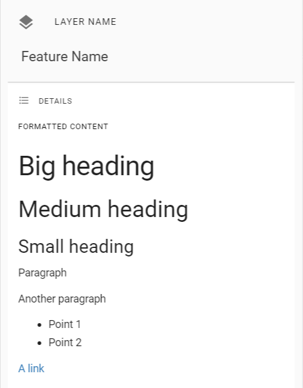

# Data Preparation
## Attribute Formatting

### Hyperlinks

When an attribute value is a URL (which is not direct link to an image), Pozi displays the *field name* as a clickable link. In addition, if the URL ends in `.pdf`, a PDF icon is shown next to the link. Otherwise, the favicon of the destination link is shown.

### Embedded Media

When an attribute value is a URL ending in `.jpg` or `.png`, Pozi displays the image within the info panel.

### Advanced Formatting

The Pozi info panel can display feature details with rich text when the attributes are formatted with HTML.

Example feature:

|Formatted Content | Title | Attribute A | Attribute B | Attribute C | ID
|--|--|--|--|--|--|
|`<h1>Big heading</h1><h2>Medium heading</h2><h3>Small heading</h3>
Paragraph

Another paragraph
<ul><li>Point 1</li><li>Point 2</li></ul>
<a href=\"https://www.example.com/ \" target=\"_blank\">A link</a>
`|`Feature Name`|`Value`|`Value`|`Value`|`101`|

When this feature is selected in Pozi, it will display like this:

{style="width:300px"}

## Image Mosaics

When aerial imagery data has been supplied as a folder of image tile files (as a opposed to a single image file), it is necessary to create an image *mosaic* for Pozi to recognise it as a single layer.

QGIS can combine hundreds or thousands of tiles into virtual layer by generating a VRT file which you then add into your QGIS project.

### Create VRT

In QGIS:

1. Raster > Miscellaneous > Build Virtual Raster
2. Virtual > click file picker > Save to File >  choose location and name of new VRT file to create (typically use the name of the source imagery folder as the new VRT filename, eg `2015 Full Coverage.vrt`)
3. Input layers > click file picker > Add File(s)
4. sort files by type, click to select first ECW file, scroll to last ECW file, hold Shift and click last ECW file to select all ECW files > Open
5. Run

It can take up to 10 minutes to process 1-2K images. During this time, QGIS may show no sign of progress. On completion, the log display will display "Process completed successfully". QGIS may still appear to be working while stuck on 97%, and may not respond to any user action. If you can confirm that the VRT file has been created at the chosen location, you can safely force QGIS to close.

### Add VRT to Project

1. open your Aerials project in QGIS
2. Layer > Add Layer > Add Rater Layer > file picker > select your new VRT file > Open > Add
3. Project > Save

It can take several hours for the VRT file to be added to the project. During this time, QGIS will not respond, and the cursor displays as a spinner. This is a [known issue](https://github.com/qgis/QGIS/issues/26231) in QGIS. Let it run overnight or however long is necessary. When you see the layer is added to the layer panel, save your project.
