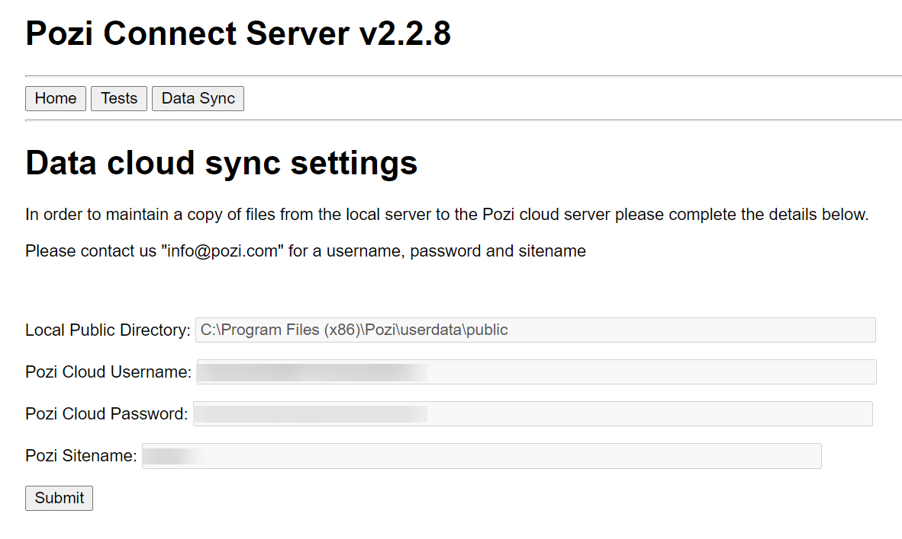

!!! Warning

We are phasing out Pozi Data Sync. Talk to your Pozi reseller about Pozi's alternative solution that enables you to manage and publish layers to the public directly from QGIS!

!!!

Pozi Data Sync is a dedicated folder within Pozi Server that is permanently synced to the Pozi cloud platform. Any files created and/or updated in this folder are automatically synchronised to the web. This enables workflows for publishing data to the public on an ad-hoc or scheduled basis.

## Configuration

After installing Pozi Server, go to [https://local.pozi.com/settingssync?](https://local.pozi.com/settingssync?) and fill in the cloud sync settings which have been provided to you by Pozi Support.

{style="width:500px"}

As soon as this is done, your sync is live. Any files placed in `C:\Program Files (x86)\Pozi\userdata\public` are automatically and continuously synchronised to the Pozi cloud.

## Troubleshooting

==- Data is not updating
  On the server on which Pozi Server is installed, go to Control Panel > Administrative Tools > Services > PoziConnectServer > right-click > Restart.
==-
