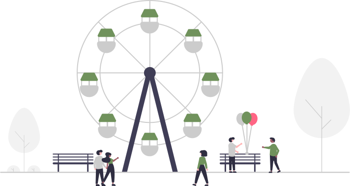

# Administrator Guide

The Pozi Administrator Guide contains self-service information for *Pozi Enterprise* and *Enterprise Cloud* clients.

## Help Yourself

Administrators control the following aspects of the Pozi experience:

* add and configure layers and linked datasets for viewing within your network
* sync layers to Pozi cloud for external viewing
* embed custom maps and widgets in your website

[!ref icon="stack" text="Working with layers"](/admin-guide/qgis/configuring-layers/)
[!ref icon="package" text="Working with projects"](/admin-guide/qgis/managing-qgis-projects/)

### Troubleshooting

[!ref icon="tools" text="Issues with individual layers"](/admin-guide/qgis/configuring-layers#troubleshooting)
[!ref icon="tools" text="Issues with projects/layer groups"](/admin-guide/qgis/managing-qgis-projects#troubleshooting)

## Let Us Help You

For other changes to the Pozi app experience, contact the your Pozi reseller:

* register a new layer catalogue (ie, layer group) in Pozi
* change the default basemap, search and imagery options
* update branding
* solve an issue that's not covered in our Troubleshooting pages

---

## Join Our Community!

We are excited to invite you to our new community forum exclusively for Pozi administrators. As a valued member of our community, we know you want to stay up-to-date with all the exciting developments happening at Pozi.

Our forum will give you access to new features, exclusive content, and important announcements that will help you get the most out of your Pozi experience. You will also be able to connect with other Pozi users, discuss important topics, and have a little fun along the way.

Don't miss out on this opportunity to engage with the Pozi community and get the most out of your Pozi experience. Contact info@pozi.com and request your invitation.

Already a member? Then head on over!

[!ref icon="people" text="Pozi Community"](https://community.pozi.com/)
