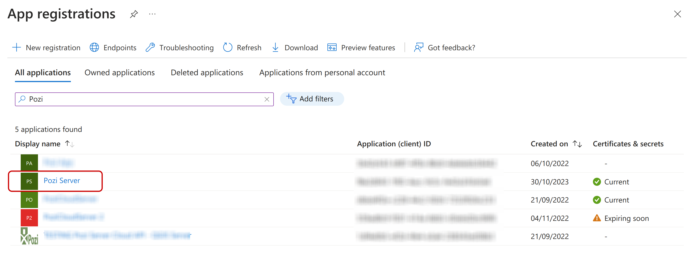
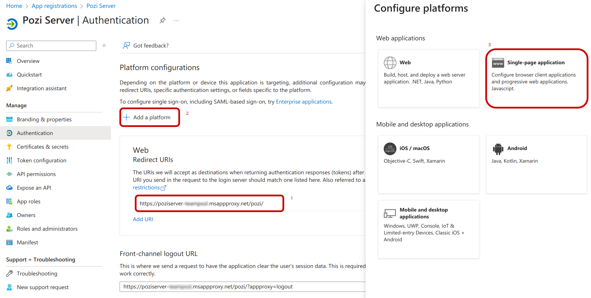
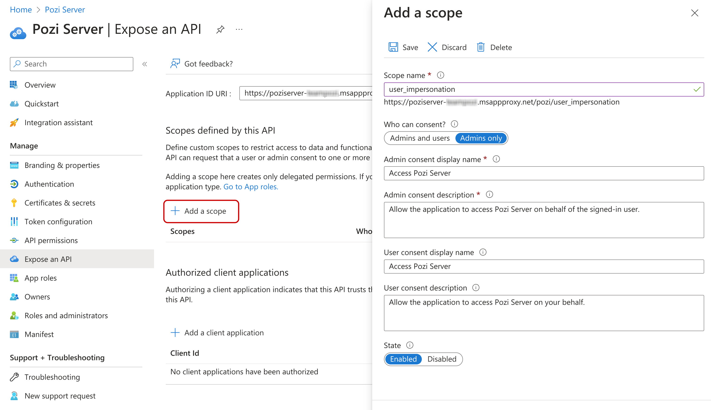
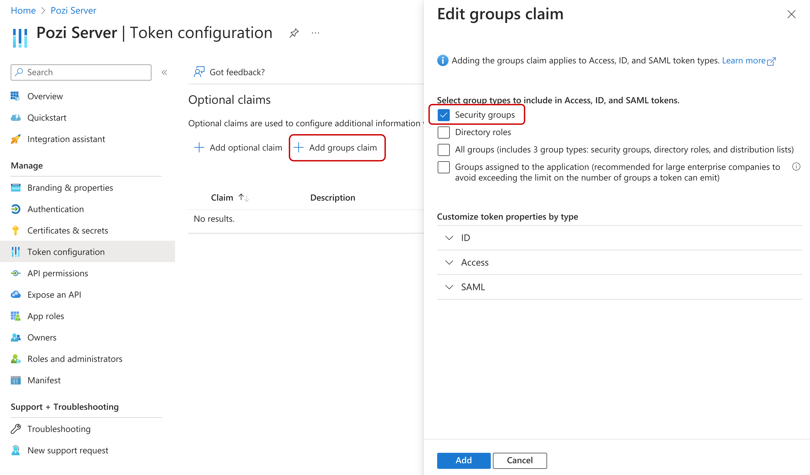
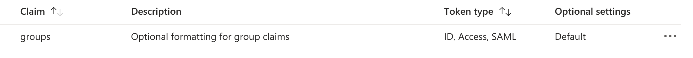

# App Registration

:::updated
02 Nov 2023
:::

Please make sure to have completed the steps in the [previous section](./application-proxy).

## 1. Configure Pozi Server Application registration

The creation of the Pozi Server Enterprise Application has also implicitly created an app registration with the same name.
Search for this app in the 'App registrations' section in Entra ID.




## 2. Authentication

In this section we will make sure that an authenticated user will be granted access through the Pozi Web App.

First, confirm that one Redirect URI has been configured that points to the Application Proxy URL that we have configured in the previous section. If it's not there, please add now.



Now, add a platform and choose 'Single-page application'. It will ask to fill in a Redirect URI. Fill in `http://localhost/`. We will add a few more in the next step.


Add the missing Redirect URIs from the list below in the Single-page application section:

* `http://localhost/` (for Pozi development purposes)
* `https://staging.pozi.com/` (for client testing/debugging)
* `https://<pozi-site-name>.enterprise.pozi.com/` (replace `<pozi-site-name>` with the actual site name)
* `https://<pozi-site-name>-entra-id.enterprise.pozi.com/` (optional: only for clients that transition their existing site to Entra ID)


There are some more settings in this section. Most can be ignored. Confirm that the following have the values below.

* **Access tokens**: Unchecked
* **ID tokens**: Unchecked
* **Enable the following mobile and desktop flows**: `No`


## 3. Expose an API (user_impersonation)

This section covers a **crucial** setting for the application to access Pozi Server on behalf of the user: the `user_impersonation` scope.

Go to the 'Expose an API' section of Pozi Server.

Firstly, confirm that the `Application ID URI` looks something like `https://poziserver-<entra-application-client-name>.msappproxy.net/pozi`. This should not be changed.


Make sure that in the 'Expose an API' section there is one scope defined, called `user_impersonation` (prefixed by the Application ID URI above).

Often, this scope gets created by Entra ID automatically but not in every organisation. If this scope is missing, add it as following.



* **Scope name**: `user_impersonation` (correct spelling is crucial!)
* **Who can consent?**: `Admins only`
* **Admin consent display name**: `Access Pozi Server`
* **Admin consent description**: `Allow the application to access Pozi Server on behalf of the signed-in user.`
* **User consent display name**: `Access Pozi Server` (optional)
* **User consent description**: `Allow the application to access Pozi Server on your behalf.` (optional)
* **State**: `Enabled`


The scope above will be used in the Site Configuration in Pozi in the 'Scopes' section. It should look something like:
`https://poziserver-<entra-application-client-name>.msappproxy.net/pozi/user_impersonation`

## 4. Access control

It is possible to further control user access to map catalogues (ie QGIS projects) in Pozi Web App. In order to enforce this access control, Pozi Web App needs to know what groups a user is a member of in the Entra ID environment is required.

This section describes how to provide Pozi Web App with the relevant group information.



Go to the 'Token configuration' section and click on 'Add groups claim'. Then, select desired group types (just 'Security groups` is generally sufficient) and keep default settings



That is all that is needed in Entra ID. Pozi Web App will receive the group information as a list of group ids, like this:

```
"groups": [
    "81ddec0b-6a1a-426a-9826-e869eef6473f",
    "17b3a8a0-bc11-4ec3-810e-94c74201b41e",
    "5ee9c710-26aa-40be-90be-36afa6fc2003",
    "3adf8e2e-7628-41ee-b902-b105f231758e",
    "c034a6cd-2b7d-4336-9f9e-9bb896ad1110"
]
```

Email support@pozi.com with your list of group ids and what catalogues (ie QGIS projects) each group should have access to.

The group ids can be found under **Identity** ⇒ **Groups** ⇒ **All groups**.


## Troubleshooting

Error message | Solution
--- | ---
MSAL Error: Invalid Client errorMessage AADSTS65005: The application 'xxxxxxxx-xxxx-xxxx-xxxx-xxxxxxxxxxxx' asked for scope 'user_impersonation' that doesn't exist. | Add the 'user_impersonation' scope
AADSTS9002326: Cross-origin token redemption is permitted only for the 'Single-Page Application' client-type. Request origin: 'https://poziserver-councilnamevicgovau.msappproxy.net'. | TODO: VERIFY - App registration -> Authentication-> platform type should be SPA
AADSTS50011: The redirect URI 'https://xxxxxxxxxxxxxxxxxxx/' specified in the request does not match the redirect URIs configured for the application 'xxxxxxxx-xxxx-xxxx-xxxx-xxxxxxxxxxxx'. Make sure the redirect URI sent in the request matches one added to your application in the Azure portal. Navigate to https://aka.ms/redirectUriMismatchError to learn more about how to fix this. | It could be that the 'https://xxxxxxxxxxxxxxxxxxx/' redirect URI was not configured as a SPA, or, it could be that the application ID of the Pozi Server Enterprise Application was accidentally
invalid_resource: AADSTS500011 -  The resource principal named xxxxxxxxxxxxxxxxxxxxxxxxxxxxxxxx was not found in the tenant named xxxxxxxx-xxxx-xxxx-xxxx-xxxxxxxxxxxx. This can happen if the application has not been installed by the administrator of the tenant or consented to by any user in the tenant. You might have sent your authentication request to the wrong tenant. | Make sure you have provided the correct tenant id and that you are logged in the correct account
AADSTS50105: Your administrator has configured the application Pozi Server ('xxxxxxxx-xxxx-xxxx-xxxx-xxxxxxxxxxxx') to block users unless they are specifically granted ('assigned') access to the application. The signed in user 'xxxxxxxxx.xxxxxxx@xxxxxxxxxxx.xxx.xxx.xx') is blocked because they are not a direct member of a group with access, nor had access directly assigned by an administrator. Please contact your administrator to assign access to this application. | Give the relevant users/groups access via Enterprise Applications. See the [Assign users](./application-proxy/#3-assign-users) section.

<!-- ## 99. App registration


`Entra ID`: **App Registrations** ⇒ **Server**

* Set Pozi Server up in Entra ID as a registered app (admin privileges required): [https://docs.microsoft.com/en-au/azure/active-directory/develop/howto-create-service-principal-portal](https://docs.microsoft.com/en-au/azure/active-directory/develop/howto-create-service-principal-portal#register-an-application-with-azure-ad-and-create-a-service-principal)
* Record the Application id (also known as as client id) as well as tenant id

### Authentication

#### Web - Redirect URIs

Add the App Proxy URL to `Redirect URIs` to the `Web` section. E.g.:
  * `https://poziserver-<entra-application-client-name>.msappproxy.net/pozi/`

This is the same as the External URL configured above.


#### Single Page Application - Redirect URIs

Add the following `Redirect URIs` to the `Single-page application` section:
  * `https://<sitename>.enterprise.pozi.com/`
  * `http://localhost:3000/` (for Pozi development purposes)
  * `https://staging.pozi.com/` (for client testing/debugging)

If upgrading an existing non-Azure Pozi Enterprise site, also add a URI for a dedicated test site with `-azure` appended to the existing site name:
  * `https://<sitename>-azure.enterprise.pozi.com/`


Please make sure that the URIs all have a trailing slash ('/') and note that the localhost URI is `http` (and not `https`).

### Implicit grant and hybrid flows

* `Access tokens` and `ID tokens` should remain unchecked


### Advanced settings

* Set `Allow public client flows` to `No`


### Authorisation

All going well, it should be possible to visit the App Proxy URL (in our example case: `https://poziserver-<entra-application-client-name>.msappproxy.net/pozi/`). If an error is shown like: `Sorry, but we’re having trouble with signing you in.` with a text similar to below, then we will need to give the relevant users/groups access.

:::note Example authorisation error:

AADSTS50105: Your administrator has configured the application Pozi Server ('xxxxxxxx-xxxx-xxxx-xxxx-xxxxxxxxxxxx') to block users unless they are specifically granted ('assigned') access to the application. The signed in user 'xxxxxxxxx.xxxxxxx@xxxxxxxxxxx.xxx.xxx.xx') is blocked because they are not a direct member of a group with access, nor had access directly assigned by an administrator. Please contact your administrator to assign access to this application.

:::

**Steps to authorise users/groups**

`Entra ID`: **Enterprise Applications** ⇒ **Server**

* In the Azure Portal, go to Enterprise Applications, select the enterprise application for the Pozi Application Proxy
* Under `Manage`, select `Users and groups`
* If no users/groups have been defined, it will say something like `No application assignments found`
* Click on `+ Add user/group`
* In the next page, click on the text `None selected` under`Users and groups
* On the right a panel should pop up with all available users/groups. Assuming that we want all users to have access, click on the group `All users` and click on `Select` in the bottom.
* It is worth taking note of the the info text `When you assign a group to an application, only users directly in the group will have access. The assignment does not cascade to nested groups.`, especially when one chooses a group that contains other groups. In the case of `All users`, this is not an issue.
* Under `Select a role`, the role `User` is preselected and cannot be changed. That is OK.
* Click on `Assign` in the bottom of the page.

Access should now be granted to the application proxy and the URL should be accessible.

### API Permissions

Give Pozi the following permissions:

- API/Permissions Name: `User.Read`
- Type: `Delegated`
- Admin consent required: `No`

This should allow Pozi to determine access based on a user's role(s). -->

<!-- Important: a user authenticated with the client's Azure AD through Pozi will need to their tokens to have been provided with permission to access all of the App Proxy (i.e. `https://poziserver-<entra-application-client-name>.msappproxy.net/`). -->


<!-- ### Token-based Authentication/Authorisation

:::note Under Construction

*This section is a work in progress. Please get in touch with us before following any of the steps below*

:::

* TO BE WRITTEN -->

<!-- ### App Roles

:::note Under Construction

*This section is a work in progress. Please get in touch with us before following any of the steps below*

:::

It is possible to assign app roles to users and groups and make those roles available through our token-based authentication/authorisation (which is currently still experimental).

The instructions below follow the [Microsoft guide on adding app roles](https://learn.microsoft.com/en-au/azure/active-directory/develop/howto-add-app-roles-in-azure-ad-apps).

#### Create App Roles

* Go to the App Proxy application in the `App registrations` sections and select `App roles`
* Create the following app role for read access to Pozi Server:
  - Display name: `Pozi Server Read Access`
  - Allowed member types: `Users/Groups`
  - Value: `PoziServer.Read`
  - Description: `Read access to Pozi Server`
  - Do you want to enable this app role?: `✔`
* Create the following app role for write access to Pozi Server:
  - Display name: `Pozi Server Write Access`
  - Allowed member types: `Users/Groups`
  - Value: `PoziServer.Write`
  - Description: `Write access to Pozi Server`
  - Do you want to enable this app role?: `✔`

#### Assign App Roles to Users/Groups

* Go to the App Proxy application in the `Enterprise applications` section and in the `Manage` category, select `Users and groups`
* Select all users/groups that should get read access to Pozi Server and click on `Edit` in the top of the page
* Click on `Select a role` and select the role `Pozi Server Read Access` and click on `Select` in the bottom of the page
* For enabling write access follow the same steps again but now select the role `Pozi Server Write Access`
* Currently, the Azure UI shows one row per role per user/group. That is expected behaviour.

#### App Roles in Tokens

* The roles defined above will automatically become available in the authentication tokens in the browser, allowing Pozi to change its behaviour depending on the roles that the user (or the group they are in) have. -->

