# Application Proxy

:::updated
31 Oct 2023
:::

Microsoft Entra ID (formerly Azure AD) provides an Application Proxy service that enables users to securely access on-premises applications from outside the organisations' internal network without the need for a VPN.

This document aims to help your organisation set up this Application Proxy for Pozi QGIS Server.

**Required permissions**:
* Administrator permissions on the on-premises server where QGIS resides
* An Entra ID service account with [Application Administrator](https://learn.microsoft.com/en-au/entra/identity/role-based-access-control/permissions-reference#application-administrator) permissions

!!!Please read carefully before executing the steps below.

This guide is based on (and refers to) steps outlined in the following Microsoft tutorial:

[Tutorial: Add an on-premises application for remote access through Application Proxy in Microsoft Entra ID](https://learn.microsoft.com/en-au/entra/identity/app-proxy/application-proxy-add-on-premises-application)

This document assumes that the first 2 steps ([Prerequisites](https://learn.microsoft.com/en-au/entra/identity/app-proxy/application-proxy-add-on-premises-application#prerequisites) and [Prepare your on-premises environment](https://learn.microsoft.com/en-au/entra/identity/app-proxy/application-proxy-add-on-premises-application#prepare-your-on-premises-environment)) of the tutorial have been followed and executed.

Entra ID's features and portal update frequently and this guide may not fully reflect the latest changes.
Please [contact us](/contact/) if you experience any inconstencies so we can update the documentation.

!!!

Visit the Microsoft Entra ID portal using https://entra.microsoft.com/

## 1. Install connector on on-premises server

The connector is a required piece of software that manages the outbound connection from the on-premises application servers to Application Proxy in Microsoft Entra ID. It runs as a service.

**Tutorial**: [Install and register a connector](https://learn.microsoft.com/en-au/entra/identity/app-proxy/application-proxy-add-on-premises-application#install-and-register-a-connector)

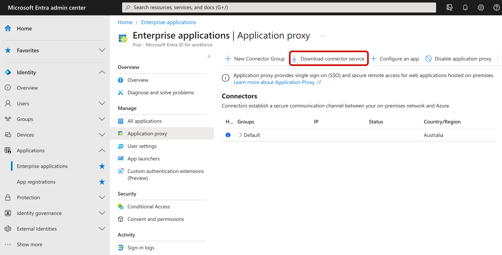

* Click on 'Download connector service', 'Accept terms & Download'
* Transfer downloaded file (e.g. 'AADApplicationProxyConnectorInstaller.exe') to the on-premises server
* Run the installer and follow the instructions

==- :icon-file-media: Screenshots of connector installation process

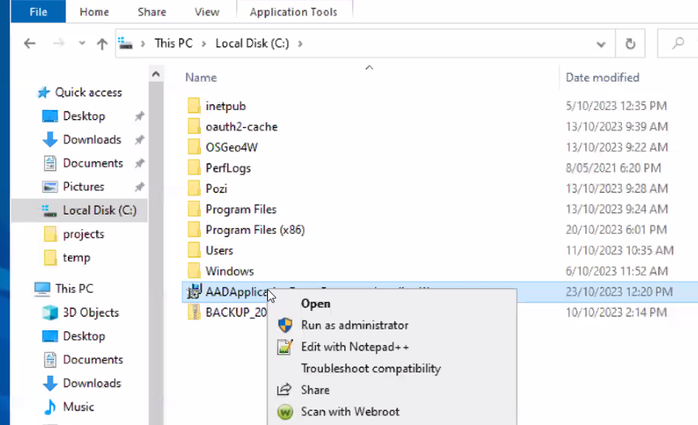
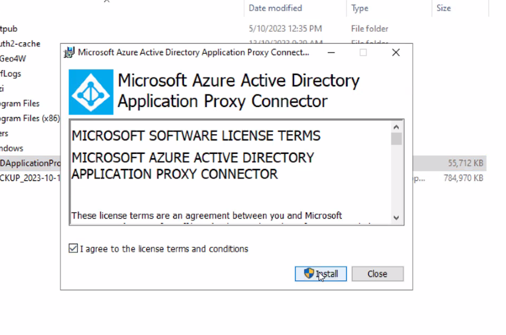
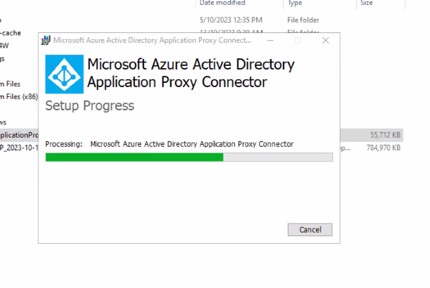
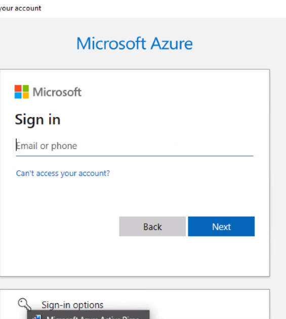
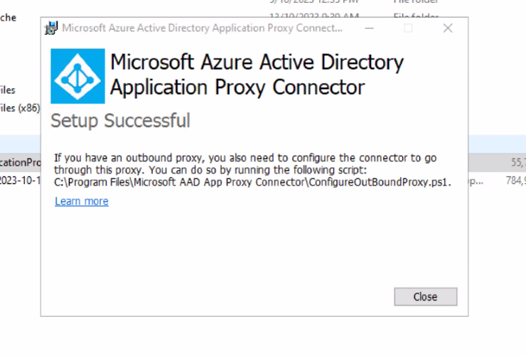

===

## 2. Add Pozi Server to Entra ID

This section describes how to add Pozi Server (on-premises app) to Entra ID platform as an Enterprise application.

**Tutorial**: [Add an on-premises app to Microsoft Entra ID](https://learn.microsoft.com/en-au/entra/identity/app-proxy/application-proxy-add-on-premises-application#add-an-on-premises-app-to-microsoft-entra-id)

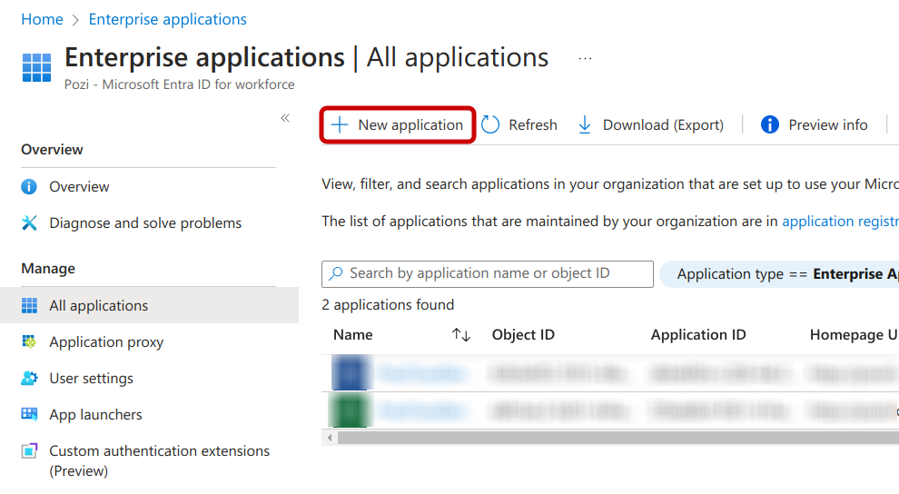
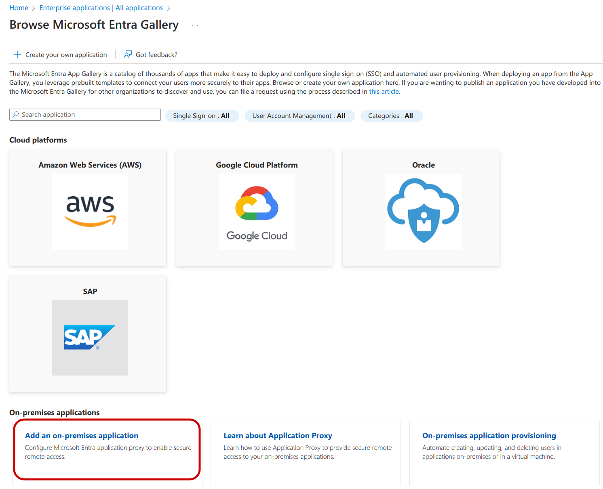

In the Add your own on-premises application section, provide the following information about your application:

### Basic

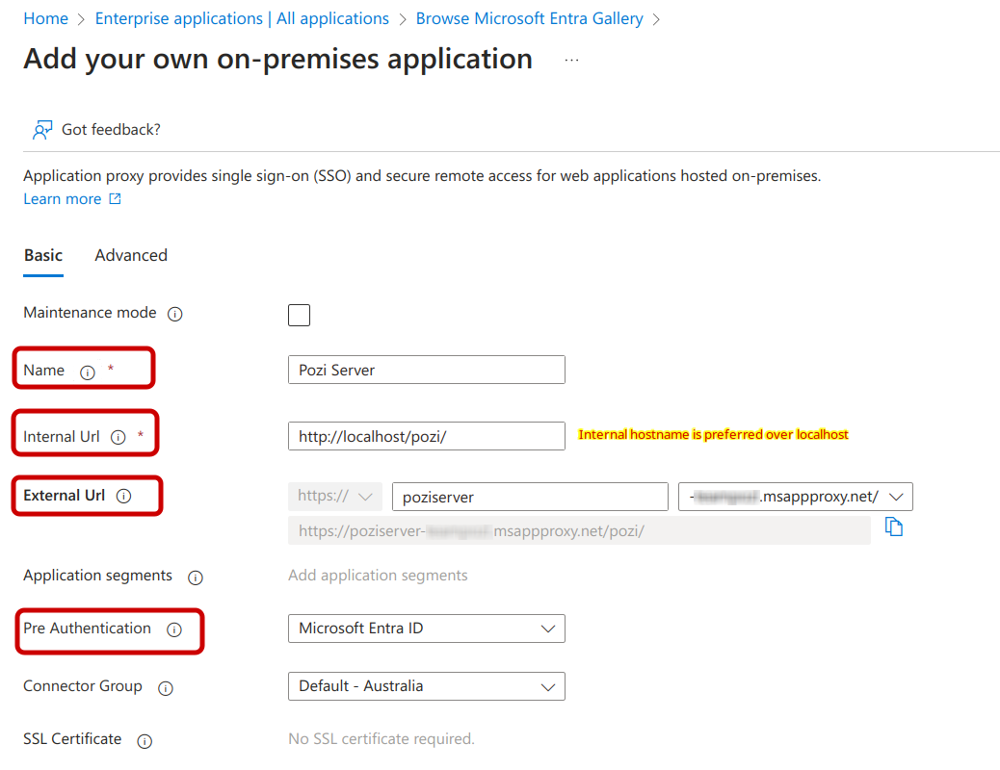

* **Name** : `Pozi Server` (recommended). The administrator is free to choose an other name if that better suits the organisation's policies.

* **Internal URL** : `http://<internal-server-name>/pozi/`. Replace `<internal-server-name>` with the actual name of the on-premises server on the internal network. This can be `localhost` but the actual server name is preferred.

  _Example: `http://gis-server.local/pozi/`_

  To test internal URL on the internal network, opening the following URL in the browser should show a QGIS Server landing page:`http://<internal-server-name>/pozi/qgisserver/wfs3.html`

  _Example: `http://gis-server.local/pozi/qgisserver/wfs3.html`_

* **External URL**: `https://` `poziserver` `-<entra-application-client-name>.msappproxy.net`.

  The `-<entra-application-client-name>.msappproxy.net` part is a name that has been given to the organisation MS Entra ID. The dropdown may reveal other domains like `.<entra-application-client-name>.onmicrosoft.com`. Please select the domain that your organisation prefers.

  The interface will show a fully qualified URL to access Pozi Server in grey text below the form fields.

  _Example: `https://poziserver-councilnamevicgovau.msappproxy.net/pozi/`_

* **Pre Authentication**: `Microsoft Entra ID`. This will get Entra ID to handle the authentication process.

  Do **not** choose `Passthrough` as that will allow any user (logged in or not) to access private resources from the server.

### Advanced

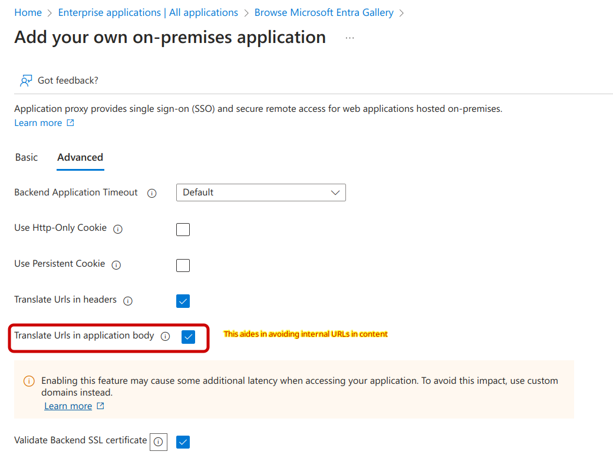

* **Translate Urls in application body** : :icon-checkbox: checked. This allows Entra ID to translate internal URLs to their external counterparts.

## 3. Assign users

**Tutorial**: [Test the application](https://learn.microsoft.com/en-au/entra/identity/app-proxy/application-proxy-add-on-premises-application#test-the-application)

It is recommended to assign an individual user first for testing before assigning additional users and/or groups.

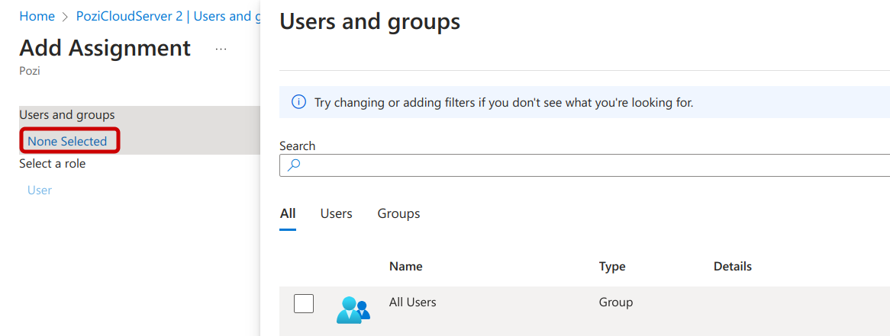

When configured correctly, a request from a logged-in user to Pozi Server through the Application Proxy URL should return the same result as within the local network.

 Visiting following the Entra ID Application Proxy URL:

`https://poziserver-<entra-application-client-name>.msappproxy.net/pozi/qgisserver/wfs3.html`

...should return the same response as a local request to...

`http://<internal-server-name>/pozi/qgisserver/wfs3.html`

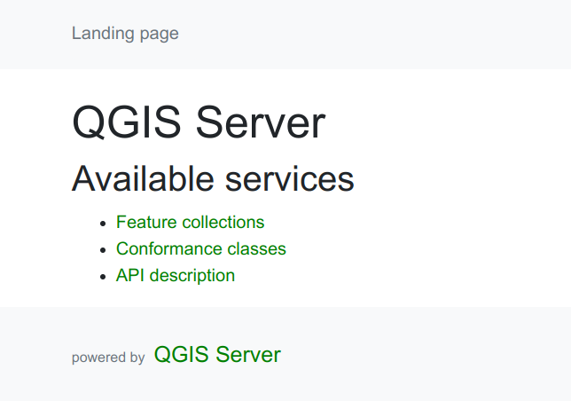

All going well, the QGIS landing page should now be visible when visiting the above Application Proxy URL.

!!!
It is recommended to try out the Application Proxy URL in an incognito browser window to verify that the page is not available to non-logged-in or anonymous users.
!!!

## Troubleshooting

Error message | Solution
--- | ---
Sorry, but we’re having trouble with signing you in.    AADSTS50105: Your administrator has configured the application Pozi Server ('xxxxxxxx-xxxx-xxxx-xxxx-xxxxxxxxxxxx') to block users unless they are specifically granted ('assigned') access to the application. The signed in user 'xxxxxxxx' is blocked because they are not a direct member of a group with access, nor had access directly assigned by an administrator. Please contact your administrator to assign access to this application. | Grant access to the user(s) by following [Step 3. Assign Users](#3-assign-users)
BadGateway: This corporate app can't be accessed.    Connection to the server failed. For more details, check the Application Proxy Connector Event Log for reported errors. | This could happen if the application proxy internal URL is accidentally configured with `https` instead of `http`
GatewayTimeout: The corporate app cannot be accessed / the service is unable to reach the connector / NoActiveConnector | <li>Make sure that the Application Proxy connector is properly installed and registered with your Entra ID tenant</li><li>Check the Application Proxy connector Event Log for reported errors</li><li> Check the network settings to make sure any inactive connectors can reach the service and become active again</li>
GatewayTimeout: The corporate app cannot be accessed  Next Steps  This application is associated with a connector group that contains no connectors. Make sure to add connectors to this group for the application to be available. | This gets reported in Pozi as an `EmptyConnectorGroup` error. Solution: install the connector by following the instructions in section 1. above. For more information, see the relevant section on the [Microft Entra Id site](https://learn.microsoft.com/en-au/entra/identity/app-proxy/application-proxy-connectivity-no-working-connector)

