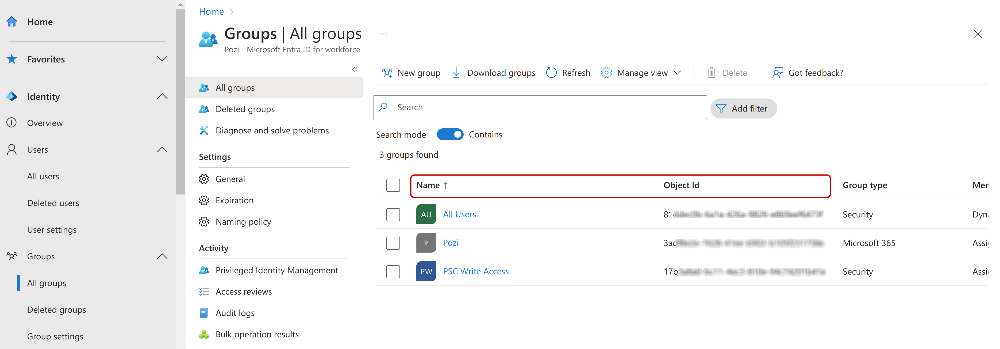

# Entra ID

:::updated
03 Nov 2023
:::

This section contains the relevant information to enable authorised users to securely access Pozi Server (QGIS) through Microsoft Entra ID (formerly Azure AD).

Follow the instructions in the following sections and return here:

1. [Application Proxy](./application-proxy.md)
1. [App Registration](./app-registration)

Once all work has been completed, please provide Pozi Support with the requested information below.

## Information to send to Pozi Support

After completion of the configuration, [email](mailto:support@pozi.com) us with the following information:

- [ ] The **internal** on-premises URL (something like `http://<internal-server-name>/pozi/`)
- [ ] The **external** application proxy URL (something like `https://poziserver-<entra-application-client-name>.msappproxy.net/pozi/`)

- [ ] The **`application (client) id`**
- [ ] The **`directory (tenant) id`**

- [ ] (optional) A list of group ids and the QGIS catalogues that have access to them.

This information is [not sensitive](https://stackoverflow.com/questions/57306964/are-azure-active-directorys-tenantid-and-clientid-considered-secrets) and can be emailed directly to the Pozi support team at support@pozi.com.

In addition to the information above, if you have not done so already, provide the Azure AD credentials (email address and password) of the [Pozi Support](/admin-guide/installation/prerequisites.md#support-account) user account. Please get in touch with us on how to securely provide us with these details.

## Azure AD Pozi Support Account

In order for the Pozi team to be able to provide support and troubleshoot any potential issues, we ask our clients to configure the [Pozi Support](/admin-guide/installation/prerequisites.md#support-account) domain user with the same permissions/groups/roles as the users of Pozi through Azure AD Application Proxy.

If it's not possible or practical for the Pozi Support domain user to be given Entra ID permissions, you may choose to create a separate user account with the Entra ID permissions. In this case, no administrator privileges are required.

## Helpful Information:

### Authentication mechanism

The authentication that Pozi Web App uses to communicate with Pozi Server through Entra ID is OAuth 2.0 through Microsoft's MSAL.js v2.0 JavaScript library

* [Microsoft identity platform and OAuth 2.0 authorization code flow](https://learn.microsoft.com/en-au/entra/identity-platform/v2-oauth2-auth-code-flow)

