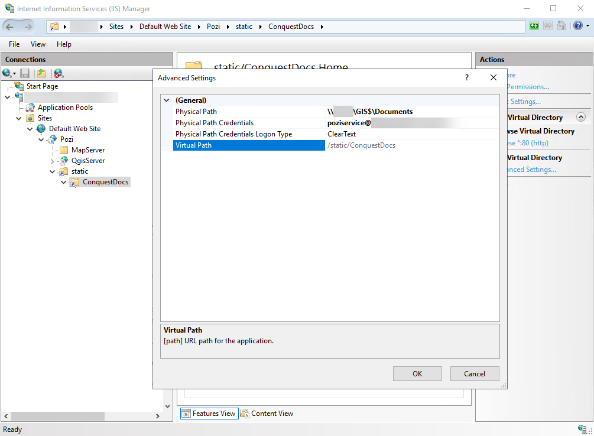

# IIS

## Install IIS

!!!secondary Copying and pasting using command prompt

When copying and pasting multiple lines into the command prompt, all lines will be executed except the last one. You must hit `Enter` for the last line to be executed.

!!!

In a new command prompt window, running as administrator:

```cmd
dism /online /enable-feature /featurename:IIS-WebServerRole
dism /online /enable-feature /featurename:IIS-WebServer
dism /online /enable-feature /featurename:IIS-ApplicationDevelopment
dism /online /enable-feature /featurename:IIS-ApplicationInit
dism /Online /Enable-Feature /FeatureName:IIS-CGI

```

If IIS has not previously been set up on the server, the command prompt may return `Restart Windows to complete this operation`.  Restarting may be necessary for the subsequent configuration.

## Prepare Folders

- create folder path: `C:\Pozi\IIS\QgisServer`
- create `web.config` file at this location with the following content

```xml C:\Pozi\IIS\QgisServer\web.config
<?xml version="1.0" encoding="UTF-8"?>
<configuration>
    <system.webServer>
        <handlers>
            <add name="PoziQgisServerFastCgi" path="*" verb="*" type="" modules="FastCgiModule" scriptProcessor="C:\OSGeo4W\apps\qgis-ltr\bin\qgis_mapserv.fcgi.exe"
            resourceType="Unspecified" requireAccess="Script" allowPathInfo="false" preCondition=""  />
        </handlers>
        <security>
            <requestFiltering>
                <requestLimits maxQueryString="32768"/>
            </requestFiltering>
        </security>
        <caching enabled="true" enableKernelCache="true" />
    </system.webServer>
</configuration>
```

NOTE: If you have installed QGIS Server to a location other than the default `C:\OSGeo4W\apps\qgis-ltr\bin\qgis_mapserv.fcgi.exe` then you will need to update that path in the `web.config` file. You'll also need to make the necessary substitutions in many of the commands below.

## Configure IIS

```cmd
"%systemroot%\system32\inetsrv\appcmd" add app /site.name:"Default Web Site" /path:/Pozi /physicalPath:"C:\Pozi\IIS"
"%systemroot%\system32\inetsrv\appcmd" add app /site.name:"Default Web Site" /path:/Pozi/QgisServer /physicalPath:"C:\Pozi\IIS\QgisServer"

```

If the command prompt returns `"C:\Windows\system32\inetsrv\appcmd" is not recognised as an internal or external command`, then a restart may be required before re-attempting this configuration step.

```cmd
%windir%\system32\inetsrv\appcmd.exe unlock config -section:system.webServer/handlers
"%systemroot%\system32\inetsrv\appcmd" set config -section:system.webServer/fastCgi /+"[fullPath='C:\OSGeo4W\apps\qgis-ltr\bin\qgis_mapserv.fcgi.exe',idleTimeout='604800']" /commit:apphost
"%systemroot%\system32\inetsrv\appcmd" set config /section:isapiCgiRestriction /+"[path='C:\OSGeo4W\apps\qgis-ltr\bin\qgis_mapserv.fcgi.exe',description='PoziQgisServer',allowed='True']"

```

## Configure Environment Variables

+++ Command Prompt

Copy and paste the following into the command prompt:

```cmd
:: Clear any potentially pre-existing env vars (handy when doing upgrades)
"%systemroot%\system32\inetsrv\appcmd.exe" set config -section:system.webServer/fastCgi /-"[fullPath='C:\OSGeo4W\apps\qgis-ltr\bin\qgis_mapserv.fcgi.exe'].environmentVariables

:: Set env vars

:: The PATH variable required
"%systemroot%\system32\inetsrv\appcmd.exe" set config -section:system.webServer/fastCgi /+"[fullPath='C:\OSGeo4W\apps\qgis-ltr\bin\qgis_mapserv.fcgi.exe'].environmentVariables.[name='PATH',value='C:\OSGeo4W\apps\qgis-ltr\bin;C:\OSGeo4W\apps\qt5\bin;C:\OSGeo4W\bin;C:\Windows\system32;C:\Windows;C:\Windows\system32\WBem']" /commit:apphost

:: The following env vars may be optional
"%systemroot%\system32\inetsrv\appcmd.exe" set config -section:system.webServer/fastCgi /+"[fullPath='C:\OSGeo4W\apps\qgis-ltr\bin\qgis_mapserv.fcgi.exe'].environmentVariables.[name='O4W_QT_PREFIX',value='C:\OSGeo4W\apps\Qt5']" /commit:apphost
"%systemroot%\system32\inetsrv\appcmd.exe" set config -section:system.webServer/fastCgi /+"[fullPath='C:\OSGeo4W\apps\qgis-ltr\bin\qgis_mapserv.fcgi.exe'].environmentVariables.[name='O4W_QT_BINARIES',value='C:\OSGeo4W\apps\Qt5\bin']" /commit:apphost
"%systemroot%\system32\inetsrv\appcmd.exe" set config -section:system.webServer/fastCgi /+"[fullPath='C:\OSGeo4W\apps\qgis-ltr\bin\qgis_mapserv.fcgi.exe'].environmentVariables.[name='O4W_QT_PLUGINS',value='C:\OSGeo4W\apps\Qt5\plugins']" /commit:apphost
"%systemroot%\system32\inetsrv\appcmd.exe" set config -section:system.webServer/fastCgi /+"[fullPath='C:\OSGeo4W\apps\qgis-ltr\bin\qgis_mapserv.fcgi.exe'].environmentVariables.[name='O4W_QT_LIBRARIES',value='C:\OSGeo4W\apps\Qt5\lib']" /commit:apphost
"%systemroot%\system32\inetsrv\appcmd.exe" set config -section:system.webServer/fastCgi /+"[fullPath='C:\OSGeo4W\apps\qgis-ltr\bin\qgis_mapserv.fcgi.exe'].environmentVariables.[name='O4W_QT_TRANSLATIONS',value='C:\OSGeo4W\apps\Qt5\translations']" /commit:apphost
"%systemroot%\system32\inetsrv\appcmd.exe" set config -section:system.webServer/fastCgi /+"[fullPath='C:\OSGeo4W\apps\qgis-ltr\bin\qgis_mapserv.fcgi.exe'].environmentVariables.[name='O4W_QT_HEADERS',value='C:\OSGeo4W\apps\Qt5\include']" /commit:apphost
"%systemroot%\system32\inetsrv\appcmd.exe" set config -section:system.webServer/fastCgi /+"[fullPath='C:\OSGeo4W\apps\qgis-ltr\bin\qgis_mapserv.fcgi.exe'].environmentVariables.[name='QGIS_PREFIX_PATH',value='C:\OSGeo4W\apps\qgis-ltr']" /commit:apphost
"%systemroot%\system32\inetsrv\appcmd.exe" set config -section:system.webServer/fastCgi /+"[fullPath='C:\OSGeo4W\apps\qgis-ltr\bin\qgis_mapserv.fcgi.exe'].environmentVariables.[name='QT_PLUGIN_PATH',value='C:\OSGeo4W\apps\qt5\plugins']" /commit:apphost
"%systemroot%\system32\inetsrv\appcmd.exe" set config -section:system.webServer/fastCgi /+"[fullPath='C:\OSGeo4W\apps\qgis-ltr\bin\qgis_mapserv.fcgi.exe'].environmentVariables.[name='TEMP',value='C:\Windows\Temp']" /commit:apphost
"%systemroot%\system32\inetsrv\appcmd.exe" set config -section:system.webServer/fastCgi /+"[fullPath='C:\OSGeo4W\apps\qgis-ltr\bin\qgis_mapserv.fcgi.exe'].environmentVariables.[name='PYTHONHOME',value='C:\OSGeo4W\apps\Python39']" /commit:apphost
"%systemroot%\system32\inetsrv\appcmd.exe" set config -section:system.webServer/fastCgi /+"[fullPath='C:\OSGeo4W\apps\qgis-ltr\bin\qgis_mapserv.fcgi.exe'].environmentVariables.[name='QGIS_SERVER_IGNORE_BAD_LAYERS',value='1']" /commit:apphost
"%systemroot%\system32\inetsrv\appcmd.exe" set config -section:system.webServer/fastCgi /+"[fullPath='C:\OSGeo4W\apps\qgis-ltr\bin\qgis_mapserv.fcgi.exe'].environmentVariables.[name='QGIS_SERVER_LOG_FILE',value='C:\Pozi\IIS\QgisServer\qgis_server.log']" /commit:apphost
"%systemroot%\system32\inetsrv\appcmd.exe" set config -section:system.webServer/fastCgi /+"[fullPath='C:\OSGeo4W\apps\qgis-ltr\bin\qgis_mapserv.fcgi.exe'].environmentVariables.[name='QGIS_SERVER_LOG_LEVEL',value='1']" /commit:apphost
"%systemroot%\system32\inetsrv\appcmd.exe" set config -section:system.webServer/fastCgi /+"[fullPath='C:\OSGeo4W\apps\qgis-ltr\bin\qgis_mapserv.fcgi.exe'].environmentVariables.[name='QGIS_PLUGINPATH',value='C:\OSGeo4W\apps\qgis-ltr\plugins']" /commit:apphost
"%systemroot%\system32\inetsrv\appcmd.exe" set config -section:system.webServer/fastCgi /+"[fullPath='C:\OSGeo4W\apps\qgis-ltr\bin\qgis_mapserv.fcgi.exe'].environmentVariables.[name='GDAL_DRIVER_PATH',value='C:\OSGeo4W\apps\gdal\lib\gdalplugins']" /commit:apphost
"%systemroot%\system32\inetsrv\appcmd.exe" set config -section:system.webServer/fastCgi /+"[fullPath='C:\OSGeo4W\apps\qgis-ltr\bin\qgis_mapserv.fcgi.exe'].environmentVariables.[name='GDAL_DATA',value='C:\OSGeo4W\apps\gdal\share\gdal']" /commit:apphost
"%systemroot%\system32\inetsrv\appcmd.exe" set config -section:system.webServer/fastCgi /+"[fullPath='C:\OSGeo4W\apps\qgis-ltr\bin\qgis_mapserv.fcgi.exe'].environmentVariables.[name='PYTHONPATH',value='C:\OSGeo4W\apps\qgis-ltr\python']" /commit:apphost
"%systemroot%\system32\inetsrv\appcmd.exe" set config -section:system.webServer/fastCgi /+"[fullPath='C:\OSGeo4W\apps\qgis-ltr\bin\qgis_mapserv.fcgi.exe'].environmentVariables.[name='PROJ_LIB',value='C:\OSGeo4W\share\proj']" /commit:apphost
"%systemroot%\system32\inetsrv\appcmd.exe" set config -section:system.webServer/fastCgi /+"[fullPath='C:\OSGeo4W\apps\qgis-ltr\bin\qgis_mapserv.fcgi.exe'].environmentVariables.[name='DEBUG_WFSOUTPUTEXTENSION',value='1']" /commit:apphost

```

+++ Manual Configuration

If the command prompt option doesn't work, you can configure the environment variables manually.


Windows > IIS > select server > Fast CGISettings > select `qgis_mapserv.fcgi.exe` application > Edit > Environment variables:

Name | Value
-----|------
PATH | `C:\OSGeo4W\apps\qgis-ltr\bin;C:\OSGeo4W\apps\qt5\bin;C:\OSGeo4W\bin;C:\Windows\system32;C:\Windows;C:\Windows\system32\WBem`
O4W_QT_PREFIX | `C:\OSGeo4W\apps\Qt5`
O4W_QT_BINARIES | `C:\OSGeo4W\apps\Qt5\bin`
O4W_QT_PLUGINS | `C:\OSGeo4W\apps\Qt5\plugins`
O4W_QT_LIBRARIES | `C:\OSGeo4W\apps\Qt5\lib`
O4W_QT_TRANSLATIONS | `C:\OSGeo4W\apps\Qt5\translations`
O4W_QT_HEADERS | `C:\OSGeo4W\apps\Qt5\include`
QGIS_PREFIX_PATH | `C:\OSGeo4W\apps\qgis-ltr`
QT_PLUGIN_PATH | `C:\OSGeo4W\apps\qt5\plugins`
TEMP | `C:\Windows\Temp`
PYTHONHOME | `C:\OSGeo4W\apps\Python39`
QGIS_SERVER_IGNORE_BAD_LAYERS | `1`
QGIS_SERVER_LOG_FILE | `C:\Pozi\IIS\QgisServer\qgis_server.log`
QGIS_SERVER_LOG_LEVEL | `1`
QGIS_PLUGINPATH | `C:\OSGeo4W\apps\qgis-ltr\plugins`
GDAL_DRIVER_PATH | `C:\OSGeo4W\apps\gdal\lib\gdalplugins`
GDAL_DATA | `C:\OSGeo4W\apps\gdal\share\gdal`
PYTHONPATH | `C:\OSGeo4W\apps\qgis-ltr\python`
PROJ_LIB | `C:\OSGeo4W\share\proj`
DEBUG_WFSOUTPUTEXTENSION | `1`

(End of `Manual Configuration` instructions)

+++

!!! Log Levels

The above script/instructions sets the `QGIS_SERVER_LOG_LEVEL` value to `1` to capture warnings and critical events in the log. If you want to capture *all* activity for troubleshooting purposes, set the value to `0` in the GUI.

More information about QGIS log levels is at https://docs.qgis.org/latest/en/docs/server_manual/config.html#qgis-server-log-level

!!!

## Application Pool

Create PoziQgisServer application pool:

```cmd
"%systemroot%\system32\inetsrv\appcmd.exe" add apppool /name:"PoziQgisServer"
"%systemroot%\system32\inetsrv\appcmd.exe" set app "Default Web Site/Pozi/QgisServer" /applicationPool:"PoziQgisServer"
"%systemroot%\system32\inetsrv\appcmd.exe" set config -section:system.applicationHost/applicationPools /+"[name='PoziQgisServer'].recycling.periodicRestart.schedule.[value='02:00:00']" /commit:apphost
"%systemroot%\system32\inetsrv\appcmd.exe" set apppool "PoziQgisServer" /recycling.periodicRestart.time:00:00:00
"%systemroot%\system32\inetsrv\appcmd.exe" set apppool "PoziQgisServer" /processModel.idleTimeout:00:00:00
"%systemroot%\system32\inetsrv\appcmd.exe" set apppool "PoziQgisServer" /startMode:AlwaysRunning
"%systemroot%\system32\inetsrv\appcmd.exe" set app "Default Web Site/Pozi/QgisServer" /preloadEnabled:true

```

## Permissions

Set permissions for `IIS AppPool\PoziQgisServer` :

IIS > select server > Application Pools > PoziQgisServer > Advanced settings > Identity > Application Pool Identity > Custom account > enter details of the domain user that runs Pozi "service" account (include the domain prefix and backslash, or use the email address of the domain user)

## Testing

Construct a WMS GetProjectSettings request for any existing QGIS project file as follows:

```
http://localhost/pozi/qgisserver?service=WMS&map=C:/Projects/SomeProject.qgs&request=GetProjectSettings
```

Substitute `C:/Projects/SomeProject.qgs` with the file path of an actual QGIS project file. Any backslashes in the path must be replaced with forward slashes.

Enter the constructed URL into the address bar of your browser, hit Enter, and you should see an XML file that describes the data endpoints for the project's layers.

<br/>

---

## Serving Static Files

Pozi can be configured to deliver documents and other content from your network to users within Pozi, either as clickable links or, if the link ends with `.jpg` or `.png`, as embedded images.

As a web application, Pozi can interact only through web URLs and not network file paths.

This section describes how to turn network folders into URLs that Pozi can use to access documents and image files.

### Create Parent Virtual Directory

Configure a top-level virtual folder within Pozi's IIS profile as follows:

IIS > select server > Sites > Default Web Site > Pozi > right-click > Add Virtual Directory

- Alias: `static`
- Physical path: `C:\Pozi\IIS\Static`
- OK

The path specified is not actually important, except if using it for directly storing content.

The purpose of this virtual directory is it creates a `/static` path within Pozi's IIS endpoint under which one or more virtual subdirectories can be configured for various folders on your network.

### Create Subdirectories for Your Content

Create the virtual subdirectories within the new `/static` directory that can point to network folders containing your content.

IIS > select server > Sites > Default Web Site > Pozi > `static` > right-click > Add Virtual Directory

- Alias: name of resource (eg `ConquestDocs`)
- Physical path: path of network folder containing your content

Note: the user account under which IIS application pool is running (typically PoziService or similar) must have read access to the physical path.

{style="width:700px"}

### Links

When configured as above, any content within the specified folders can be accessed via their corresponding virtual directory.

#### Example File 

- Physical file: `\\<networkdrive>\GIS$\Documents\Cavendish\preschool.JPG`

#### Example Links

- Local URL: `http://localhost/pozi/static/ConquestDocs/Cavendish/preschool.JPG`
- Network URL: `http://<servername>/pozi/static/ConquestDocs/Cavendish/preschool.JPG`
- Azure App Proxy URL: `https://<appproxyendpoint>/pozi/static/ConquestDocs/Cavendish/preschool.JPG`

The local and network URLs can be used for testing and troubleshooting purposes.

The Azure App Proxy URL is the link format you'll use for referencing content within your layers.

<br/>

---

## Proxy ogr2ogr from IIS

For clients with the legacy Pozi Server installed, but who are about to implement Azure AD integration, IIS can be configured to proxy requests to existing Pozi Server services (such as `ogr2ogr` required for Unified Search).

This enables IIS to be the default entry point for the Azure App Proxy whilst keeping access to Pozi Server's `ogr2ogr` functionality.

Two pieces of software need to be installed with admin privileges and IIS needs to be configured manually (currently) to make the proxy functionality work.

### Instructions

* Download & install x64 installer for https://www.iis.net/downloads/microsoft/url-rewrite
* Then download & install x64 installer for https://www.iis.net/downloads/microsoft/application-request-routing
* Close and reopen IIS console

### In IIS Home

* Open 'Application Request Routing' icon
* Click on Proxy - Server Proxy Settings
* Check 'Enable Proxy' and hit 'Apply'

Sites > Default Web Site > Pozi

* Open feature 'URL rewrite'
* 'Add rules...' and double-click 'Reverse Proxy'
* Enter server name without http or https in 'Inbound rules'. E.g., enter `local.pozi.com` if that is where PoziServer is running
* OK
* select newly created item, then Inbound Rules - Edit
* Make sure that the values in the new rule match the attached image:
* **Pattern**: `^ogr2ogr(.*)`
* **Rewrite URL**: `https://local.pozi.com/ogr2ogr{R:1}` (make sure to match the `http` or `https` of the original URL)
* Apply
* click Back
* select ReverseProxyInboundR.. > Rename: Pozi Server ogr2ogr

Test: http://localhost/pozi/ogr2ogr

### Example urls

* https://pozicloudserver-teampozi.msappproxy.net/pozi/ogr2ogr?source=sample/queenscliffe/delwp/vmfeat/foi_point.shp

### IIS Virtual Directory

This allows us to serve content from the file system

* Right click on Pozi (in Sites / Default Web Site)
* Click on 'Add Virtual Directory...'
* Fill in the alias field, eg `static`
* Physical path: choose the path in the file system eg `C:\Pozi\IIS\Static`
* Hit OK

---

## Troubleshooting

==- ECW layers are not rendered

Depending on how QGIS has been installed, some dependency paths may vary.

#### `GDAL_DRIVER_PATH`

* GDAL 3.4 and earlier: `C:\OSGeo4W\bin\gdalplugins`
* GDAL 3.5: `C:\OSGeo4W\apps\gdal\lib\gdalplugins`

Update the `GDAL_DRIVER_PATH` environment variable accordingly.

==- QGIS Desktop doesn't open

If you experience an "Error loading QGIS" message, it may specify a file named `qgis-ltr-bin.env` that might not exist in your installation:

> Error loading QGIS
> Oops, looks like an error loading QGIS
>
> Details:
> Could not load qgis_app.dll
> Windows Error: The specified module could not be found.
>
> Help:
> Check C:\OSGeo4W\bin\qgis-ltr-bin.env for correct environment paths

Use a text editor to recreate the missing file with the following content:

```bat C:\OSGeo4W\bin\qgis-ltr-bin.env
PATH=C:\OSGeo4W\apps\qgis-ltr\bin;C:\OSGeo4W\apps\qt5\bin;C:\OSGeo4W\apps\Python39\Scripts;C:\OSGeo4W\bin;C:\Windows\system32;C:\Windows;C:\Windows\system32\WBem
GDAL_DATA=C:\OSGeo4W\apps\gdal\share\gdal
GDAL_DRIVER_PATH=C:\OSGeo4W\apps\gdal\lib\gdalplugins
GDAL_FILENAME_IS_UTF8=YES
JPEGMEM=1000000
OSGEO4W_ROOT=C:\OSGeo4W
PROJ_LIB=C:\OSGeo4W\share\proj
PYTHONHOME=C:\OSGeo4W\apps\Python39
PYTHONUTF8=1
QGIS_PREFIX_PATH=C:/OSGeo4W/apps/qgis-ltr
QT_PLUGIN_PATH=C:\OSGeo4W\apps\qgis-ltr\qtplugins;C:\OSGeo4W\apps\qt5\plugins
VSI_CACHE=TRUE
VSI_CACHE_SIZE=1000000
O4W_QT_PREFIX=C:/OSGeo4W/apps/Qt5
O4W_QT_BINARIES=C:/OSGeo4W/apps/Qt5/bin
O4W_QT_PLUGINS=C:/OSGeo4W/apps/Qt5/plugins
O4W_QT_LIBRARIES=C:/OSGeo4W/apps/Qt5/lib
O4W_QT_TRANSLATIONS=C:/OSGeo4W/apps/Qt5/translations
O4W_QT_HEADERS=C:/OSGeo4W/apps/Qt5/include
QGIS_WIN_APP_NAME=OSGeo4W\QGIS Desktop 3.22.8
```

Check that the `GDAL_DATA` and `GDAL_DRIVER_PATH` paths exist for your installation. If not, update the file accordingly.

If you are denied permission to create or edit the file in the destination location, create the file elsewhere and move it to `C:\OSGeo4W\bin\` using Windows Explorer. 

[Further details about this issue](https://github.com/qgis/QGIS/issues/49148#issuecomment-1174459434)

==- IIS seems to "go to sleep"

IIS > select server > Application Pools > PoziQgisServer > Advanced Settings:

* General > Start Mode > `AlwaysRunning`
* Process Model > Idle Time-out (minutes) > `0`
* Recycling > Regular Time Interval (minutes) > `0`

==- Layers that are visible in QGIS appear as blank/empty layers in Pozi

Check that the domain account that is running the IIS application pool (eg PoziService) has the necessary permissions to access the layer source.

Check whether the service account has the right permissions by running QGIS as the service account user. Hold Shift and right-click on the QGIS desktop shortcut, choose 'Run as a different user', then enter the credentials of the service account. Open the QGIS project to which the affected layer(s) belong and check whether you can view the layer.

If the layer(s) are visible in QGIS but still not in Pozi, try updating the following IIS setting:

IIS > Your Server > Application Pools > PoziQgisServer > Advanced Settings > Load User Profile > set to `True`.

Recycle the PoziQgisServer application pool and reload Pozi.

==- QGIS project layer group is visible but can't be expanded

On loading the error message "Something went wrong: layer may be misconfigured. Layer: '[Your QGIS project layer]', type: 'QGISProjectSettings'" appears.

If the layer group for the QGIS project is visible, but cannot be expanded to show the layers within the project, this may be due to a CORS (cross-origin resource sharing) issue.  This is a security precaution that stops a website from drawing content across from another domain name.  In this case the QGIS Server needs to allow the organisation's Pozi site as a trusted content source.

IIS > select server > Site > Default Web Site > Pozi > QgisServer:

* Open feature 'HTTP Response Headers'
* Action 'Add...'
* **Name**: `Access-Control-Allow-Origin`
* **Value**: `https://[sitename].pozi.com`

==-
