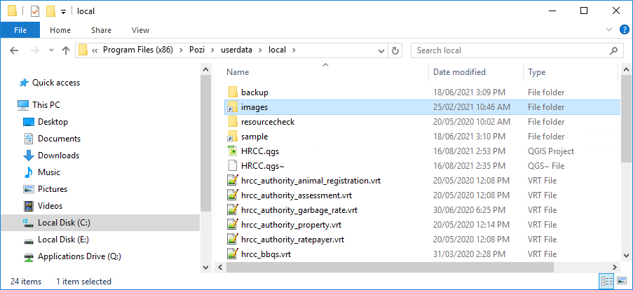

Pozi can display and link to images and documents within internal networks and on the web.

You can configure Pozi Server to access internal files that stored on a network drive by setting up a Windows symbolic link (symlink).

In this example, Pozi Server is configured to access any file within the organisation's image library, which is located at `\\HRCCSVRFILE01\shared\Images`.

Open a command prompt in [administrator mode](https://www.howtogeek.com/194041/how-to-open-the-command-prompt-as-administrator-in-windows-10/), and enter the following:

```
mklink /D "C:\Program Files (x86)\Pozi\userdata\local\images" "\\HRCCSVRFILE01\shared\Images"
```

(Note that the `local` folder is used for all static content such as photos, even if other user data such as VRT files is stored in a folder based on the server name.)

{style="width:600px"}

This creates a virtual file path within the Pozi userdata folder to enable Pozi Server to access the network folder.

Now, any files that are located relative to the source folder can now be served by Pozi using `https://<servername>.pozi.com/images/` as the prefix.

For example:

* source file path: `\\HRCCSVRFILE01\shared\Images\Bridges\img_1001.jpg`
* new URL: `https://<servername>.pozi.com/images/Bridges/img_1001.jpg`

Update the image paths in the source data accordingly by prepending the URL prefix to any reference to the file name. This can be done within the data itself, or as a string expression if using a database view, VRT file or QGIS virtual field.

==- VRT Example

In this example, the `bridges` dataset contains a field name called `image_file_name` which is populated with values like `img_1001.jpg`. The customised query (in SQLite format) uses a string expression to add a new field called `photo` containing the full image URL.

```xml bridges.vrt
<?xml version="1.0" encoding="UTF-8"?>
<OGRVRTDataSource>
    <OGRVRTLayer name="bridges">
        <SrcDataSource>\\gis\layers\assets\bridges.tab</SrcDataSource>
        <SrcSQL dialect="sqlite">
            select
                *,
                'https://<servername>.pozi.com/images/Bridges/' || image_file_name as photo
            from bridges
        </SrcSQL>
    </OGRVRTLayer>
</OGRVRTDataSource>
```

==-
