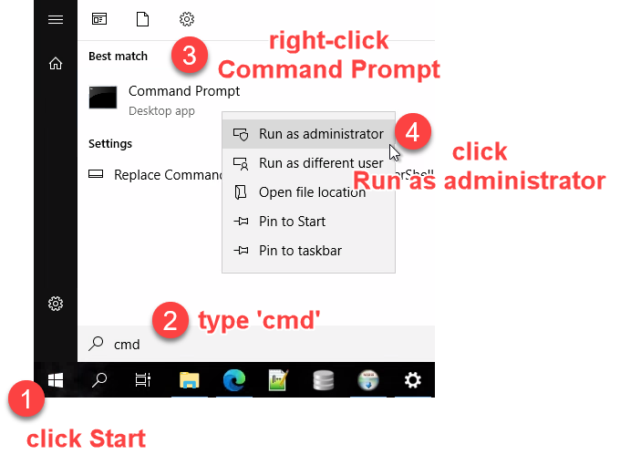
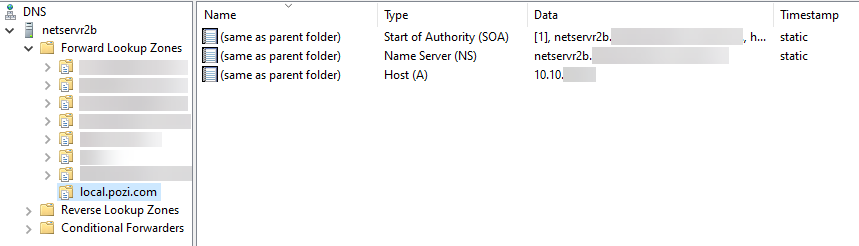

# Pozi Server

Pozi Server is the software in the Pozi Enterprise suite that enables internal datasets to be served to Pozi users within the organisation’s network.

Pozi Server is installed on premise, enabling it to serve local data directly to an internal user's browser without any data leaving the network. For users to access these datasets, they must be connected to the network, either directly or via a VPN.

With Pozi Server installed and configured, the Pozi web application can access internal data in the same way it accesses external APIs from other providers (eg, DataVic, data.gov.au, HERE, ArcGIS Online, various government web services, etc). The Pozi web application aggregates internal and external data in the browser in a seamless experience for staff.

**Pozi Enterprise** sites utilise their internal network for connections to private data sources. **Pozi Enterprise Cloud** sites utilise Azure Active Directory to handle these connections.

## How Pozi Server Works

Pozi Server is configured on the network with DNS rules that enable local users to access its API via a dedicated URL (typically `local.pozi.com`).

* when a user outside the organisation's network uses Pozi, any request to `local.pozi.com` quietly fails because it's not a valid endpoint on the internet (however any data from any public data sources will load in the app as normal)

{style="width:600px"}

* when a user inside the client's network uses Pozi, any request to `local.pozi.com` is directed by the local DNS rules to the internal server on which Pozi Connect Server is installed, and Pozi Connect Server responds with the requested data
* IT managers maintain control over internal user access to Pozi Connect Server by configuring the network DNS and firewall rules. For example, access to Pozi Server can be restricted for specific users or groups of users with a group policy or firewall rules that blacklists the `local.pozi.com` endpoint

By following these step-by-step instructions, you can install and configure Pozi Server on your network.

## Prerequisites

Prior to installation, ask your network administrator to set up two domain user accounts.

**Support Account**

* example name: `PoziSupport`
* read-only permissions on GIS file locations
* trusted read-only user of GIS database and any relevant corporate databases
* **local admin on server**
* **access for remote support by Pozi staff**
* internet access

**Service Account**

* example name: `PoziService`
* read-only permissions on GIS file locations
* trusted read-only user of GIS database and any relevant corporate databases
* **permissions for running scheduled tasks**
* **credentials must never expire**
* internet access (needed to communicate with connect.pozi.com for software updates)

Provide these credentials to your Pozi support contact, along with any instructions for remote access.

## Download and Install

1. download the [Pozi Connect Server installer](https://connect.pozi.com/installer/PoziConnectInstaller.exe)
2. run installer and follow prompts

==- Is it called **Pozi Server** or **Pozi Connect Server**?

The Pozi Server application is often referred to as "Pozi Connect Server". This name came about from our attempt to combine our two on-premise applications, *Pozi Connect* and *Pozi Server*, into one application. We have since abandoned that approach, but the hybrid name persists in the Pozi Server interface and documentation.

***Pozi Server*** (what this page is about) is the API that the Pozi web app uses for accessing the local data. It runs as a Windows service (PoziConnectServer), and auto-updates with the help of the Updater (PoziConnectUpdater) service.

***[Pozi Connect](/pozi-connect/)*** is the desktop application used by Victorian municipalities for generating property data change reports (M1s). It is distributed as a Windows installer, and councils are notified by email when there are new versions available to download and install.

==-

### Optional Setup

==- Useful supplementary software

* [Notepad++](https://notepad-plus-plus.org/downloads/)
* [JSON Viewer browser extension](https://chrome.google.com/webstore/detail/json-viewer/gbmdgpbipfallnflgajpaliibnhdgobh/)
* [TAD Viewer](https://www.tadviewer.com/) for previewing CSV files
* [DB Browser for SQLite](https://sqlitebrowser.org/dl/)

==- Useful desktop preparation

Desktop shortcuts:

* Pozi webpage shortcuts
  * live site: https://sitename.pozi.com/
  * staging/testing site: https://staging.pozi.com/master/#/site[sitename]/
  * config page: https://staging.pozi.com/master/#/site[sitename]/config[true]/preview[true]/
  * Pozi Server: https://local.pozi.com/
  * Admin Guide: https://pozi.com/admin-guide/
* GIS data folder
* Pozi folder: `C:\Program Files (x86)\Pozi`
* GDAL Shell:`C:\Program Files (x86)\Pozi\server\pipeline\.shell.cmd`
* Pozi Server log: `C:\Program Files (x86)\Pozi\server\server.log`
* QGIS Server log:`C:\Program Files (x86)\Pozi\server\iis\logs\qgis_server.log`

Pin to taskbar:

* Windows > Services
* Windows > IIS
* QGIS Desktop

File associations:

* `.config` > Notepad++
* `.sld` > Notepad++
* `.vrt` > Notepad++

==-

## Enable permissions on `userdata` folder

!!!

The instructions below assume that Pozi Server has been installed in the default location. If it has been installed elsewhere, substitute your path in place of `C:\Program Files (x86)\Pozi` in all subsequent steps.

!!!

The `C:\Program Files (x86)\Pozi` folder will be created by the installation process with limited permissions for editing. To enable your user account to make changes within the userdata folder, do the following:

1. in Windows Explorer, navigate to `C:\Program Files (x86)\Pozi`
2. right click `userdata` folder
3. Properties > Security > Edit > Add > Locations > select Entire Directory > OK
4. type part of the user name of the support account, then click Check Names
5. select your name and click OK, then click OK again
6. tick Modify / Allow, then click OK
7. click OK

## Prepare `userdata` folder

Sample data is included in the Pozi Server installation. To enable the Pozi Server service to access this data, create a Windows symlink in within the `Pozi\userdata\local` folder.

Open the command prompt in administrator mode:

Press Windows button > type `cmd` > right-click 'Command Prompt' > click 'Run as administrator' > click 'Yes'

{style="width:350px"}

Then run the following command:

```
mklink /D "C:\Program Files (x86)\Pozi\userdata\local\sample" "C:\Program Files (x86)\Pozi\server\data\local\sample"
```

The `local` folder corresponds to the subdomain that is configured as per the *DNS Configuration* instructions on this page. During the Pozi Server installation, the hosts file is updated to automatically resolve requests by the local user to  `local.pozi.com`. You can add other folders to correspond to any other subdomains you might want to use.

## DNS Configuration

During the installation, the PC's `hosts` file is updated to redirect any web traffic going to `local.pozi.com` to the local machine at `127.0.0.1`.

``` C:\Windows\System32\drivers\etc\hosts
127.0.0.1 local.pozi.com
```

This enables the local user to communicate with the Pozi Server instance.

To enable all PCs across the network to communicate with the Pozi Server instance, configure the network Domain Name System (DNS) so that any requests to `local.pozi.com` (or another subdomain of your choosing) resolve to the IP address of the server on which Pozi Server is installed.

Ask your network administrator to add the lookup (eg `local.pozi.com`) as a "forward lookup zone (primary)" then create an "A record with no hostname" (matches zone) to target server.



If your network setup uses OpenVPN, you may need to add the following line to the OpenVPN client configuration file:

`dhcp-option DOMAIN local.pozi.com`

To confirm the DNS is configured correctly, open a command prompt window and ping local.pozi.com. It should return a reply from the server on which Pozi Server is installed.

When this is established, you can remove the `local.pozi.com` entry in the hosts file. Use Notepad++ in Administrator mode to carry out the edit.

## SSL Certificates

Pozi Server communicates only on port 443, so all requests must be sent via https. The Pozi Server installation manages its own SSL certificate (`*.pozi.com`) to enable the local endpoint (eg `local.pozi.com`) to run securely.

If your organisation wants to use its own SSL certificate, place the `certificate.cer` and `certificate.key` files in the root Pozi folder, and restart the PoziConnectServer service.

Instead of configuring your DNS for `local.pozi.com`, you will use something like `poziserver.[yourorganisation].com`. Accordingly the subfolder you create inside the `userdata` folder (see [Prepare Userdata Folder](#prepare-userdata-folder) above) will need to be named to correspond with the subdomain (eg, `userdata\poziserver` instead of `userdata\local`).

Note: due to a current limitation in Pozi Server, it will still expect any static files (images, style files, resource check, pre-rendered GeoJSON, etc) to be in `userdata\local` regardless of whatever subdomain is being used for domain forwarding.

## Resource Check

The Pozi web app will be configured to look for a local file, known as a 'resource check', in order to know whether it has access to local data sources on your network. When Pozi detects that it is local, it knows to display a privacy notification and send subsequent `GetCapabilities` requests to know exactly what resources it has access to.

When Pozi doesn't get a valid response from a resource check, it assumes the user is public. Pozi will list only the layers it knows are public in the Layer Panel, and doesn't make any further attempt to contact any local resources.

### Configuration

Any internal URL that returns some response can be used as a resource check. The URL can reference a static file or a call to the QGIS Server. The instructions below describe setting up a static file, which provides a near-instant response, and can include a custom message for displaying in browser console that may be useful when troubleshooting.

Create a text file, and save it to `C:\Program Files (x86)\Pozi\userdata\local\resourcecheck\[yoursitename].json`

Example:

```json centralgoldfields.json
{"You are successfully connected to Pozi Server on cgs-smc01 on Central Goldfield's internal network"}
```

!!!

Note that the resource check must reside in the `userdata\local\` folder, even if the endpoint for the data is not in `local`.

!!!

The Pozi app now be configured to request a resource check via a URL, for example:

https://cgs-smc01.pozi.com/resourcecheck/centralgoldfields.json

## Scheduled Restarts

As a Windows server, Pozi Server is designed to be always on. However sometimes Windows services can fail and cause the sync and other functions to become unresponsive.

To minimise any extended outages, configure a nightly scheduled task to force Pozi Server to restart to ensure it remains responsive.

The task requires `Run with highest privileges` to be able to restart services as that is usually restricted to Administrators.

The script will log exceptions to RestartPoziConnectServer.log if they occur.

```powershell RestartPoziConnectServer.ps1
Try {
  Restart-Service PoziConnectServer
} Catch {
  "[$(Get-Date)] [ERROR] $($_)" | Add-Content RestartPoziConnectServer.log
}
```

{style="width:600px"}

## Testing New Versions

### Install Test or Dev Release

Edit the `C:\Program Files (x86)\Pozi\updater\updater-config.json` file as follows:

+++ Testing release

  ```
  {
    "serverManifestFile": "manifest-server-testing.json"
  }
  ```

+++ Dev release

  ```
  {
    "serverManifestFile": "manifest-server-dev.json"
  }
  ```

+++

Then stop and start the `PoziConnectUpdater` service. Monitor the `updater.log` file for progress.

### Revert to Production Release

To rollback to a previous version (e.g., from `v2.3.0-beta.3` on `dev` manifest to `v2.2.0` on `production` manifest):

1. revert the manifest file to the `production` version by emptying the contents
2. stop the `PoziConnectServer` service
3. rename the `server` folder
4. stop and start the `PoziConnectUpdater` service

This will revert from the higher numbered `dev` manifest version to the lower numbered production manifest version.

Important note: any additional folders under the `server` folder that have been set up for "clean" URL configuration for QGIS Server will not appear in the new installation, which would be catastrophic for those sites that are using it. They must be copied from the renamed server folder.

## Troubleshooting

==- PoziConnectServer doesn't appear in Windows Services

  Open PowerShell in Administrator mode, and enter the following:

  ```
  cd "C:\Program Files (x86)\Pozi\updater"
  .\nssm.exe install PoziConnectServer "C:\Program Files (x86)\Pozi\server\poziserver.exe"
  ```

==- Ping test fails

  If you encounter a message that says "The ping test to connect.pozi.com failed", ensure that your machine has permissions to connect to the `connect.pozi.com` domain.

==-
