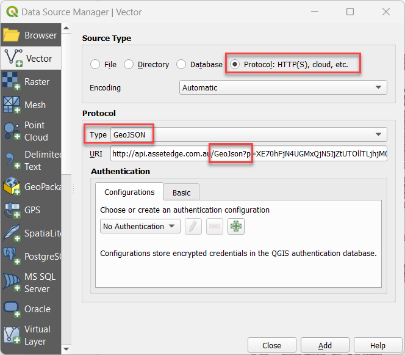
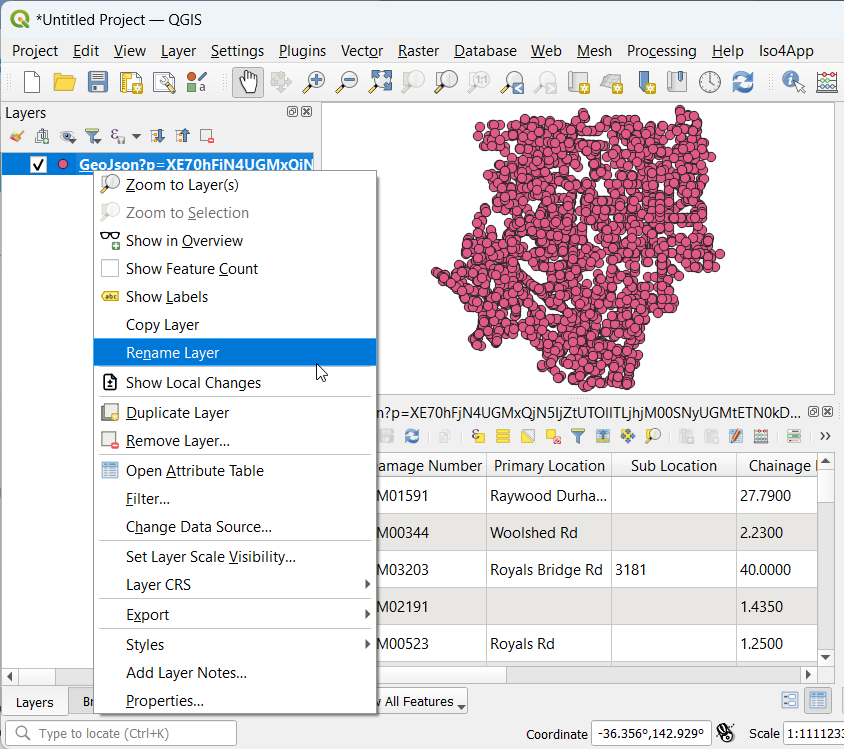

# Asset Edge

Asset Edge's [Reflect](https://www.assetedge.com.au/product/reflect---inspection-and-maintenance-management-software) inspection and maintenance management software is utilised by local and state governments across Australia.

## Configure Source in QGIS

1. QGIS > Layer > Add Layer > Add Vector Layer
2. Source Type: Protocol: HTTP(S), cloud, etc
3. Protocol Type: GeoJSON
4. URI: your Asset Edge Reflect API URL

Note: if the URL supplied to you contains `Kml3=`, replace it with `GeoJson=`.

{style="width:400px"}

Preview your new layer, and give it a user-friendly layer name.

{style="width:400px"}
