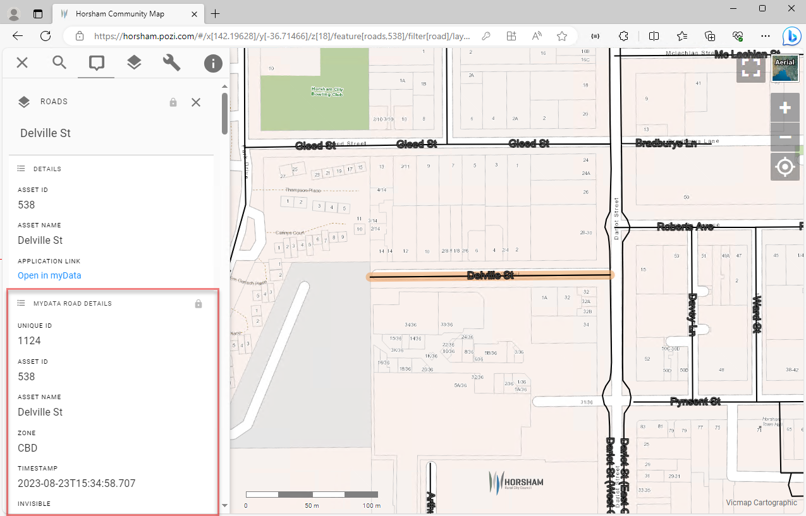

# Assetic myData

## Application Link

### Link-Out from Pozi

Assetic myData is a Windows application that supports linking via a URL protocol handler.

For any selected asset feature, Pozi users can click a link to launch the myData application which displays the asset's details.


An example link for myData looks like this:

[mydata://action=goto&assetCategory=Buildings&assetID=BD0021](mydata://action=goto&assetCategory=Buildings&assetID=BD0021)

For any PC on which a URL protocol handler has been installed, clicking this link will launch the myData application.

+++ QGIS Configuration

Layer Properties > Fields > Field Calculator > Create virtual field:

* Output field name: `Application Link`
* Output field type: `Text (string)`
* Expression:

```
'<a href="mydata://action=goto&assetCategory=Bridges&assetID='||Asset_ID||'" target="_blank" >Open in myData</a>'
```

For more information, see the instructions for working with [virtual fields](../qgis/configuring-layers#virtual-fields).

!!! The `mydata` protocol

Because the `mydata` URL prefix is a non-standard link, it is whitelisted within the Pozi application so that it can be displayed as a clickable link. If you're using the examples on this page as the basis for setting up a new protocol handler, contact Pozi Support to have it added to the Pozi whitelist.

!!!

+++ VRT Configuration (Legacy)

An example configuration in the VRT file is as follows:

```xml
<?xml version="1.0" encoding="UTF-8"?>
<OGRVRTDataSource>
    <OGRVRTLayer name="Buildings">
        <SrcDataSource>\\nhillDB2\MapData\Assets\Building\Building.TAB</SrcDataSource>
        <SrcSQL dialect="sqlite">
            select
                *,
                '&#60;a href="mydata://action=goto&#38;assetCategory=Buildings&#38;assetID=' || Asset_ID || '" target="_blank" &#62;Open in myData&#60;/a&#62;' as "Application Link"
            from Building
        </SrcSQL>
    </OGRVRTLayer>
</OGRVRTDataSource>
```

!!!note

Some of the HTML link text characters (eg "`<`") require replacement codes (eg "`&#60;`") to avoid breaking the XML format of the VRT file.

!!!

+++

==- Supported Asset Categories

* `Buildings`
* `Bridges`
* `Civil`
* `Culverts`
* `Drains`
* `FleetPlantAndEquipment`
* `Kerbs`
* `ParkInfrastructure`
* `Parks`
* `Pathways`
* `Pits`
* `PlayEquipment`
* `Playgrounds`
* `Runways`
* `SealedRoads`
* `StreetFurniture`

==-

## Data Link

When a user selects an asset feature in the Pozi map, the feature's `Asset_ID` value can be used to look up details for that feature from a *child* dataset, such as a non-spatial table of asset, maintenance or inspection details.



+++ QGIS Configuration

Add the non-spatial myData table to your QGIS project, enable it for WFS, and add the following keyword metadata:

Layer Properties > QGIS Server > Keyword list:

```
parent=Roads, parameter=EXP_FILTER=assetID in ('[Asset_ID]'), promoteDetails=true
```

Assumptions in this example:

- the parent spatial table is named `Roads`
- the id field in the parent spatial table is named `Asset_ID`
- the id field in the non-spatial myData table is named `assetID`
- if there is only one record per asset in the non-spatial table, it is useful to use `promoteDetails=true` to display the details automatically when the parent feature is selected

Adjust accordingly if your data differs.

+++ VRT Configuration (Legacy)

For integrations that don't use QGIS Server, the parent-child data lookup can be added by Pozi Support within the site's configuration.

#### Site Configuration

```json Footpath Inspections
{
  "title": "Footpath Inspections",
  "type": "GeoJSON",
  "parent": "Footpaths",
  "showInLayerControl": false,
  "localDataSource": true,
  "ResourceCheck": "https://local.pozi.com/resourcecheck/hindmarsh.json",
  "config": {
    "spatial": {
      "loader": "geojson",
      "url": "https://local.pozi.com/ogr?source=hsc_assets_inspections.vrt&options=-where|AssetID in ('[Asset_ID]')",
      "label": "InspectionNameAndDate",
      "id": "ID"
    }
  }
}
```

#### VRT Configuration

```xml hsc_assets_inspections.vrt
<?xml version="1.0" encoding="UTF-8"?>
<OGRVRTDataSource>
	<OGRVRTLayer name="Inspections">
		<SrcDataSource>ODBC:DRIVER={SQL Server};SERVER=NHILLDB2;DATABASE=myDataProduction,InspectionView</SrcDataSource>
		<SrcSQL dialect="sqlite">
		    select
			    *,
				InspectionName + ' (' + cast ( cast ( ScheduledDueDate as date ) as varchar ) + ')' as InspectionNameAndDate
			from InspectionView
			order by ScheduledDueDate desc
		</SrcSQL>
		<GeometryType>wkbNone</GeometryType>
	</OGRVRTLayer>
</OGRVRTDataSource>
```
