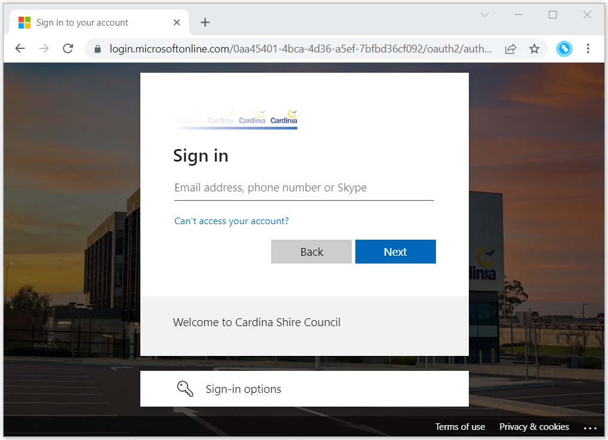

# Azure AD Application Proxy

*Azure AD integration is a feature of the **Pozi Enterprise Cloud** offering.*

Pozi's [Azure AD Application Proxy](https://azure.microsoft.com/en-au/services/active-directory/) integration enables your organisation's staff and other authorised users to access internal data sources in Pozi without needing to be connected to your network.

{style="width:500px"}

## How it works

1. user visits the dedicated Pozi Enterprise address (eg `cardinia.enterprise.pozi.com`)
2. Pozi app sends a request to client's MS App Proxy endpoint (eg `https://pozi-cardiniavicgovau.msappproxy.net/resourcecheck/cardinia.json`)
3. if user is signed in to their Microsoft account, Pozi continues to load, and the user will have access to the internal datasets configured for Pozi within the organisation's app proxy

If the user is not already logged in, the browser is redirected to the Microsoft login page.

{style="width:600px"}

Once signed in, users will have access to internal datasets for as long their Microsoft account remains logged in.

### Permissions

Whether a user can access private datasets is based on whether the user is given permission by the organisation to access the MS App Proxy endpoint that is dedicated for Pozi.

As long as the staff member or other authorised user has permission to access the MS App Proxy endpoint ( eg `https://pozi-cardiniavicgovau.msappproxy.net/`), then they will have access to the internal datasets that have been configured within Pozi.

### URL

Users use a separate URL that enforces a login to Azure Active Directory before the browser loads the Pozi site.

Example:

* Public URL: `https://<sitename>.pozi.com/`
* Staff URL: `https://<sitename>.enterprise.pozi.com/`

## Configuration

### Azure Add App Proxy

Microsoft documentation: https://docs.microsoft.com/en-us/azure/active-directory/app-proxy/application-proxy-add-on-premises-application#add-an-on-premises-app-to-azure-ad

* Azure Application Proxy to point to https://local.pozi.com/ (or other previously configured DNS forward address)
* ensure "Pre Authentication" is Azure Auth, not passthrough

Other settings:

{style="width:600px"}

When configured correctly, a request from a logged-in user to URL (for example)...

`https://pozi-cardiniavicgovau.msappproxy.net/resourcecheck/cardinia.json`

...should return the same response as a local request to...

`https://local.pozi.com/resourcecheck/cardinia.json`

Ensure it doesn't return a response to a non-logged-in or anonymous user.

### Azure Add App Registration

* Set Pozi up in Azure as a registered app (admin privileges required): [https://docs.microsoft.com/en-us/azure/active-directory/develop/howto-create-service-principal-portal](https://docs.microsoft.com/en-us/azure/active-directory/develop/howto-create-service-principal-portal#register-an-application-with-azure-ad-and-create-a-service-principal)
* Record the Application id (also known as as client id) as well as tenant id

#### Authentication
* Add the App Proxy URL to `Redirect URIs` to the `Web` section. E.g.:
  * `https://pozi-cardiniavicgovau.msappproxy.net`
* Add the following `Redirect URIs` to the `Single-page application` section:
  * `https://<sitename>.enterprise.pozi.com/*`. Note: the wildcard is required
  * `https://staging.pozi.com/*` (for testing/debugging)
  * `http://localhost:3000/*` (for development)
  * If needed, add any extra URIs that the client uses (e.g. `https://cardinia-qgis.enterprise.pozi.com/*`)
* In `Implicit grant and hybrid flows`: select both `Access tokens` anda `ID tokens`
* In `Advanced settings`: Set `Allow public client flows` to `No`

In order for Pozi to work properly, the Redirect URIs must be configured with wildcards, like: `https://cardinia.enterprise.pozi.com/*` .
If the UI in `Single-page application` does not allow this, it may be possible to manually override this in the `Manifest`. Change the section `ReplyUrlsWithType` in a similar way to the following:

```
    "replyUrlsWithType": [
        {
            "url": "https://staging.pozi.com/*",
            "type": "Spa"
        },
        {
            "url": "http://localhost:3000/*",
            "type": "Spa"
        },
        {
            "url": "https://next.enterprise.pozi.com/*",
            "type": "Spa"
        },
        {
            "url": "https://pozicloudserver-teampozi.msappproxy.net/",
            "type": "Web"
        }
    ],
```

#### API Permissions
* Give Pozi the following permissions:
  - API/Permissions Name: `User.Read`, Type: `Delegated`, Admin consent required: `No`. This should allow Pozi to determine access based on a user's role(s).

### Site URL

Using `<sitename>.enterprise.pozi.com` forces user to authenticate before proceeding to the Pozi site. These users will gain access to the private datasets.

Public users should continue to use `<sitename>.pozi.com`. They will not be prompted to authenticate, and they will have access to only public data.
