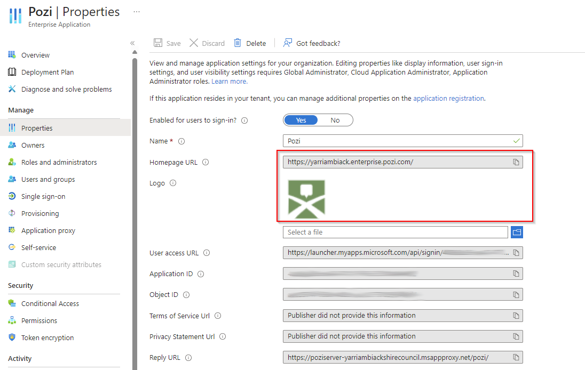
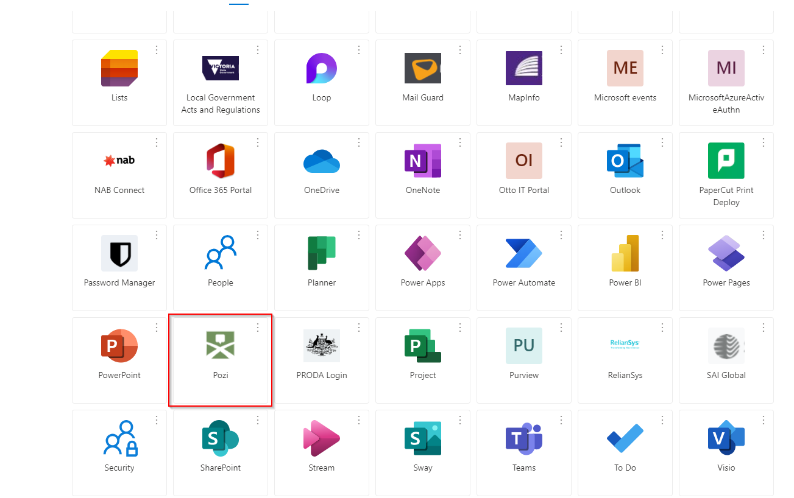

# Azure AD Application Proxy

*Azure AD integration is a feature of the **Pozi Enterprise Cloud** offering.*

Pozi's [Azure AD Application Proxy](https://azure.microsoft.com/en-au/services/active-directory/) integration enables your organisation's staff and other authorised users to access internal data sources in Pozi without needing to be connected to your network.

{style="width:500px"}

## How it works

1. user visits the dedicated Pozi Enterprise address (eg `<sitename>.enterprise.pozi.com`)
2. Pozi app sends a request to client's MS App Proxy endpoint (eg `https://poziserver-<clientname>.msappproxy.net/pozi/qgisserver/wfs3.json`)
3. if user is signed in to their Microsoft account, Pozi continues to load, and the user will have access to the internal datasets configured for Pozi within the organisation's app proxy

If the user is not already logged in, the browser is redirected to the Microsoft login page.

{style="width:600px"}

Once signed in, users will have access to internal datasets for as long their Microsoft account remains logged in.

### Permissions

Whether a user can access private datasets is based on whether the user is given permission by the organisation to access the MS App Proxy endpoint that is dedicated for Pozi.

As long as the staff member or other authorised user has permission to access the MS App Proxy endpoint ( eg `https://poziserver-<clientname>.msappproxy.net/pozi/`), then they will have access to the internal datasets that have been configured within Pozi.

### Site Url

Using `<sitename>.enterprise.pozi.com` enables a user to be authenticated before proceeding to the Pozi site. These users will gain access to the private datasets.

Public users should continue to use `<sitename>.pozi.com`. They will not be prompted to authenticate, and they will have access to only public data.

**Example**:

* Public Url: `https://<sitename>.pozi.com/`
* Staff Url: `https://<sitename>.enterprise.pozi.com/`

## Configuration

See the [Azure AD section](/admin-guide/installation/entra-id) in the Installation Guide.

## Azure Enterprise Application

Pozi can be set up as an Azure Enterprise Application for an organisation. This will enable end users to access the app via a shortcut on both the [Microsoft My Apps](https://myapplications.microsoft.com/) page and the [Microsoft 365 Apps](https://www.microsoft365.com/apps) page.

To create an Azure Enterprise Application, follow these steps.

* Navigate to `Enterprise applications` in the Azure Portal.
* Click to add a `New application`.
* Click `Create your own application`.
* Add "Pozi" as the name.
* Select `Integrate any other application you don't find in the gallery (Non-gallery)`.
* Push the `Create` button.
* Navigate to the `Properties`, and fill the form much like the image below.

{style="width:600px"}

Your new Pozi app will appear along your other corporate apps.

{style="width:600px"}
