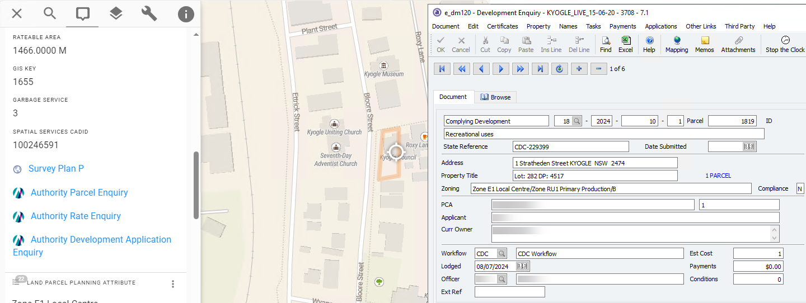

# Civica Authority

Civica [Authority](https://www.civica.com/en-au/product-pages/enterprise-management-software/) is a enterprise management software solution designed to support local governments by providing integrated tools for tracking land records, ownership details, zoning regulations, and valuation data.

## Legacy Authority

### Link-Out

Pozi enable users to launch the Authority application from a property selection to view further information or trigger workflows.

The following examples show the link format that can be used in a standard link (using [virtual fields](/admin-guide/qgis/configuring-layers.md#virtual-fields)) or a [link-out](/admin-guide/link-outs/).

Pozi recognises the `aul:` protocol prefix as a valid endpoint and makes the link clickable.

#### Prior to Authority 7.1

- `aul:event=runCommand&command=/f rtenq filter "auprparc.pcl_num=123"`
- `aul:event=runCommand&command=/f prenq filter "auprparc.pcl_num in (123,456,789)"`

#### Authority 7.1

- `aul:event=runCommand&command=/f rtenq -f pcl_num 123 map`
- `aul:event=runCommand&command=/f prenq filter auprparc.pcl_num=123`

### Link-In

Contact us for information regarding how to configure an ASPX page to launch Pozi.

---

## Authority Altitude

*Coming soon*

---
