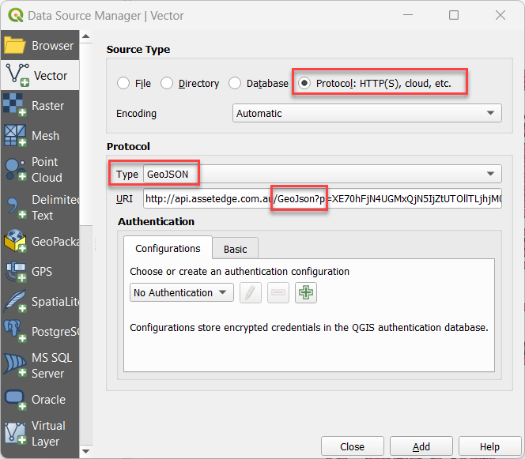
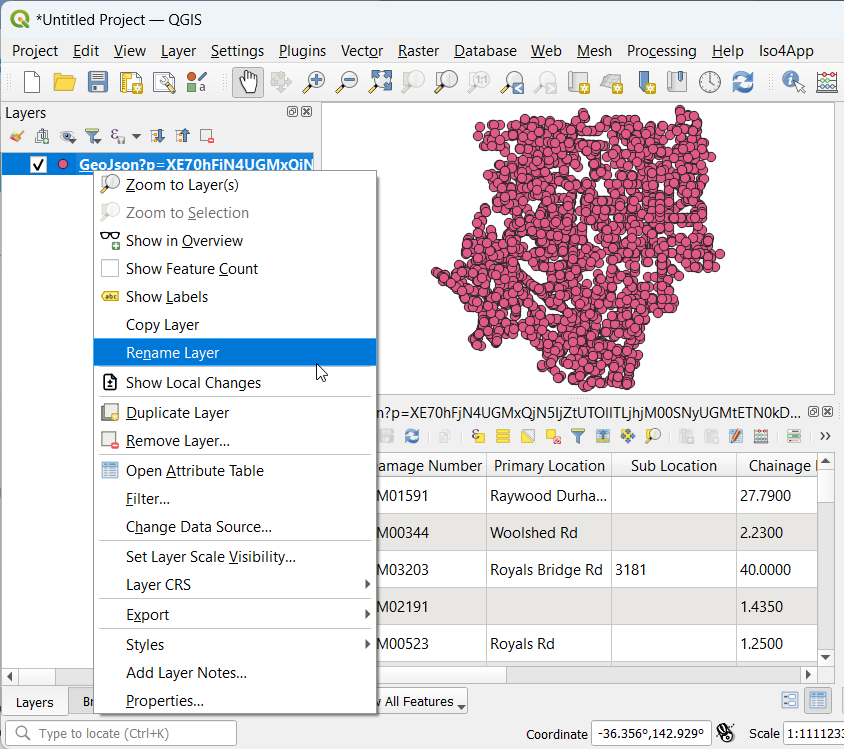

# Civica Reflect

Civica [Reflect](https://www.civica.com/en-au/product-pages/reflect/) (formerly Asset Edge Reflect) is an inspection and maintenance management solution is utilised by local and state governments across Australia.

## Configure Source in QGIS

1. Layer > Add Layer > Add Vector Layer
2. Source Type: Protocol: HTTP(S), cloud, etc
3. Protocol Type: GeoJSON
4. URI: your dataset URL

!!!

Since October 2024, the Reflect API URL has changed from `https://api.assetedge.com.au` to `https://api.civicagov.com`.

!!!

Note: if the URL supplied to you contains `Kml3=`, replace it with `GeoJson=`.

{style="width:400px"}

Preview your new layer, and give it a user-friendly layer name.

{style="width:400px"}

Don't forget to enable the layer for WFS to allow users to interact with the layer via the table view and search box.
