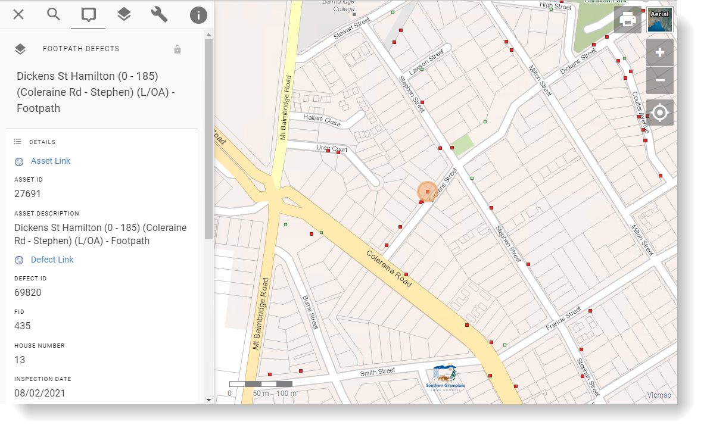

# Conquest

[Conquest](https://www.conquest-solutions.com.au/) is a suite of tools to assist organisations with corporate asset management.

{style="width:800px"}

## Application Link

### Link-Out from Pozi

To generate these links, see the instructions for working with [virtual fields](../qgis/configuring-layers#virtual-fields).

#### Conquest Desktop

``` Asset Example
conquest://link.conquest.live/?objectType=Asset&objectId=44930
```

#### Conquest On-Premise Web Client

``` Asset Example
http://conquest/Link.aspx?Connection=Conquest&AssetID=13647
```

``` Defect Example
http://conquest/Link.aspx?Connection=Conquest&DefectID=39582
```

#### Conquest Cloud

``` Asset Example
https://southerngrampians.conquest.live/Link.aspx?Connection=Conquest+Cloud+Southern+Grampians+Production&AssetID=14196
```

``` Defect Example 
https://southerngrampians.conquest.live/Link.aspx?Connection=Conquest+Cloud+Southern+Grampians+Production&DefectID=46164
```
