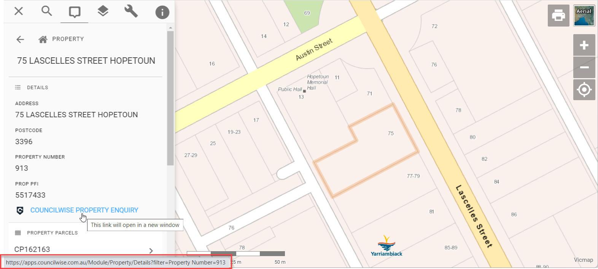

# CouncilWise

## Link-Out

Properties in Pozi are configured with a link that is dynamically populated with the property number.

{style="width:800px"}

Property example:

- https://apps.councilwise.com.au/Module/Property/Details?filter=Property%20Number=913
- https://apps.councilwise.com.au/Module/Property/Details/913

Other examples:

- https://councilwise-test.councilwise.com.au/Module/Infringement/Details/18
- https://councilwise-test.councilwise.com.au/Module/RegulatedEntities/Details/29
- https://councilwise-test.councilwise.com.au/Module/Associates/Details/21
- https://councilwise-test.councilwise.com.au/Module/FireAbatement/Details/1
