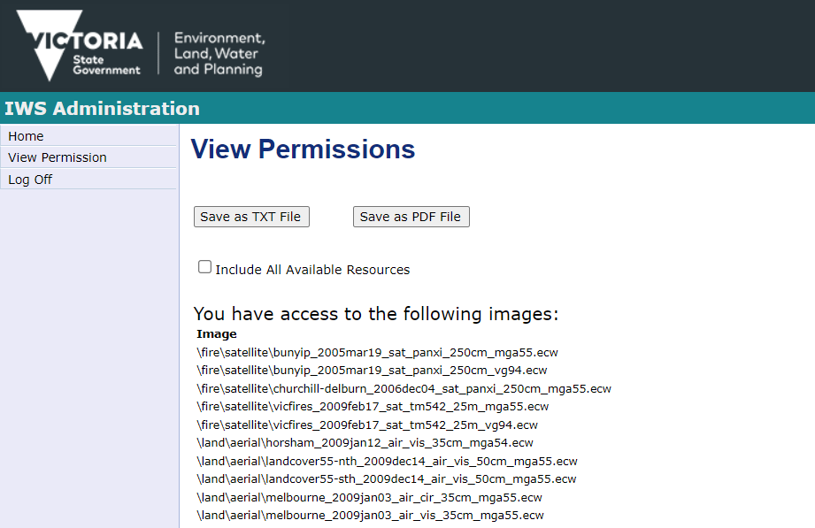

# DEECA Web Services

## Image Web Server

### New IWS

[IWS Viewer](https://iws.maps.vic.gov.au/erdas-iws/viewer/index.html)

#### Catalogues

- [WMS](https://iws.maps.vic.gov.au/erdas-iws/ogc/wms/RDP?SERVICE=WMS&REQUEST=GetCapabilities)
- [WMTS](https://iws.maps.vic.gov.au/erdas-iws/ogc/wmts/RDP?SERVICE=WMTS&REQUEST=GetCapabilities)

#### Credentials

Your DataShare account provides access to your organisation's IWS layers.

If you haven't already, sign up for a DataShare account using an email address that belongs to your organisation, ideally a generic one like gis@example.com. Send your DataShare username and password to support@pozi.com to be added to the proxy service.

​Your username and password are not exposed to the public at all. They reside only on Pozi's proxy server which applies the credentials to each image request that passes through the server. The communication between our proxy server and the IWS is private, so your username and password remain secret.

### Legacy IWS

*The legacy IWS will be disabled in late April 2023.*

Aerial imagery acquired in through DELWP's Coordinated Imagery Programme (CIP) is available for use by contributing organisations via the DELWP [Image Web Server](https://www.land.vic.gov.au/maps-and-spatial/imagery/about-image-web-server) (IWS).

Instructions for publishing IWS imagery layers in Pozi:

1. log in to [IWS Admin](http://images.land.vic.gov.au/iwsadmin/)
2. click View Permissions
3. copy the name of the image(s) to be published
4. paste into an email to support@pozi.com

{style="width:600px"}

If you don't have credentials to log in to IWS, contact coordinated.imagery@delwp.vic.gov.au. New clients for Pozi will also need to pass any new credentials on to support@pozi.com so that Pozi can be configured to access to the layers. (Client credentials will remain private within Pozi's web proxy service).

Credentials for the Image Web Server: http://services.land.vic.gov.au/MyProfile/

## MapShare

DEECA's MapShare service is powered by ArcGIS Online.

- [FeatureServer](https://enterprise.mapshare.vic.gov.au/server/rest/services)

There is a known limitation for *What's Here* queries whereby the service cannot return results when there are more than six input geometries (ie, an initial selection plus five point locations using Ctrl-click).

## Open Data Platform

### Catalogues

- [WMS](https://opendata.maps.vic.gov.au/geoserver/wms?SERVICE=WMS&REQUEST=GetCapabilities)
- [WFS](https://opendata.maps.vic.gov.au/geoserver/wfs?SERVICE=WFS&REQUEST=GetCapabilities)

### Legacy Catalogues

- [WMS](https://services.land.vic.gov.au/catalogue/publicproxy/guest/dv_geoserver/wms?SERVICE=WMS&REQUEST=GetCapabilities)
- [WFS](https://services.land.vic.gov.au/catalogue/publicproxy/guest/dv_geoserver/wfs?SERVICE=WFS&REQUEST=GetCapabilities)

## Vicmap Basemap

### Catalogue

- [WMTS](https://base.maps.vic.gov.au/service?SERVICE=WMTS&REQUEST=Getcapabilities)
