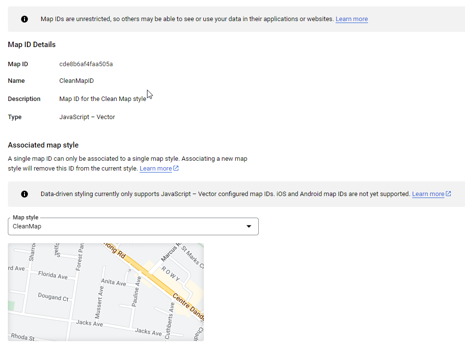

# Google Maps Platform

## Google Basemap

Google Maps offers high-quality basemap with a crisp design and comprehensive content. As the world's most popular basemap, users will feel right at home with Google Maps as a background map on which to view your orgnanisation's layers. If you're organisation has a Google Maps API key, you can use the Google Basemap in Pozi.

<iframe width="100%" height="500px" frameborder="0" scrolling="no" allow="fullscreen" src="https://kingston.pozi.com/#/x[145.13042]/y[-38.01680]/z[17]/layers[googlemaps]/"></iframe>

 

### Custom Map ID

You can configure a custom Google Map with only the features you want to see on the map. You can find your custom map ID [here](https://developers.google.com/maps/documentation/get-map-id).

 

## Google Street View

Google Street View is included by default in Pozi. You don't need to have your own Google Maps API key to use it.

<iframe width="100%" height="500px" frameborder="0" scrolling="no" allow="fullscreen" src="https://gleneira.pozi.com/#/x[145.05214]/y[-37.90750]/z[19]/feature[whatshere,145.05191244150686%20-37.90734218522966]/tab[info]/"></iframe>
