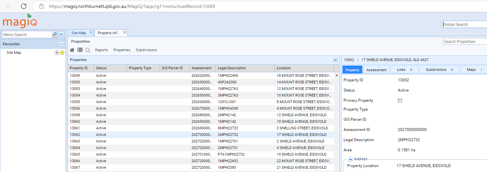
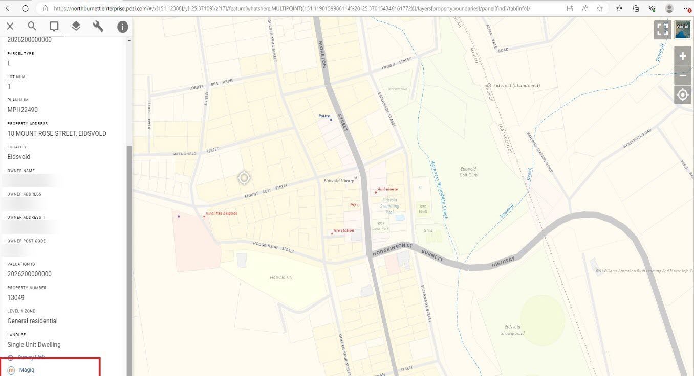

# MAGIQ

## Application Link

### Link-Out from Pozi

MAGIQ is a browser based application that supports linking via passing a URL from Pozi to MAGIQ.

For any selected property feature, Pozi users can click a link to launch the MAGIQ application which displays the properties details.



An example link for MAGIQ looks like this:

[https://magiq.northburnett.qld.gov.au/MagiQ/?app/rg11menu/loadRecord/13049](https://magiq.northburnett.qld.gov.au/MagiQ/?app/rg11menu/loadRecord/13049)

Update magiq.northburnett.qld.gov.au for your specific MAGIQ URL.

#### QGIS Configuration

Create a virtual field with the output field type of “Text” on your property boundary layer.

Layer Properties > Fields > Field Calculator > Create virtual field:

* Output field name: `MAGIQ Link`
* Output field type: `Text (string)`
* Expression:

```
'https://magiq.northburnett.qld.gov.au/MagiQ/?app/rg11menu/loadRecord/'||Property_Number
```

Update the MAGIQ URL and property number field with the relevant data for the specific site.


For more information, see the instructions for working with [virtual fields](../qgis/configuring-layers#virtual-fields).

Once a user selects a Property the link will display as a hyperlink.


