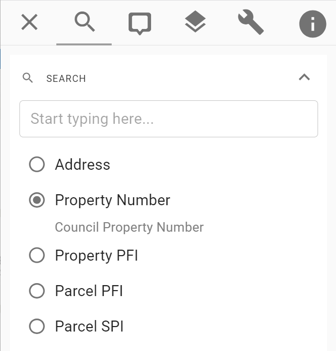

# Link In

The Pozi link-in enables other applications to launch Pozi and zoom to specific locations on the map.

This page outlines the URL parameters to launch a Pozi map to dynamically customise the map's location and display.

The URL parameters can be manually or programmatically constructed, or you can simply copy the URL of your Pozi session to capture and share its current state.

## Parameters

### Location by Search Parameter

{style="float:right;width:250px;margin:0px 40px;"}

Your Pozi site may be configured with search options for users to type in values for searching.

These search options can be accessed via a URL parameter.

`https://sitename.pozi.com/#/search[searchname,searchvalue]/`

Use the name of the search, convert to lower case, and remove any spaces or special characters. For example, if your search is called `Property Number`, use `propertynumber` as the search parameter name.

==+ Property Number Example

`https://mansfield.pozi.com/#/search[propertynumber,A7706]/`

==- Property PFI Example

`https://mansfield.pozi.com/#/search[propertypfi,45386823]/`

==- Parcel PFI Example

`https://mansfield.pozi.com/#/search[parcelpfi,5409508]/`

==- Parcel SPI Example

`https://mansfield.pozi.com/#/search[parcelspi,1\TP225210]/`

==-

### Location by Coordinates

The Pozi map will display centred at a specific location and zoom level.

https://frankston.pozi.com/#/x[145.12617]/y[-38.14357]/z[17]/

### Layer Display

Pozi will display the specified layer. Specify the layer name in lower case and with any spaces or underscores removed.

https://shepparton.pozi.com/#/layers[wastecollectionzones]/

Pozi also supports multiple layers being turned on.

https://cardinia.pozi.com/#/layers[communityinfrastructurelevy]/layers[localities]/

These links will continue to work as long as the layer names remain the same. If a layer name is changed in the future, that layer will fail to load but the map will still load, and any other layers that haven't changed will still display.

!!! Tip

Any Pozi link that you copy from the browser address bar will contain the `x`, `y` and `z` values for your current map view. If your intention is for the link you're sharing to display your entire region (ie, your site's default map view), remove the `x`, `y` and `z` parameters.

This will ensure that Pozi displays the whole region and automatically set the most appropriate zoom level based on the user's screen size.

!!!

### What's Here

Pozi will display the Info Panel results for the target point location or region.

#### Point Location

https://gleneira.pozi.com/#/x[145.05178]/y[-37.90975]/z[18]/feature[whatshere,POINT(145.05178%20-37.90975)]/

#### Region

https://strathbogie.pozi.com/#/x[145.56842]/y[-36.75206]/z[19]/feature[whatshere,POLYGON((145.56777%20-36.75196%2C145.568832%20-36.75147%2C145.56863%20-36.75224%2C145.56777%20-36.75196))]/

### Feature Selection

Given a layer name and feature id, Pozi will highlight the feature and display its info results.

https://latrobe.pozi.com/#/layers[skateparks]/feature[skateparks,4]/

If the feature location is known (for example, if you have coordinates in addition to the feature id), specify the coordinates and a suitable zoom level.

https://latrobe.pozi.com/#/x[146.40171]/y[-38.23845]/z[18]/layers[skateparks]/feature[skateparks,4]/

### Layer Filter

https://northerngrampians.pozi.com/#/filter[assets]/tab[layers]/

### Panel Focus

https://bendigo.pozi.com/#/tab[layers]/

### Location by Property Identifier (Legacy)

!!! Note

There is now a more robust method of linking to properties using a property number or PFI value. See [above](#location-by-search-parameter)

!!!

Pozi will zoom to a specific property and display info results for the location based on a property number.

https://northerngrampians.pozi.com/?propnum=1038143

Note:

* available for Victorian property numbers maintained in `prop_propnum` field in Vicmap Property
* available for Pozi Pro, Enterprise and Enterprise Cloud plans

Supported property identifiers:

- `propnum`
- `propertypfi`
- `parcelpfi`
- `parcelspi`

## Re-Use Pozi Browser Tab

When you're using a web application that links to Pozi, you may end up with multiple tabs of Pozi - one for each time you click on a link from the other application.

When configuring the links in your application, instead of using `target="_blank"` to open Pozi in a new tab, use `target="pozi"`. This will open a new tab on the first time you use it. As long as that tab stays open, any subsequent link-ins to Pozi will reuse the same browser tab.

[Reference](https://superuser.com/questions/304285/i-want-a-hyperlink-to-open-a-browser-tab-then-all-subsequent-link-clicks-go-to)

Note that only the [Property Identifier](#location-by-property-identifier-legacy) format (above) link-in is currently supported (example `?propnum=xxx`). Other link-in formats are currently unable to update the re-used browser tabs.

### Test

#### Initial Link

```
<a href="https://westwimmera.pozi.com/?propnum=1018753" target="pozi">Test link 1</a>
```
<a href="https://westwimmera.pozi.com/?propnum=1018753" target="pozi">Test link 1</a>

#### Re-Use

```
<a href="https://westwimmera.pozi.com/?propnum=1018530" target="pozi">Test link 2</a>
```
<a href="https://westwimmera.pozi.com/?propnum=1018530" target="pozi">Test link 2</a>
