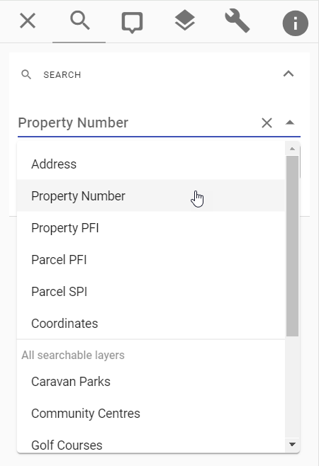

# Link Ins

Pozi link-ins enable external applications to launch Pozi and zoom to specific locations on the map.

URL parameters are used to launch a Pozi map to control the Pozi map's location and display.

The URL parameters can be manually or programmatically constructed, or you can simply copy the URL of a Pozi session from your browser's address bar to capture and share its current state.

## Parameters

### Location by Coordinates

Centre and zoom the map on a specific location by adding `x`, `y` and `z` parameters to the URL.

https://frankston.pozi.com/#/x[145.12617]/y[-38.14357]/z[17]/

When the `x`, `y` and `z` parameters are not present, Pozi will display the site's default map view.

### Location by Search Parameter

{style="width:250px;margin:0px 40px;"}

Your Pozi site may be configured with standard search options for users to type in values for searching. (A 'standard' search is one that appears in the top section of the search drop-down menu.)

These standard search options can be accessed via a URL parameter.

`https://sitename.pozi.com/#/search[searchname,searchvalue]/`

Use the name of the search, convert to lower case, and remove any spaces or special characters. For example, if your search is called `Property Number`, use `propertynumber` as the search parameter name.

==+ Property Number Example

`https://mansfield.pozi.com/#/search[propertynumber,A7706]/`

==- Property PFI Example

`https://mansfield.pozi.com/#/search[propertypfi,45386823]/`

==- Parcel PFI Example

`https://mansfield.pozi.com/#/search[parcelpfi,5409508]/`

==- Parcel SPI Example

`https://mansfield.pozi.com/#/search[parcelspi,1\TP225210]/`

==-

### Layer Display

Pozi will display the specified layer. Specify the layer name in lower case and with any spaces or underscores removed.

https://shepparton.pozi.com/#/layers[wastecollectionzones]/

Pozi also supports multiple layers being turned on.

https://cardinia.pozi.com/#/layers[communityinfrastructurelevy]/layers[localities]/

These links will continue to work as long as the layer names remain the same. If a layer name is changed, Pozi will not load the layer.

!!! Tip

Any Pozi link that you copy from the browser address bar will contain the `x`, `y` and `z` values for your current map view. If your intention is for the link you're sharing to display your entire region (ie, your site's default map view), remove the `x`, `y` and `z` parameters.

This will ensure that Pozi displays the whole region and automatically set the most appropriate zoom level based on the user's screen size and resolution.

!!!

### What's Here

Pozi will display the Info Panel results for the target point location or region.

#### Point Location

https://gleneira.pozi.com/#/x[145.05178]/y[-37.90975]/z[18]/feature[whatshere,POINT(145.05178%20-37.90975)]/

#### Region

https://strathbogie.pozi.com/#/x[145.56842]/y[-36.75206]/z[19]/feature[whatshere,POLYGON((145.56777%20-36.75196%2C145.568832%20-36.75147%2C145.56863%20-36.75224%2C145.56777%20-36.75196))]/

### Feature Selection

Given a layer name and feature id, Pozi will activate the layer, select and highlight the target feature, zoom the map to it, and display its details in the Info Panel.

Example: link to a feature in the `Parks` layer where the `fid` field is `15`:

https://council.pozi.com/#/feature[parks.fid,15]/

This also works for datasets that are configured for What's Here or a custom search. Even though the layer may not be displayed in the layer panel, Pozi can still use feature link-ins to select and highlight the target feature.

https://council.pozi.com/#/feature[propertyandrating.land_id,1234797]/

Layers must be configured as [selectable](/admin-guide/qgis/configuring-layers.md#selectability) in QGIS for feature link-ins to work.

#### Multiple Features

Pozi also supports multiple feature link-ins.

Each feature can be specified in its own `feature` parameter.

https://council.pozi.com/#/feature[propertyandrating.land_id,1375426]/feature[propertyandrating.land_id,1375562]/

Alternatively, feature ids can be separated by a comma within a single `feature` parameter.

https://council.pozi.com/#/feature[propertyandrating.land_id,1375426,1375562]/
https://council.pozi.com/#/feature[playgrounds.fid,790,795,829]/

### Layer Filter

Launch Pozi with a filtered view of the available layers.

For example, show only the layers that are related to assets:

https://northerngrampians.pozi.com/#/filter[assets]/tab[layers]/

Only layers whose name or folder name contains "assets" will be displayed.

### Panel Focus

Launch Pozi with one of the five available panels displayed to the left of the map, using the `tab` parameter.

- `search`
- `info`
- `layers`
- `tools`
- `about`

Example: https://bendigo.pozi.com/#/tab[layers]/

### Specified Search

Launch Pozi with a specific search item. The specified search overrides the site's default search.

Use it in conjunction with `tab[search]` to act as a prompt for the user to start searching for the search you've specified.

https://frankston.pozi.com/#/tab[search]/search[roadresponsibility]/

The URL can also contain a value for the search. Users can pick from any of the result candidates.

https://frankston.pozi.com/#/tab[search]/search[roadresponsibility,seabrook]/

### Reload

When using Pozi as an embedded map in your web application, it can be useful for the application to update the Pozi iframe URL to reflect some change in the application's state.

For instance, if the application selects a different property, the Pozi URL can be updated to reflect the new property location.

Append the URL with `/reload[true]` to trigger a reload of the Pozi map.

- <a href="https://council.pozi.com/#/feature[propertyandrating.land_id,1234797]/reload[true]/" target="pozi">Test link 1</a>
- <a href="https://council.pozi.com/#/feature[propertyandrating.land_id,1350515]/reload[true]/" target="pozi">Test link 2</a>

### Location by Property Identifier (Legacy)

!!! Note

There is now a more robust method of linking to properties using a property number or PFI value. See [above](#location-by-search-parameter)

!!!

Pozi will zoom to a specific property and display info results for the location based on a property number.

https://northerngrampians.pozi.com/?propnum=1038143

Note:

* available for Victorian property numbers maintained in `prop_propnum` field in Vicmap Property
* available for Pozi Pro, Enterprise and Enterprise Cloud plans

Supported property identifiers:

- `propnum`
- `propertypfi`
- `parcelpfi`
- `parcelspi`

#### Re-Use Pozi Browser Tab

When you're using a web application that links to Pozi, you may end up with multiple tabs of Pozi - one for each time you click on a link from the other application.

When configuring the links in your application, instead of using `target="_blank"` to open Pozi in a new tab, use `target="pozi"`. This will open a new tab on the first time you use it. As long as that tab stays open, any subsequent link-ins to Pozi will reuse the same browser tab.

[!ref icon="" text="Learn more"](https://superuser.com/questions/304285/i-want-a-hyperlink-to-open-a-browser-tab-then-all-subsequent-link-clicks-go-to)

Currently, link-ins that attempt to update the map with a layer setting or feature selection require the `/reload[true]` parameter - see [Reload](#reload) above.

```
<a href="https://westwimmera.pozi.com/#/search[propertynumber,1018753]/reload[true]/" target="pozi">Test link 1</a>
<a href="https://westwimmera.pozi.com/#/search[propertynumber,1018530]/reload[true]/" target="pozi">Test link 2</a>
```

- <a href="https://westwimmera.pozi.com/#/search[propertynumber,1018753]/reload[true]/" target="pozi">Test link 1</a>
- <a href="https://westwimmera.pozi.com/#/search[propertynumber,1018530]/reload[true]/" target="pozi">Test link 2</a>

The exception is the [Property Identifier (Legacy)](#location-by-property-identifier-legacy) format link-in, which can update the selection without reloading.

```
<a href="https://westwimmera.pozi.com/?propnum=1018753" target="pozi">Test link 1</a>
<a href="https://westwimmera.pozi.com/?propnum=1018530" target="pozi">Test link 2</a>
```

- <a href="https://westwimmera.pozi.com/?propnum=1018753" target="pozi">Test link 1</a>
- <a href="https://westwimmera.pozi.com/?propnum=1018530" target="pozi">Test link 2</a>
