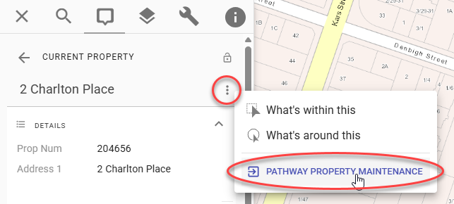
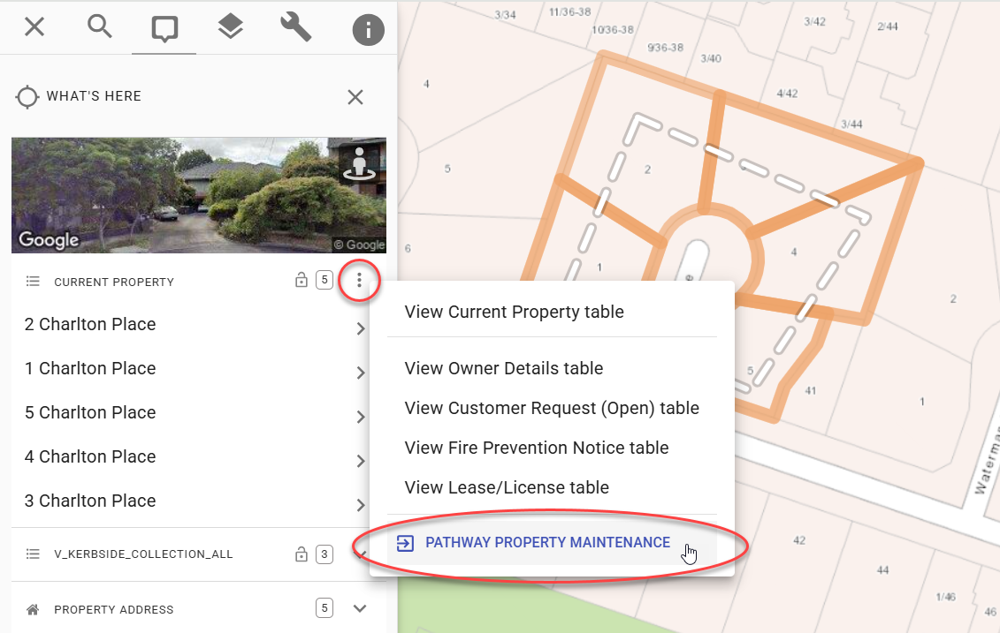

# Link Outs

Link-outs are a powerful way for Pozi to interact with external applications. From a selection of one or more features in the Pozi map, users can launch external applications to view further information or trigger workflows relating to the features.

{style="width:400px"}

Link-outs can be used in complex workflows where a user needs to select one or more features from the Pozi map for sending to the external application.

For example, users can use Pozi to trigger the generation of notification letters from their organisation's corporate property system by selecting the properties from the map and clicking the appropriate link-out option.

{style="width:600px"}

## Standard Links vs Link Outs

Link-outs differ to standard hyperlinks in the following ways:

| Standard hyperlink | **Link-out** |
| --- | --- |
| the link URL is obtained directly from a layer's pre-populated or [virtual](/admin-guide/qgis/configuring-layers.md#virtual-fields) field | the link URL is configured by the administrator in a layer's `linkOuts` keyword parameter|
| the link appears as an *attribute* in the selected feature's info panel | the link appears as an item in the options (three-dot) menu in the header of the results pane |
| the link relates to a single feature only | the link relates to *all* selected features |

The power of link-outs is their ability to generate a link that includes parameters for multiple selected features.

## Configuration

Link-outs are configured in the layer's metadata using the `linkOuts` keyword.

The keyword structure is as follows:

- `linkOuts=`
- link-out name as displayed to the user (eg Pathway Property Maintenance)
- `|`
- link-out URL (eg `pathway://pthprod/lpaf6000/pthlink?multiselect=1&`)
- `[` name of the field that contains the feature ids `]` (eg `[PropNum]`)

Example:

```
linkOuts=Pathway Property Maintenance|pathway://pthprod/lpaf6000/pthlink?multiselect=1&proptpklist=[PropNum]
```

Multiple link-outs can be configured by separating each one with a semi-colon.

```
linkOuts=Pathway Property Maintenance|pathway://pthprod/lpaf6000/pthlink?multiselect=1&proptpklist=[PropNum]; Pathway Customer Service Request Enquiry|pathway://pthprod/acrg1000/display?tpkacrrequ==[PropNum]
```

When a user selects multiple features in the Pozi map, the link-out URL might look like this, with the feature ids being separated by commas:

`pathway://pthprod/lpaf6000/pthlink?multiselect=1&proptpklist=101,102,103,104`

Notes:

- URLs can be standard web links (eg `https://`) or any application protocols supported by the user's browser (eg `pathway://`)
- specify the actual field name, not any field alias
- field names can't contain spaces - use a virtual field with an alternative name that doesn't include a space
- ensure that the field is exposed via WFS (ie, not [hidden](/admin-guide/qgis/configuring-layers.md#hide-fields))
