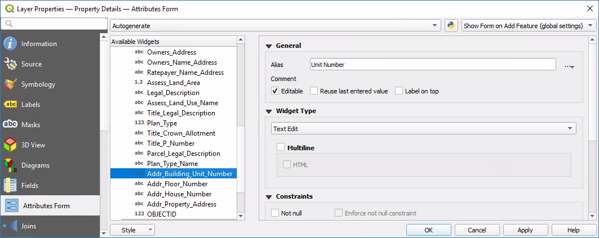
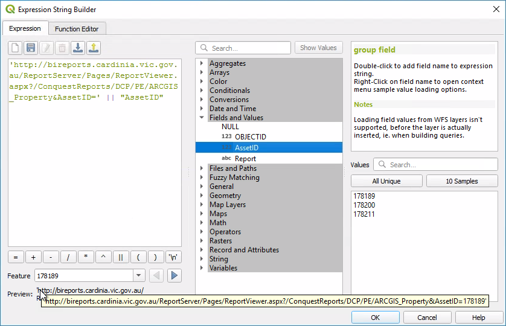
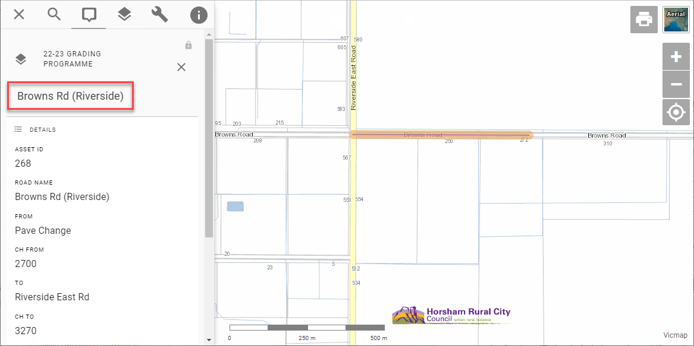

# Configuring Layers

## Adding Layers

Using your [existing QGIS project](managing-qgis-projects), you can add new layers to publish them to your users.

1. open your project file in QGIS
2. Layer > Add Layer > pick from vector, raster or other options
3. navigate to source (see note about file paths below)
4. Add
5. Close
6. Project > Save (`Ctrl` + `S`)

[QGIS Reference: Opening Data](https://docs.qgis.org/latest/en/docs/user_manual/managing_data_source/opening_data.html#opening-data)

!!! Note

If QGIS displays a question mark next to the layer name, it may indicate that QGIS needs a projection to be specified. Go to Layer Properties > Source > Assigned CRS, and pick a projection. See [here](https://groups.google.com/g/australian-qgis-user-group/c/xE8pV4gDKfA/m/mJYLm0-QAgAJ) for more information.

!!!

==- About layer file paths

When adding new file-based layers, use the layer's absolute file path (UNC) to ensure that the service under which the QGIS Server is running can recognise the path.

Typically your own user account will have certain drives mapped for convenience, so you might be used to working with data using file paths that refer to a drive letter (eg, `S:\` or `V:\`). However, the domain user account that runs QGIS Server often won't have these drives mapped.

A UNC path is an absolute path that is recognised by all user accounts, regardless of what drives are mapped on startup. An example UNC path might look like this:

* `\\ad.hrcc.vic.gov.au\shared\GIS\`
* `\\bs-intra\GIS\`

Add the UNC path of your GIS data folder as a *Favorite* in the QGIS Browser panel for easy access. Learn more [here](https://docs.qgis.org/latest/en/docs/user_manual/introduction/browser.html#favorites). Also add a shortcut to the UNC location on your PC desktop for extra convenience.

==- About layer names

Pozi does not currently support duplicate layer names within a site.

If you have two layers that share a name, even if they are maintained in separate QGIS projects, [alter the layer name](https://docs.qgis.org/latest/en/docs/user_manual/working_with_vector/vector_properties.html#source-properties) on one or both layers in the affected QGIS project(s) so that they are no longer the same.

Similarly, layer folder names must also be unique, and must not share a name with any layer within a site.

==-

Some common layer configuration tasks you can do in QGIS include:

* [change layer name](https://docs.qgis.org/latest/en/docs/user_manual/working_with_vector/vector_properties.html#source-properties)
* [filter data](https://docs.qgis.org/latest/en/docs/user_manual/working_with_vector/vector_properties.html#query-builder)
* [modify fields](https://docs.qgis.org/latest/en/docs/user_manual/working_with_vector/vector_properties.html#fields-properties)

!!!warning

Some changes may not be available immediately in Pozi. If you encounter an issue such as a recently added or renamed layer not loading, restart the IIS application pool on the server.

Windows > IIS > (select server) > Application Pools > PoziQgisServer > Recycle

{style="width:400px"}

!!!

<br>

## Publish as Vector Layer

Publishing a layer as a *vector layer* enables users to directly interact with map features. When a vector layer is turned on in Pozi, every feature from the source dataset is loaded in the browser, including all geometries and attributes. Users can make use of advanced functionality such as filtering and table view.

By default, QGIS Server does NOT expose layers as vectors. Evaluate the pros and cons of using vectors for your layer, and if appropriate, follow the directions below to enable it.

#### Advantages

* layers are fully interactive using Pozi's filter, report and table view functionality
* after the layer is loaded in the browser, the browser doesn't need to send further requests for the layer to the server every time the map moves
* the cursor changes when hovering over object to indicate the feature is clickable
* users can select an individual feature and display its details in Info Panel (without displaying results of features on other layers at the same location)

#### Disadvantages

* the browser can be easily overwhelmed when dealing with thousands of features or complex features with many vertices, resulting in slow map rendering
* not all QGIS styles are supported in Pozi for vector features
* only one vector feature can be selected at a time - info results are not displayed for any features that have been overlapped by another feature
* cannot directly use text expressions for labels (but you can still make use of virtual fields for creating generating custom label values)

As a guideline, use vectors only for layers with fewer than 5-10K features, or even fewer for layers with complex polylines or polygons.

### Enabling Vector Layer

1. Project > Properties > QGIS Server
2. `WFS capabilities > Published`: tick on for each layer to be published (or you can click `Select All` if all layers are required)
3. OK
4. Project > Save (`Ctrl` + `S`)

{style="width:500px"}

<br/>

## Styling Layers

Using QGIS, you can control many visual aspects of your layer. You may apply a common style for all the features in a layer 
([Single Symbol](https://docs.qgis.org/latest/en/docs/user_manual/working_with_vector/vector_properties.html#single-symbol-renderer)) or apply a thematic style that displays features according to any of its attributes ([Categorized](https://docs.qgis.org/latest/en/docs/user_manual/working_with_vector/vector_properties.html#categorized-renderer)).

When Pozi fetches a layer using WMS, QGIS Server renders the layer exactly as configured in QGIS. When using WFS, the rendering is done by Pozi in the browser, which can cause the layer to appear differently compared to QGIS for complex styles. 

### Styling for Vector Layers

For any layers that are to be made accessible to Pozi as fully interactive *vector* layers (ie, WFS-enabled), use only the supported styles specified below.

(If you need Pozi to display layers using a QGIS style that doesn't appear in the below lists of supported styles, consider disabling WFS to force Pozi to retrieve the layer via WMS, and thus using the QGIS Server renderer.)

==- Points

Supported marker symbols:

* Simple Marker
  * `square`
  * `circle`
  * `triangle`
  * `star`
  * `cross`
  * `x`

Note that SVG marker symbols are not supported, nor `diamond`, `cross2`, `cross_fill` symbols. Symbol rotation is not supported.

Suggested sizes:

* set size to `4mm` or greater enable to easier interaction for users in the browser
* set stroke to white, `0.5mm` or greater to provide separation from the background

==- Lines

Supported lines:

* Simple Line
  * Solid Line
  * No Pen
  * Dash Line
  * Dot Line
  * Dash Dot Line
  * Dash Dot Dot Line

Set line thicknesses to `1mm` or greater to enable users to more easily select line features.

==- Polygons

Supported fills:

* Simple Fill
  * Solid
  * No brush (see note below)
  * Cross
  * Diagonal X
* Point Pattern Fill

{style="width:250px"}

Note that the 'No brush' fill will prevent users from being able to select a polygon by clicking within the polygon. To enable users to select a polygon feature by clicking anywhere within it, use the 'Solid' fill, and set the opacity of the fill colour to a low or zero value.

==-

Point, line and polygon features can optionally be configured to display labels.

==- Labels

[QGIS Reference](https://docs.qgis.org/latest/en/docs/user_manual/working_with_vector/vector_properties.html#labels-properties)

Notes:

* label offsets and label buffer transparency are not supported
* text expressions in labels (eg, combining values from multiple fields, or find-and-replace operations) are possible by configuring [virtual fields](#virtual-fields)

Set label text size to `10 points` or greater, and a white `1.8mm` buffer for better legibility.

==-

!!! MapInfo Styles

MapInfo tables sometimes contain embedded styles. QGIS Desktop may recognise and display the map features using these styles, but QGIS Server cannot serve the layer to Pozi without first overriding the style.

If the layer appears in QGIS Symbology mode "Embedded", switch it to "Single Symbol" or "Categorized", and style it according to your preference.

!!!

#### Categorized Symbology

Layers can be styled using the `Categorized` option. However, when publishing the layer as a vector layer, the following limitations apply:

* the symbology must be based on a field, not an expression
* the values must not be merged (ie, only one value per row)
* the field name must not contain any spaces

A workaround for these limitations is to use a suitably named virtual field which contains the required logic.

For instance, the virtual field can contain a case statement to accept any number of input values (from one or more fields) and generate a specific value for use in subsequent styling.

{style="width:800px"}

### Opacity

Layer Styling > Layer Rendering > Opacity

{style="width:250px"}

Layers are initially displayed in Pozi using the opacity value you've set - the user may then adjust the opacity up or down from the initial value.

<br/>

## Managing Data Fields

QGIS enables you to control what users see of the data without altering the source data.

### Hide Fields

You can prevent fields from the source data being displayed in Pozi's info panel.

Layer Properties > Fields > select field > Configuration

* tick 'Do not expose via WMS'
* tick 'Do not expose via WFS'

{style="width:600px"}

### Rename Fields

You can make field names more user-friendly by giving your field names an *alias*.

Layer Properties > Attributes Form > select field > Alias

{style="width:600px"}

### Virtual Fields

You can control how your data appears to users without having to modify your source data by using the Field Calculator function in QGIS to create virtual fields.

Some examples include:

* generate a link for a web page or photo by combining a URL string and an ID value
* combine fields (eg first name plus last name, or street address plus locality)
* generate distinct values/classes from ranges to simplify styling or filtering (eg convert a date into a year value)
* perform calculations based on one or more existing values
* generate values based on the feature geometry (eg, length, area)
* do a find-and-replace within text values to change what is displayed to users
* duplicate an existing field, but use a different name (for example, for Pozi to support categorised styling, the target field name must not contain any spaces)

See the QGIS help guide for more information [virtual fields](https://docs.qgis.org/latest/en/docs/user_manual/working_with_vector/attribute_table.html#virtual-field) and [using the field calculator](https://docs.qgis.org/latest/en/docs/user_manual/working_with_vector/attribute_table.html#using-the-field-calculator).

#### Create Link Field

This example shows how to generate a clickable link in Pozi by combining a URL string and an ID value from the data.

1. Layer Properties > Fields > click Field Calculator button
2. tick `Create virtual field`
3. fill in `Output field name` with your new field name
4. in `Output field type`, select Text (string)
5. build expression

Tips for building expressions:

* pick existing fields from the `Fields and Values` list
* use `||` to combine strings
* enclose static text with single quotes

{style="width:600px"}

The resulting virtual field appears in QGIS and Pozi as if it were standard field.

{style="width:600px"}

If the value in the field is a URL (as in this example), Pozi will display it as a clickable link.

{style="width:300px"}

If the value is a URL ending in `.png` or `.jpg`, Pozi will display a thumbnail of the target image.

<br/>

## Feature Title

When users select a feature from the map, Pozi prominently displays one of the feature's attributes at the top of the Info Panel as the feature's title.

{style="width:800px"}

Typically the title will be the name of the feature or some other useful information to distinguish the feature from others in the same layer.

The field from which this attribute is obtained is defined in QGIS in Layer Properties > Display > Display Name.

{style="width:500px"}

Please note that Pozi cannot use the display field if the field name has been given an alias.

<br/>

## Selectability

<small>#selectable #queryable #identifiable</small>

To prevent the Info Panel from displaying results from specific layers (say, for aerial photos), update the `Data Sources` settings in the QGIS project.

Project > Properties > Data Sources > Identifiable > untick to disable layer selectability

{style="width:450px"}

<br/>

## Optional Settings

Other settings can be configured using QGIS Server keyword list. Pozi obtains these settings, along with any other keywords, when it loads and imports and project's catalogue.

These settings provide an override for some of the default behaviours in Pozi.

Layer Properties > QGIS Server > Keyword list

* `enabled=false`: temporarily disable a dataset (without having to remove it completely)
* `group=[group name]`: override which layer group the layer is listed under
* `showInLayerControl=false`: don't display layer in layer panel
* `showLegend=false`: don't display layer legend
* `visible=true`: display layer by default

When using multiple keyword settings, use commas to separate them.

``` Example Keyword List
showLegend=false, visible=true
```

[Developer reference](https://github.com/pozi/PoziApp/blob/master/app/src/config/catalog/KeywordsParser.ts)

<br/>

## Table File Maintenance

If you need to move, rename or delete a source dataset from its file location or database, first remove the layer from any QGIS project to which the layer is registered, then save the QGIS project.

You may then attempt to make any changes to the table file(s). If Windows prevents you from making any changes, stop the IIS service that is locking the files.

Windows > IIS > (select server) > Application Pools > PoziQgisServer > Stop

You may also need to stop any other services that start with `PoziQgisServer`.

Restart the service(s) after you make your changes.

<br/>

## Troubleshooting

==- Layer features are not displayed when the layer is turned on

Check the following:

* If your project is configured as a WFS source, check that the layer is enabled for WFS. Go to Project > Properties > QGIS Server > WFS Capabilities > your layer > Published (tick on)
* Pozi is only able to display features that have at least one valid/non-null attribute. If any records in your data contain no attributes, populate some values into one of the fields.
* Ensure the layer has a coordinate reference system set. Go to Layer Properties > Source > Assigned CRS, and pick a projection
* For file-based layers, ensure that the file path is one that is recognised by the server. See [About layer file paths](#about-layer-file-paths) above.
* Ensure that any categorised styling is based on a single field with a single value per row. See [Categorized Symbology](#categorized-symbology) above.

==- Layers are not displayed with the styling from QGIS

Pozi will display layers in a generic style if it cannot process the style that was configured in QGIS.

Simplify the style in the QGIS project and try again. Replace hatch styles with semi-opaque fills. Replace custom point symbols with one of the standard symbols specified above.

==- Labels are not appearing as expected

There are some limitations for labels on vector features in Pozi:

* labels are always placed in the centre of the feature, regardless of any placement rules
* complex text expressions may not generate the expected text

The issue with text expressions can be easily overcome by using a [virtual field](#virtual-fields) for the label.

Otherwise, for complete control of how the layer appears in Pozi, consider switching the layer to WMS by disabling WFS for the layer.

==- Layers are slow to load

**Consider using WMS instead of WFS**

If a layer is being served via WFS, the load time will be proportional to how large the source dataset is. Layers with a large number of records or complex shapes may not be suitable for loading as a vector layer in the browser.

Consider using WMS for your layer. If you disable WFS, Pozi will instead use WMS, enabling it to render layers efficiently for the user's current map view without loading the entire dataset.

**Check source data**

Use QGIS to determine whether the layer also causes its project file to load slowly. Observe the progress bar at the bottom to see if any layers are taking more than a fraction of a second to load in QGIS. If it appears that a layer is taking longer, check the source data. If it's from a database view, check that any join fields are properly indexed.


[!ref text="Testing Load Performance"](../qgis/managing-qgis-projects#test-project-load-performance)

==- Pozi takes a long time to start

Use QGIS to determine identify any slow-loading projects. If one or more of your projects takes significantly longer to load than others, then use the QGIS Debugging tool to narrow down which layers are slowing down the project load.

[!ref text="Testing Load Performance"](../qgis/managing-qgis-projects#test-project-load-performance)

==- Can't see the layer option for switching on the table view

Layers must be [enabled as a vector layer](#enabling-vector-layer) in order to access the table view.

If you've already enabled a layer for WFS, and the table view option is still not available, it may be because the layer shares the same name as a layer folder. Rename the layer or folder so they are unique.

==- Clicking on overlapping features shows only the details of one feature

​When you select a vector feature in Pozi, it displays only the feature you've selected, and not any overlapping features that may lie underneath.
​
​This issue is mentioned briefly [above](#disadvantages), as a disadvantage of enabling WFS for a layer:

​If you anticipate having overlapping features in a layer, consider NOT enabling the layer for WFS. Pozi will instead treat the layer as WMS. When clicking on a  location, Pozi will return the details for all overlapping features.
​
==-
