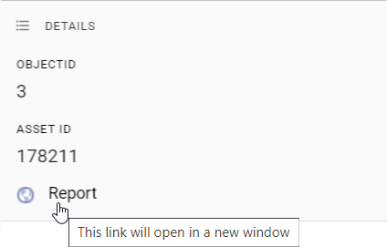
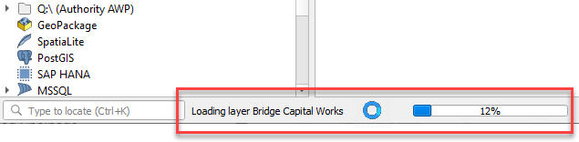

# Configuring Layers

## Adding Layers

Using your [existing QGIS project](managing-qgis-projects), you can add new layers to publish them to your users.

1. open your project file in QGIS
2. Layer > Add Layer > pick from vector, raster or other options
3. navigate to source (see note about file paths below)
4. Add
5. Close
6. Project > Save (`Ctrl` + `S`)

[QGIS Reference: Opening Data](https://docs.qgis.org/latest/en/docs/user_manual/managing_data_source/opening_data.html#opening-data)

!!! Note

If QGIS displays a question mark next to the layer name, it may indicate that QGIS needs a projection to be specified. Go to Layer Properties > Source > Assigned CRS, and pick a projection. See [here](https://groups.google.com/g/australian-qgis-user-group/c/xE8pV4gDKfA/m/mJYLm0-QAgAJ) for more information.

!!!

==- About layer file paths

When adding new file-based layers, use the layer's absolute file path (UNC) to ensure that the service under which the QGIS Server is running can recognise the path.

Typically your own user account will have certain drives mapped for convenience, so you might be used to working with data using file paths that refer to a drive letter (eg, `S:\` or `V:\`). However, the domain user account that runs QGIS Server often won't have these drives mapped.

A UNC path is an absolute path that is recognised by all user accounts, regardless of what drives are mapped on startup. An example UNC path might look like this:

* `\\ad.hrcc.vic.gov.au\shared\GIS\`
* `\\bs-intra\GIS\`

Add the UNC path of your GIS data folder as a *Favorite* in the QGIS Browser panel for easy access. Learn more [here](https://docs.qgis.org/latest/en/docs/user_manual/introduction/browser.html#favorites). Also add a shortcut to the UNC location on your PC desktop for extra convenience.

==- About layer names

Pozi does not currently support duplicate layer names within a site.

If you have two layers that share a name, even if they are maintained in separate QGIS projects, [alter the layer name](https://docs.qgis.org/latest/en/docs/user_manual/working_with_vector/vector_properties.html#source-properties) on one or both layers in the affected QGIS project(s) so that they are no longer the same.

Similarly, *layer folder* names must be unique, and must not share a name with any layer or layer folder within a site.

==-

Some common layer configuration tasks you can do in QGIS include:

* [change layer name](https://docs.qgis.org/latest/en/docs/user_manual/working_with_vector/vector_properties.html#source-properties)
* [filter data](https://docs.qgis.org/latest/en/docs/user_manual/working_with_vector/vector_properties.html#query-builder)
* [modify fields](https://docs.qgis.org/latest/en/docs/user_manual/working_with_vector/vector_properties.html#fields-properties)

 

## Publish as Vector Layer

Publishing a layer as a *vector layer* enables users to directly interact with map features. When a vector layer is turned on in Pozi, every feature from the source dataset is loaded in the browser, including all geometries and attributes. Users can make use of advanced functionality such as filtering and table view.

By default, QGIS Server does NOT expose layers as vectors. Evaluate the pros and cons of using vectors for your layer, and if appropriate, follow the directions below to enable it.

#### Advantages

* layers are fully interactive using Pozi's filter, report and table view functionality
* after the layer is loaded in the browser, the browser doesn't need to send further requests for the layer to the server every time the map moves
* the cursor changes when hovering over object to indicate the feature is clickable, and a tooltip is displayed with the feature's title
* users can select an individual feature and display its details in Info Panel (without displaying results of features on other layers at the same location)

#### Disadvantages

* the browser can be easily overwhelmed when dealing with thousands of features or complex features with many vertices, resulting in slow map rendering
* not all QGIS styles are supported in Pozi for vector features
* only one vector feature can be selected at a time - info results are not displayed for any features that have been overlapped by another feature
* cannot directly use text expressions for labels (but you can still make use of virtual fields for creating generating custom label values)

As a guideline, use vectors only for layers with fewer than 5-10K features, or even fewer for layers with complex polylines or polygons.

### Enabling Vector Layer

1. Project > Properties > QGIS Server > WFS/OAPIF
2. `Published`: tick on for each layer to be published as a vector layer (or you can click `Publish All` if *all* layers are required)
3. OK
4. Project > Save (`Ctrl` + `S`)

{style="width:700px"}

 

## Styling Layers

Instructions for styling your layers have been moved to a new dedicated page.

[!ref icon="paintbrush" text="Styling layers"](styling-layers.md)

 

## Managing Data Fields

QGIS enables you to control what users see of the data without altering the source data.

### Hide Fields

You can prevent fields from the source data being displayed in Pozi's info panel.

Layer Properties > Fields > select field > Configuration

* tick 'Do not expose via WMS'
* tick 'Do not expose via WFS'

{style="width:600px"}

### Rename Fields

You can make field names more user-friendly by giving your field names an *alias*.

Layer Properties > Attributes Form > select field > Alias

{style="width:700px"}

### Virtual Fields

You can control how your data appears to users without having to modify your source data by using the Field Calculator function in QGIS to create virtual fields.

Some use cases for virtual fields include:

* generate a link for a web page or photo by combining a URL string and an ID value
* combine fields (eg first name plus last name, or street address plus locality)
* generate distinct values/classes from ranges to simplify styling or filtering (eg convert a date into a year value)
* perform calculations based on one or more existing values
* generate values based on the feature geometry (eg, length, area)
* do a find-and-replace within text values to change what is displayed to users
* duplicate an existing field, but use a different name (for example, for Pozi to support categorised styling, the target field name must not contain any spaces)

See the QGIS help guide for more information [virtual fields](https://docs.qgis.org/latest/en/docs/user_manual/working_with_vector/attribute_table.html#virtual-field) and [using the field calculator](https://docs.qgis.org/latest/en/docs/user_manual/working_with_vector/attribute_table.html#using-the-field-calculator).

#### Create Link Field

This example shows how to generate a clickable link in Pozi by combining a URL string and an ID value from the data.

1. Layer Properties > Fields > click Field Calculator button
2. tick `Create virtual field`
3. fill in `Output field name` with your new field name
4. in `Output field type`, select Text (string)
5. build expression

Tips for building expressions:

* pick existing fields from the `Fields and Values` list
* use `||` to combine strings
* enclose static text with single quotes

{style="width:700px"}

The resulting virtual field appears in QGIS and Pozi as if it were standard field.

{style="width:700px"}

If the value in the field is a URL (as in this example), Pozi will display it as a clickable link, using the field name as the link text.

{style="width:300px"}

If the value is a string ending in `.png` or `.jpg`, Pozi will attempt to display a thumbnail of the target image. If you want Pozi to display the image, ensure that the string is a valid URL.

 

## Feature Title

When users select a feature from the map, Pozi prominently displays one of the feature's attributes at the top of the Info Panel as the feature's title.

{style="width:800px"}

The title should be the name of the feature or some other useful information to distinguish the feature from others in the same layer.

You can control which field is used for the layer's title in QGIS.

Layer Properties > Display > Display Name

{style="width:600px"}

Please note that Pozi cannot use the display field if the field name has been given an [alias](#rename-fields). Consider creating a virtual field with the desired name and use that as the display field.

 

## Selectability

<small>#selectable #queryable #identifiable</small>

To prevent the Info Panel from displaying results from specific layers (say, for aerial photos), update the `Data Sources` settings in the QGIS project.

Project > Properties > Data Sources > Identifiable > untick to disable layer selectability

{style="width:450px"}

It can be useful to make a layer not selectable if it has a corresponding *What's Here* dataset to avoid the Info Panel returning duplicate results.

 

## Exclude Layers

Your QGIS project may contain layers that are not needed for viewing in Pozi. For instance, your project may contain basemap layers that provide context for viewing map layers in QGIS, but you don't want these to appear in the project's layer group in Pozi.

To exclude any layers from appearing in Pozi:

Project > Properties > QGIS Server > WMS > `Exclude layers` (tick) > add > pick layers to exclude > OK

{style="width:500px"}

## Optional Settings

Other settings can be configured using QGIS Server keyword list. Pozi obtains these settings when it loads and imports each project's catalogue.

These settings provide an override for some of the default behaviours in Pozi.

Layer Properties > QGIS Server > Keyword list

* `enabled=false`: temporarily disable a dataset in Pozi (without having to remove it from QGIS)
* `group=[group name]`: override which layer group the layer is listed under
* `showInLayerControl=false`: don't display layer in layer panel
* `showLegend=false`: don't display layer legend
* `type=TileWMS`: for WMS layers, render as image tiles (instead of a single image)
* `visible=true`: display layer by default
* `downloadable=false`: don't display download options for this layer
* `linkedLayers=[layer name]`: link the current layer's visibility to another layer in the project

When using multiple keyword settings, use commas to separate them.

Example: `showLegend=false, visible=true`

[Developer reference](https://github.com/pozi/PoziApp/blob/master/app/src/config/catalog/KeywordsParser.ts)

 

## Table File Maintenance

If you need to move, rename or delete a source dataset from its file location or database, first remove the layer from any QGIS project to which the layer is registered, then save the QGIS project.

You may then attempt to make any changes to the table file(s). If Windows prevents you from making any changes, stop the IIS service that is locking the files.

Windows > IIS > (select server) > Application Pools > PoziQgisServer > Stop

You may also need to stop any other services that start with `PoziQgisServer`.

Restart the service(s) after you make your changes.

 

## Troubleshooting

==- Layer features are not displayed when the layer is turned on

Check the following:

* Open the source project in QGIS and see if the layers can be visualised. If not, check whether the source database connection or file path has changed or been removed.
* Pozi is only able to display features that have at least one valid/non-null attribute. If any records in your data contain no attributes, populate some values into one of the fields.
* Ensure the layer has a coordinate reference system set. Go to Layer Properties > Source > Assigned CRS, and pick a projection
* For file-based layers, ensure that the file path is one that is recognised by the server. See [About layer file paths](#about-layer-file-paths) above.
* Ensure that any categorised styling is based on a single field with a single value per row. See [Categorized Symbology](styling-layers.md#categorized-symbology).
* Ensure that any categorised styling is based on a field that is exposed as WFS (ie, ensure the field option 'Do not expose via WFS' is *unticked*).
* If the layer source is a MapInfo table, ensure that the symbology type is *not* "Embedded Symbols". Change it to another type such as "Single Symbol" or "Categorized".

==- Selected features from WMS layers are displayed with a mis-shaped highlight

It's possible that the GetFeatureInfo response coordinates do not have enough precision.

Open the affected QGIS project(s), go to Project > Properties > QGIS Server > WMS Capabilities > GetFeatureInfo geometry precision, and set it to 8 decimal places.

==- Layers are slow to load

**Consider using WMS instead of WFS**

If a layer is being served via WFS, the load time will be proportional to how large the source dataset is. Layers with a large number of records or complex shapes may not be suitable for loading as a vector layer in the browser.

Consider using WMS for your layer. If you disable WFS, Pozi will instead use WMS, enabling it to render layers efficiently for the user's current map view without loading the entire dataset.

**Check source data**

Use QGIS to determine whether the layer also causes its project file to load slowly. Observe the progress bar at the bottom to see if any layers are taking more than a fraction of a second to load in QGIS. If it appears that a layer is taking longer, check the source data. If it's from a database view, check that any join fields are properly indexed.

[!ref text="Testing Load Performance"](../qgis/managing-qgis-projects#test-project-load-performance)

==- Pozi takes a long time to start

Use QGIS to determine identify any slow-loading projects. If one or more of your projects takes significantly longer to load than others, then use the QGIS Debugging tool to narrow down which layers are slowing down the project load.

[!ref text="Testing Load Performance"](../qgis/managing-qgis-projects#test-project-load-performance)

==- Can't see the layer option for switching on the table view

Layers must be [enabled as a vector layer](#enabling-vector-layer) in order to access the table view.

If you've already enabled a layer for WFS, and the table view option is still not available, it may be because the layer shares the same name as a layer folder. Rename the layer or folder so they are unique.

==- Clicking on overlapping features shows only the details of one feature

​When you select a vector feature in Pozi, it displays only the feature you've selected, and not any overlapping features that may lie underneath.
​
​This issue is mentioned briefly [above](#disadvantages), as a disadvantage of enabling WFS for a layer:

​If you anticipate having overlapping features in a layer, consider NOT enabling the layer for WFS. Pozi will instead treat the layer as WMS. When clicking on a  location, Pozi will return the details for all overlapping features.
​
==- Can't see the latest changes from QGIS in Pozi

Some changes may not be available immediately in Pozi. If you encounter an issue such as a recently added or renamed layer not loading, restart the IIS application pool on the server.

Windows > IIS > (select server) > Application Pools > PoziQgisServer > Recycle

{style="width:500px"}

==-
