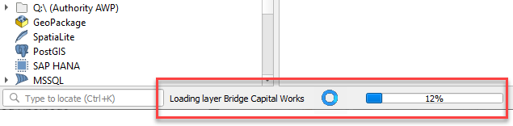

# Configuring Linked Datasets

A linked dataset contains complementary attributes that relate to a features from a map layer.

Users can select a feature from a standard map layer (the 'parent' dataset) and Pozi will fetch and display its associated records from the linked table (the 'child' dataset) based on an attribute that is shared between the two.

Use cases:

* owner details
* inspections
* defects
* maintenance
* photos

There is no special configuration required for the parent dataset for it to support a child dataset.

## Add Dataset

Add datasets to an [existing QGIS project](managing-qgis-projects) (eg `Child Datasets.qgs`).

1. open project file in QGIS
2. Layer > Add Layer > pick from file or database options
3. pick source table
4. Add
5. Close
6. Project > Properties > QGIS Server
7. `WFS capabilities > Published`: tick on for each dataset
8. OK
9. Project > Save (`Ctrl` + `S`)

## Create GetFeature URL

Construct a `GetFeature` URL by combining the following:

1. the project's [Advertised URL](/admin-guide/qgis/managing-qgis-projects/#construct-advertised-url) (eg `https://local.pozi.com/iis/qgisserver?MAP=C:/Program%20Files%20(x86)/Pozi/userdata/local/property.qgs`)
2. WFS GetFeature request: `&service=WFS&version=1.1.0&request=GetFeature`
3. table: `&typename=` + table name

Combine these three text strings to create a `GetFeature` URL.

Example `GetFeature` URL:

https://bs-gis.pozi.com/iis/qgisserver?MAP=//bs-intra/GIS/System/POZI/QGIS%20Projects/Child%20Datasets.qgs&SERVICE=WFS&VERSION=1.1.0&REQUEST=GetFeature&OUTPUTFORMAT=application%2Fjson&TYPENAME=POZI_BridgeDefects

Test your URL by pasting it in your browser and check that you get a valid response that returns records from the source.

### Submit Helpdesk Ticket

Email support@pozi.com with these details:

* subject: New child dataset
* `GetFeature` URL
* name of new child dataset(eg `Bridge Defects`)
* name of field in child dataset that contains the link attribute (eg `Asset_ID`)
* name of existing parent dataset (must already exist in Pozi) (eg `Bridges`)
* name of field in parent dataset that contains the link attribute (eg `AssetID`)

Within 24 hours, the child dataset will be configured and available in Pozi.

## Troubleshooting

==- Info Panel displays 'No results'

* in Pozi, click on a parent feature for which you know a child feature exists
* check that the layer is enabled for WFS. In QGIS, go to Project > Properties > QGIS Server > WFS Capabilities > your dataset > Published (tick on), then Save the project
* check that the names of the fields in the child and parent datasets that are used for the link are consistent with the names supplied with the child dataset's registration in Pozi

==- Results are slow to load

Use QGIS to determine whether the layer also causes its project file to load slowly. Observe the progress bar at the bottom to see if any layers are taking more than a fraction of a second to load in QGIS. If it appears that a layer is taking longer, check the source data. Also check how long it takes for QGIS to show the dataset's table view (Layer > Open Attribute Table). Check that any join fields are properly indexed.

==-
