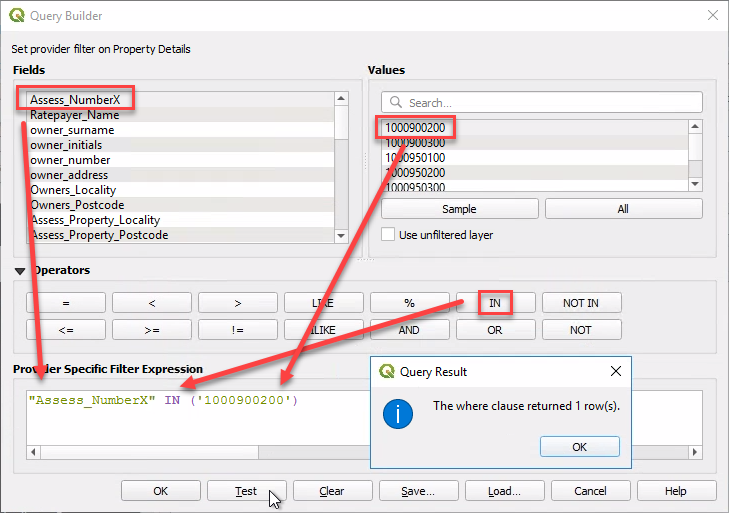

# Configuring Linked Datasets

A linked dataset contains complementary attributes that relate to a features from a map layer.

{style="width:400px"}

When a user selects a feature from a standard map layer (the 'parent' dataset), Pozi fetches and displays associated records from any linked table (the 'child' dataset) based on an attribute that's shared between the two.

Use cases:

* properties
  * owner details
  * building and planning permits
  * animal registrations
  * associated land parcels
  * intersecting planning zones and overlays
* assets
  * inspections
  * defects
  * maintenance
  * photos
* council wards
  * representatives
* more...

The parent record contains various attributes, such as the ones that are visible in the Details panel, other hidden attributes, and also the record's geometry. Any of these can be used as a key for querying other datasets. And any child record can become a parent of another dataset, and so on.

In the above example:

* `Property Information` is queried using the parent record's property number
* `Property Parcels` is queried using the parent record's property pfi
* `Property Planning Overlays` and `Zones` both use the parent record's geometry (ie, property boundary) in a spatial intersection query

Administrators can use QGIS to configure child datasets for viewing by internal users. The parent dataset can be an internal or external dataset.

## Joined Datasets vs Linked Datasets

Before configuring a *linked* dataset, you may consider using a *joined* dataset.

### Joined Datasets

Joined datasets take advantage of QGIS's built-in table join function.

Configuring *joined* tables in QGIS may be suitable when:

- there is a one-to-one relationship between records in parent and child tables
- the table has fewer than 10,000 records (larger tables are still supported, however you may observe that they are slow to load)
- users expect to search on joined attributes or view them in a table

Think of joined tables as adding fields from one table to another. Attributes from joined tables appear in the Pozi info panel in the same information tab as the parent dataset.

If you decide a joined dataset is right for you, see [here](https://docs.qgis.org/3.34/en/docs/user_manual/working_with_vector/joins_relations.html#joining-features-between-two-layers) for information on how to configure it in QGIS. The remainder of the instructions on this page are not relevant to joined datasets.

### Linked Datasets

Alternatively, adding *linked* datasets (as covered in this page) is recommended when:

- there is a one-to-many relationship between records in the tables, or
- for tables with more than 10,000 records, or
- the child dataset is a spatial table which uses a spatial intersection to link to its parent

Attributes from linked tables appear in the Pozi info panel in separate tabs below the parent's information tab.

If you decide a linked dataset is right for you, continue to the instructions below.

## Add Linked Dataset

Add the source table for the child dataset to a [QGIS project](managing-qgis-projects). The project can be an existing project that contains map layers or it can be a dedicated project that contains no layers and only child datasets.

1. open project file in QGIS
2. Layer > Add Layer > pick from file or database options
3. pick source table
4. Add
5. Close
6. Project > Properties > QGIS Server
7. `WFS capabilities > Published`: tick on for the new dataset
8. OK
9. Project > Save (`Ctrl` + `S`)

## Configure Child Settings

The parent/child settings are maintained in the child layer's QGIS Server keyword list. Pozi obtains these settings, along with any other keywords, when it loads and imports and project's catalogue.

{style="width:600px"}

Only the child dataset needs to be configured. There is no configuration required for the parent dataset for it to used by a child dataset.

Below are details of how to derive and combine the components of this setting.

### Parent

The `parent` dataset contains the features which, when selected, will trigger a data request to the child dataset.

For example, if the parent is the "Property" layer, then every time a user selects a feature in the Property layer, Pozi will trigger a request to the child dataset.

Example: `parent=Property`

The parent layer can exist in the same QGIS project, or a different project, or even a layer from an external source.

### Parameter

The `parameter` is an expression that contains instructions for filtering the child dataset to return only records that relate to an individual parent feature.

The options below are for spatial and non-spatial filters.

#### Spatial Filter

If you are configuring a child dataset as a *spatial intersection* of its parent, you don't need to specify any `parameter` filter. In the absence of any filter, Pozi assumes that the parent/child relationship is a spatial intersection, and it will generate the necessary query to return all child records that intersect with the selection spatial record.

However if you want to explicitly specify a filter, you can do so by using the following:

```
parameter=filter=<Filter><Intersects><PropertyName>geometry</PropertyName>[$gml]</Intersects></Filter>
```

Alternatively you can also a custom spatial filter. In this example, we are applying a negative buffer to the parent geometry to exclude records that have only a slight (<1m) overlap:

```
parameter=EXP_FILTER=intersects(@geometry [$comma] buffer(geom_from_wkt('[$wkt]') [$comma] -0.00001 ))
```

#### Non-Spatial Filter

If you are configuring a child dataset to use an id-based join, use the layer's Query Builder to construct and test a filter expression.

1. Layer Properties > Source > Query Builder
2. double-click the name of the field to be used as the link - this will be added to the expression
3. click `IN`, and add an open bracket (`(`)
4. click the Sample button to obtain a list of existing values from the target field
5. double click one of the sample values to add it to the expression
6. add a close bracket (`)`)
7. click Test

{style="width:500px"}

If the test query returns one or more rows, your expression is valid, and it can be used in the child parameter. Clear the Query Result dialog box, select your expression text, and copy it to your clipboard.

!!! Note

If your child data source is a MySQL table, and your test returns 0 records, try removing any double quotes from around the target field and try again.

!!!

Exit the Query Builder by clicking Cancel. **DO NOT click OK**. (If you accidentally click OK, re-open the Query Builder and clear the expression before saving.)

Construct the `parameter` text as follows:

1. `parameter=` + `EXP_FILTER=` + the expression from your test pasted from the clipboard
2. remove any double quotes from around the target field
3. replace the sample value with the name of the link field from the *parent* dataset where the target value is obtained, enclosed in a pair of square brackets (eg, replace `1000900200` with `[Property Number]`)

Example: `parameter=EXP_FILTER=Assess_NumberX IN ('[Property Number]')`

Pozi will substitute any field names within square brackets with values from those fields from the parent.

*Note: `EXP_FILTER` doesn't support spaces in the child dataset's lookup field name. If this field contains any spaces, update the dataset's Attributes Form settings to use a alias name for the lookup field that doesn't contain spaces.*

### Optional Settings

These settings provide an override for some of the default layer behaviours in Pozi.

* `downloadable=false`: prevent Pozi from showing a table view of the selected features
* `enabled=false`: disable a dataset in Pozi (without having to remove it from QGIS)
* `infoPanelCollapse=true`: collapse info results panel for this dataset
* `promoteDetails=true`: display all child attributes instead of a preview

[Developer reference](https://github.com/pozi/PoziApp/blob/master/app/src/config/catalog/KeywordsParser.ts)

### Combine and Configure

In the child dataset's Layer Properties, go to QGIS Server. Fill in the 'Keyword list' with the `parent`, `parameter` and optional settings derived above, each separated by commas.

{style="width:600px"}

Non-spatial example: `parent=Property, parameter=EXP_FILTER=Assess_NumberX in ('[Property Number]')`
Spatial example: `parent=Property`

Click OK, then save the project.

Open your Pozi site in your browser, refresh the page, click on the map, select a parent record, and confirm that you can see the related child record(s) in the info panel.

Pozi automatically prevents the child table appearing in the layer panel due to the presence of the `parent` keyword. Do NOT add the table to the list of excluded layers in the QGIS Server settings, except if you want to disable the child dataset lookup.

## Troubleshooting

==- Info Panel doesn't display results tab for new child dataset

* check that the layer is enabled for WFS. In QGIS, go to Project > Properties > QGIS Server > WFS Capabilities > your dataset > Published (tick on), then Save the project
* ensure the parent keyword value is configured accurately with the parent dataset name

==- Info Panel displays 'No results'

* in Pozi, click on a parent feature for which you know a child feature exists
* check that the names of the fields in the child and parent datasets that are used for the link are consistent with the names supplied with the child dataset's registration in Pozi
* check that there are no double quotes in the `parameter` setting

==- Results are slow to load

Use QGIS to determine whether the layer also causes its project file to load slowly. Observe the progress bar at the bottom to see if any layers are taking more than a fraction of a second to load in QGIS. If it appears that a layer is taking longer, check the source data. Also check how long it takes for QGIS to show the dataset's table view (Layer > Open Attribute Table). Check that any join fields are properly indexed.


==- Pozi displays "Something went wrong... No data found for downloading."

This can happen when querying a large selection because IIS has a default limit to the request length it will accept.

Include this `<security>` section in the IIS QGIS Server `web.config` file to allow longer requests:

```xml !#2-6 C:\Pozi\IIS\QgisServer\web.config
    <system.webServer>
        <security>
            <requestFiltering>
                <requestLimits maxQueryString="32768"/>
            </requestFiltering>
        </security>
    </system.webServer>
```

==-
