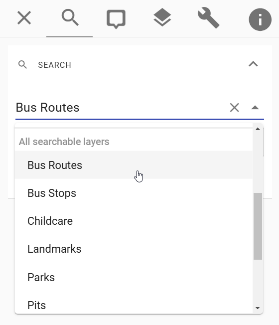
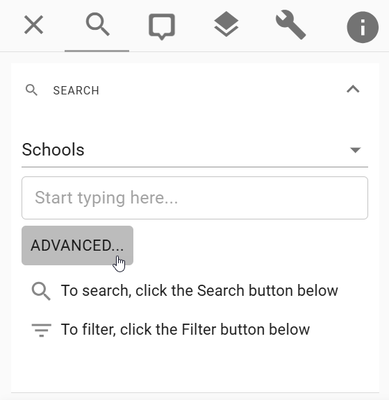

# Configuring Searches

Pozi's Search Panel offers users several options for searching for features and locations on the map.

## Preconfigured Searches

Your Pozi site may include one or more preconfigured searches. These typically include Address and other search services provided by external providers. If you require any changes to these searches, please contact support@pozi.com.

## Generic Searches

Any layer that is enabled for WFS, and is queryable, and is not configured to be hidden in the layer panel is automatically available as a search option. These search items are listed in the Search drop-down list under 'All searchable layers'. There is no special configuration required to enable these search options.

{style="width:350px"}

Users can type in text to match *any* field in the layer. Alternatively, users can click the Advanced button to access Pozi's table view for further search and filter options.

{style="width:350px"}


## Custom Searches

!!!
Custom searches will be available in the November 2024 release. Only layers that are hidden in the layer panel can be used as custom searches in that release.
!!!

Layers that aren't available as a *generic* search can be configured to be available as a *custom* search.

A common use case for this is the Property layer. The Property layer is typically a large dataset that is often used as a What's Here result but also configured to be hidden in the layer panel.

You can configure any of the layer's fields to be searchable. Each field you specify will show up as a separate search item in the drop-down list.

### Example

In this example, we'll use the existing Property layer which is already configured to show in the What's Here results and be hidden in the layer panel. We'll append the `searchFields` keyword to enable the Property layer to be searchable by the `polygon_nu`, `land_id` and `pi_parcel` fields, separated by semicolons.

Layer > Properties > QGIS Server > Keyword list:

```
parent=Whats Here, showInLayerControl=false, searchFields=polygon_nu;land_id;pi_parcel
```

This configuration will expose the `polygon_nu`, `land_id` and `pi_parcel` fields as search options. If the fields are configured in QGIS with a user-friendly [alias](./configuring-layers/#rename-fields), Pozi will use the alias when showing the search item in the drop-down list.

{style="width:350px"}
