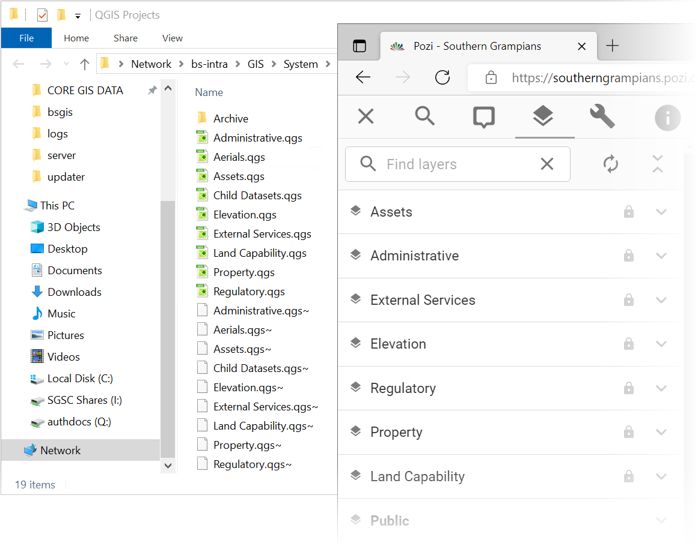
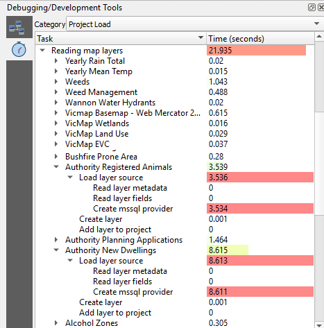

# Managing QGIS Projects

A QGIS project is a collection of layers and settings that make up a QGIS map. Pozi uses these projects as layer catalogues, each of which is displayed in Pozi as a layer group.

{style="width:400px"}

The workflow for getting a project into Pozi are as follows:

1. [create project](#create-project)
2. [configure web services](#configure-web-services)
3. [start adding layers](#add-layers)
4. [register project for Pozi](#register-project)

## Create Project

!!!

If you have an existing QGIS project that's already configured for Pozi, you can fast-track the steps below.

Save a copy of an existing project, remove all layers (except for any basemap that you might be using as a background layer), and skip to [configuring web services](#configure-web-services).

!!!

Create new project from scratch:

1. open QGIS
2. Project > Save > specify name and path of new project file (`.qgs`)
3. note the exact file path of project file (needed for subsequent configuration below)

### Add Basemap

It's useful to include a basemap in the project to provide visual context for the layers you will add on top.

#### Vicmap Basemap Example

If you've [set up](/admin-guide/qgis/setting-up-qgis/#basemap) 'Vicmap Basemap' as a WMS/WMTS source, you can easily one of its layers as your basemap.

Browser > WMS/WMTS > Vicmap Basemap > Vicmap Basemap - VicGrid2020 - Cartographic

## Configure Web Services

### Construct Advertised URL

*Note: this is no longer a requirement for newer Azure-only implementations if the site is configured with the correct [Application Proxy internal URL](/dev-guide/azure-integration#application-proxy-internal-url).*

The project's *Advertised URL* is a URL at which WMS and WFS requests can interact with the layers in the project file. Essentially, the project file needs a reference to itself in a URL format.

This step involves constructing the URL text that will be used in subsequent configuration below. You can use a temporary blank text document in Notepad to compile the text.

Combine the details below to create your project's Advertised URL:

1. server URL (server URL is typically `https://<servername>.pozi.com/`, but check your local setup for any custom endpoint - older implementations may use `https://local.pozi.com/`)
2. service endpoint (eg `iis/qgisserver?`)
3. QGIS project file path, with any backslashes replaced with forward slashes (eg `MAP=C:/Pozi/Projects/Assets.qgs`)

Combine these three text strings to create the Advertised URL.

Example Advertised URL:

```
https://<servername>.pozi.com/iis/qgisserver?MAP=<projectfilepath>
```

Copy the URL to your clipboard for subsequent configuration below.

### Enable Web Services

1. Project > Properties > QGIS Server
2. WMS
   * `Exclude layers` (tick) > add > pick any background layers you don't need to see in Pozi
   * `Use layer ids as names`: ensure this is NOT ticked
   * `Add geometry to feature response`: tick ON
   * `Advertised URL`: enter Advertised URL (from above)
3. WMTS
   * `Published layers > Project > Published`: tick on
   * `Advertised URL`: enter Advertised URL
4. WFS/OAPIF
   * `Advertised URL`: enter Advertised URL
5. OK
6. Project > Save  (`Ctrl` + `S`)

### Further Settings

A comprehensive guide for configuring QGIS projects for publishing layers via WMS/WFS can be found at:

https://docs.qgis.org/latest/en/docs/server_manual/getting_started.html#creatingwmsfromproject

<br/>

## Add Layers

See [Configuring Layers](/admin-guide/qgis/configuring-layers.md) for details about adding and configuring new layers within your project.

Remember to use only UNC paths for file-based layers.

When you're done, remember to [enable any layers for WFS](/admin-guide/qgis/configuring-layers/#publish-as-vector-layer) if required.

<br/>

## Test Project Load Performance

The speed at which Pozi can access layers from the QGIS project is limited by how fast QGIS can access the layers from their respective data sources.

To ensure that QGIS is able to access the layers quickly, check the project's performance using QGIS's debugging tool to identify any performance issues.

View > Panels > Debugging/Development Tools > Profiler (clock button)

As soon as you load your QGIS project, a new category called `Project Load` will be available. Select it from the category list.

Expand the entry called `Reading map layers` in the profiler tree to see all of the QGIS project layers and their corresponding loading time.

{style="width:350px"}

If the results show any layer that takes more than a fraction of a second to load, there may be an issue with the network or database that is worth investigating.

Some file formats can be less efficient than others for a project to load. Large GeoJSON files can be significantly slower to load than a their equivalent SHP, GeoPackage or TAB version, so consider using one of these faster formats.

[(via GIS StackExchange)](https://gis.stackexchange.com/a/414884)

<br/>

## Register Project

Your new project must be registered in Pozi's central web configuration for users to view the map layers in your Pozi site.

Follow these steps to register your project:

1. obtain the project's `GetProjectSettings` URL
2. submit a helpdesk ticket to Pozi

### 1. Obtain GetProjectSettings URL

In a text editor, construct a `GetProjectSettings` URL by combining the following:

1. Advertised URL from above (eg `https://<servername>.pozi.com/iis/qgisserver?MAP=<projectfilepath>`)
2. GetProjectSettings request: `&service=WMS&REQUEST=GetProjectSettings`

Combine these text strings to create a `GetProjectSettings` URL.

Example `GetProjectSettings` URL:

```
https://<servername>.pozi.com/iis/qgisserver?MAP=<projectfilepath>&service=WMS&request=GetProjectSettings
```

Test this URL by pasting it in your browser and check that you get a valid response that lists the available layers.

### 2. Submit Helpdesk Ticket

Email support@pozi.com with these details:

* subject: New layer catalogue
* name of new layer group to appear in Pozi layer panel
* order in which the layer group is to appear in the Pozi Layer Panel (relative to an existing layer group)
* `GetProjectSettings` URL (from above)

Within 24 hours, the new layer group will be configured and available for users to view in Pozi.

During this time, and any time afterwards, you may continue to [add and configure layers](/admin-guide/qgis/configuring-layers/) in your new project.

## Troubleshooting

==- None of the project's layers are displaying in Pozi

Check that advertised URLs contains the exact path and file name of the .qgs project file.

Ensure that `Use layer ids as names` is NOT ticked. See Project > Properties > QGIS Server > WMS.

Check the Network panel in your browser console as you turn on layers. Look at the `GetFeature` requests and preview the response. If it contains bounding box coordinates but no records, there may be an issue with IIS.

Open the IIS Manager, and recycle the PoziQgisServer application pool.

{style="width:600px"}

==-

For further assistance, contact support@pozi.com.
