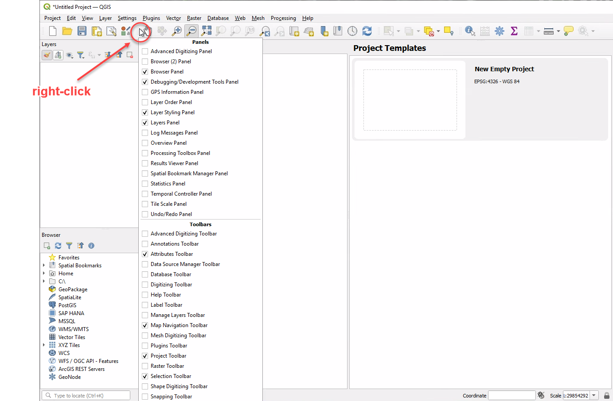

# Setting Up QGIS

These are the recommended settings for QGIS. They are optional. They only need to be set once.

## Project Settings

Settings > Options > General > Project Files

* Prompt for confirmation when a layer is to be removed: untick
* Default project file format: QGS Project

## View Settings

When opening a layer's attribute table, the default behaviour for QGIS is to open it as a separate window. Use the following setting to instead dock attribute tables under the map in the current QGIS window.

Settings > Options > Data Sources > Open attribute table as docked window > tick 

{style="width:600px"}

## Panels and Toolbars

Right-click on any toolbar to reveal tickboxes for adding and removing panels and toolbars.

{style="width:600px"}

### Panels

* Layer Styling
* Layers
* Browser
* Debugging/Development Tools

### Toolbars

* Attributes
* Map Navigation
* Project
* Selection

## Data Sources

Set up your Browser panel to enable access to commonly-used data sources.

### Layer Files

Add the path of your GIS data folder as a *Favorite* in the QGIS Browser panel for easy access. Learn more [here](https://docs.qgis.org/latest/en/docs/user_manual/introduction/browser.html#favorites).

Browser > Favorites (right-click) > Add a Directory... > navigate to your GIS data folder (use UNC path only!)

Also add a shortcut to the UNC location on your PC desktop for extra convenience.

### Database Connections

Browser > MSSQL (right-click) > New Connection...

### Basemap

{style="width:600px"}

Browser > WMS/WMTS (right-click) > New Connection...

* Name: Vicmap Basemap
* URL: https://base.maps.vic.gov.au/service
* OK
