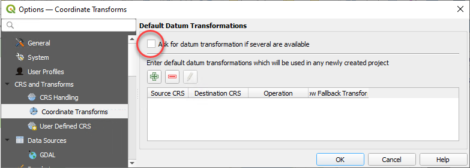

# Setting Up QGIS

These are the recommended settings for QGIS. They are optional. They only need to be set once.

## Project Settings

Settings > Options > General > Project Files

* Prompt for confirmation when a layer is to be removed: untick
* Default project file format: QGS Project

## Transformation Settings

QGIS projects can sometimes fail to return all layers if there are *projection transformations* specified the in project. You can prevent QGIS prompting you to save transformations in the project by unticking the following setting.

Settings > Options > CRS and Transforms > Coordinate Transforms > Ask for datum transformation if several are available: UNTICK

{style="width:600px"}

## View Settings

When opening a layer's attribute table, the default behaviour for QGIS is to open it as a separate window. Use the following setting to instead dock attribute tables under the map in the current QGIS window.

Settings > Options > Data Sources > Open attribute table as docked window > tick 

{style="width:600px"}

## Panels and Toolbars

Right-click on any toolbar to reveal tickboxes for adding and removing panels and toolbars.

{style="width:600px"}

### Panels

* Layer Styling
* Layers
* Browser
* Debugging/Development Tools

### Toolbars

* Attributes
* Map Navigation
* Project
* Selection

## Data Sources

Set up your Browser panel to enable access to commonly-used data sources.

### Layer Files

Add the path of your GIS data folder as a *Favorite* in the QGIS Browser panel for easy access. Learn more [here](https://docs.qgis.org/latest/en/docs/user_manual/introduction/browser.html#favorites).

Browser > Favorites (right-click) > Add a Directory... > navigate to your GIS data folder (use UNC path only!)

Also add a shortcut to the UNC location on your PC desktop for extra convenience.

### Database Connections

Browser > MSSQL (right-click) > New Connection...

### Basemap

{style="width:600px"}

Browser > WMS/WMTS (right-click) > New Connection...

* Name: Vicmap Basemap
* URL: https://base.maps.vic.gov.au/service
* OK

## Font Awesome

Pozi's [Font Awesome](https://fontawesome.com/) integration enables administrators to configure icon symbols for their map layers.

1. contact Pozi Support to request the download link for `qgis-fontawesome-pro-6.4.0.zip`
2. download zip file from link
3. unzip file to `C:\Pozi\QGIS Assets\Pozi SVGs\`
4. confirm that the correct folder structure exists - you should see SVG files in this exact location: `C:\Pozi\QGIS Assets\Pozi SVGs\fontawesome-pro-6\regular\`
5. QGIS > Settings > Options > System > SVG Paths
    - remove `C:\Users\username\AppData\Roaming\QGIS\QGIS3\profiles\default\svg\`
    - remove `C:\OSGeo4W\apps\qgis-ltr\svg\`
    - add `C:\Pozi\QGIS Assets\Pozi SVGs`

Repeat steps 3 to 5 for any administrators who are responsible for updating QGIS projects that are used by Pozi. If an administrator intends to update projects using QGIS on their local PC (ie, not using Remote Desktop to the server), they will need to install Font Awesome on their local PC and update their own QGIS settings to point to that location.

It is also necessary to update the QGIS settings as per step 5 *while logged in to the server as the *Pozi Service* user*. Failure to update the settings for the Pozi Service user will prevent FontAwesome SVGs from rendering in WMS mode.
