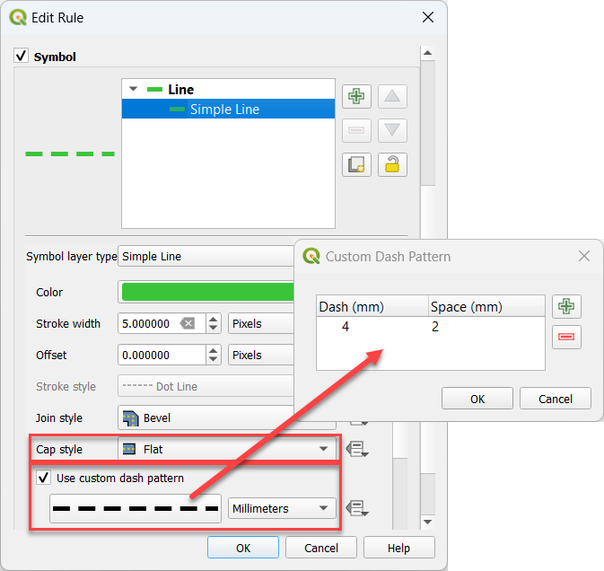
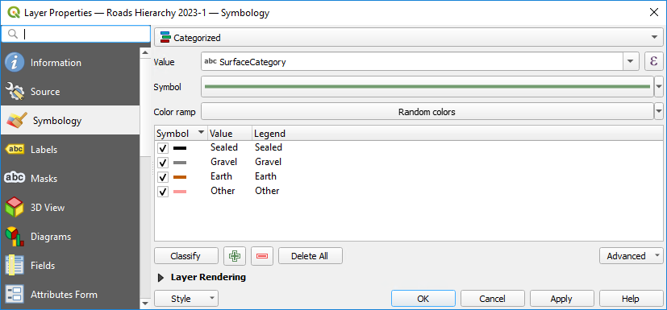
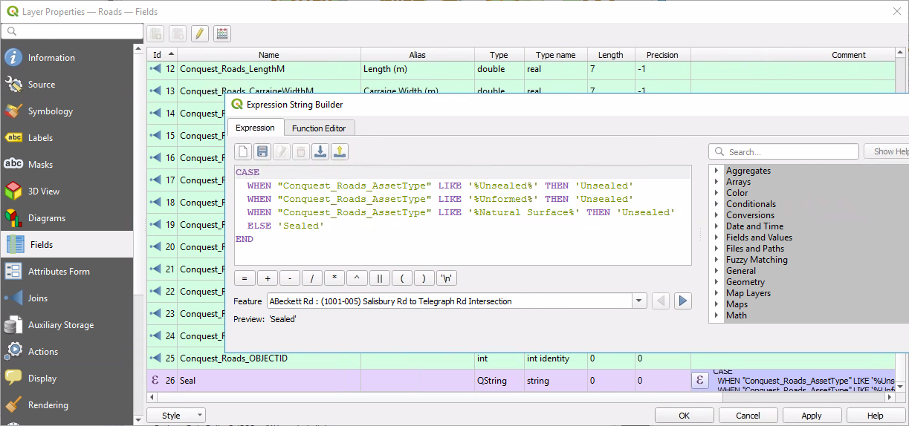
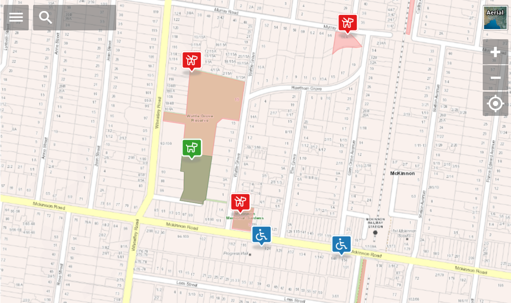

# Styling Layers

Using QGIS, you can control many visual aspects of your layer. You may apply a common style for all the features in a layer 
([Single Symbol](https://docs.qgis.org/latest/en/docs/user_manual/working_with_vector/vector_properties.html#single-symbol-renderer)) or apply a thematic style that displays features according to any of its attributes ([Categorized](https://docs.qgis.org/latest/en/docs/user_manual/working_with_vector/vector_properties.html#categorized-renderer)).

## WMS Layers

When Pozi fetches a layer using WMS (ie, *not* vector), QGIS Server renders the layer exactly as configured in QGIS.

## Vector Layers

When using *vector* layers (ie, WFS-enabled), the rendering is done by Pozi in the browser, which can cause the layer to appear differently compared to QGIS for some styling options. 

When styling *vector layers*, use only the supported styles specified below.

(If you need Pozi to display layers using a QGIS style that doesn't appear in the below lists of supported styles, disable WFS for the layer to force Pozi to retrieve the layer via WMS, which uses the QGIS Server renderer.)

### Points

Supported marker symbols:

* Simple Marker
  * `square`
  * `circle`
  * `triangle`
  * `star`
  * `cross`
  * `x`

Note that SVG marker symbols are not supported, nor `diamond`, `cross2`, `cross_fill` symbols. Symbol rotation is not supported.

Suggested sizes:

* set size to `4mm` or greater enable to easier interaction for users in the browser
* set stroke to white, `0.5mm` or greater to provide separation from the background

### Lines

Supported lines:

* Simple Line
  * Solid Line
  * No Pen
  * Custom Dash Pattern

Set line thicknesses to `2mm` or greater to enable users to easily select line features.

To style a line with dots and/or dashes:

* set the cap style to `flat`
* tick "Use custom dash pattern"
* specify a dash pattern (eg, `4 2`) in millimeters.

{style="width:450px"}

### Polygons

Supported fills:

* Simple Fill
  * Solid
  * No brush (see note below)
  * Cross
  * Diagonal X
* Point Pattern Fill

{style="width:350px"}

Note that the 'No brush' fill will prevent users from being able to select a polygon by clicking within the polygon. To enable users to select a polygon feature by clicking inside it, use the 'Solid' fill, and set the opacity of the fill colour to a low or zero value.

### Labels

Point, line and polygon features can optionally be configured to display labels.

[!ref target="blank" icon="tag" text="Labelling in QGIS"](https://docs.qgis.org/latest/en/docs/user_manual/working_with_vector/vector_properties.html#labels-properties)

Notes:

* label offsets and label buffer transparency are not supported
* text expressions in labels (eg, combining values from multiple fields, or find-and-replace operations) are possible by configuring [virtual fields](configuring-layers.md#virtual-fields)

Set label text size to `10 points` or greater, and a white `1.8mm` buffer for better legibility.

!!! MapInfo Styles

MapInfo tables sometimes contain embedded styles. QGIS Desktop may recognise and display the map features using these styles, but QGIS Server cannot serve the layer to Pozi without first overriding the style.

If the layer appears in QGIS Symbology mode "Embedded", switch it to "Single Symbol" or "Categorized", and style it according to your preference.

!!!

## Categorized Symbology

Layers can be styled using the `Categorized` option. Pick the field to use for the category from the drop-down list, then click the Classify button.

{style="width:500px"}

### Limitations

When publishing the layer as a vector layer, the following limitations apply:

* the symbology must be based on a field (real or virtual), not an expression
* the values must not be merged (ie, only one value per row)
* the field name must not contain any spaces

You can work around these limitations by creating a suitably named virtual field that contains the required logic.

For instance, the virtual field can contain a case statement to accept any number of input values (from one or more fields) and generate specific values for use in subsequent styling.

{style="width:800px"}

See [Virtual Fields](configuring-layers.md#virtual-fields) for more information.

### Fallback Style

When using the Classify button to generate styles for each unique value, QGIS automatically generates an additional **fallback** style for "*all other values*". However this function is not supported in Pozi, and Pozi will display **all** the layer's features with the fallback style.

{style="width:600px"}

Delete the "*all other values*" item from the list before saving.

## Opacity

Layer Styling > Layer Rendering > Opacity

{style="width:300px"}

Layers are initially displayed in Pozi using the opacity value you've set - the user may then adjust the opacity up or down from the initial value.

 

## Bubble Symbols

Pozi *Enterprise Cloud* customers can display their vector point layers using Pozi's popular *bubble* symbols.

{style="width:600px"}

Ensure the PC on which the QGIS project is being maintained has the Font Awesome icon library installed and configured in QGIS.

[!ref icon="typography" text="Configuring Font Awesome"](setting-up-qgis.md#font-awesome)

### Customise Bubble Symbol

1. download sample SLD file
    [!file Sample SLD file](./bubble-and-font-awesome-example.sld)
2. go to Layer Properties > Symbology > Style > Load Style > ... (select downloaded SLD file) > Load Style
3. pick icon
    - select top SVG Marker item
    - in SVG browser, select Pozi SVGs
    - browse icons or use search box to find icon
    - select icon
    - {style="width:500px"}
4. pick bubble colour
    - select middle SVG Marker item
    - click Fill Color to change colour
    - {style="width:500px"}
5. OK

Save your project, and preview the layer in Pozi.

Note that the vertical alignment of the icon within the bubble in QGIS may differ slightly to what you see in the Pozi app. What's important is that the icon displays appropriately in Pozi, even if it looks slightly misaligned in QGIS.

!!!

The Font Awesome icon library contains thousands of icons to choose from. While you can use the search function within the QGIS SVG browser to search based on an icon filename, you can also use the online Font Awesome search tool to discover icons that match your need, even if your search term doesn't appear in the icon file name.

[!ref target="blank" icon="location" text="Exploring Font Awesome icons"](https://fontawesome.com/search)

Looking for a barbecue icon? Type 'bbq' into the Font Awesome online search to see the matching icons. Note that they are named 'grill'. Now go to QGIS and type in 'grill' to find the icon.

!!!

 

## Troubleshooting

==- Layers are displayed, but not with the styling from QGIS

Pozi will display layers in a generic style (often purple) if it cannot process the style that was configured in QGIS.

Simplify the style in the QGIS project and try again. For point features, replace custom point symbols with one of the [standard symbols](#points) specified above. For polygon features, replace hatch styles with semi-opaque fills or any of the [supported fill styles](#polygons) specified above.

If using a *categoized* style, remove any style that QGIS generates for *all other values*. See [Fallback Style](#fallback-style) above.

==- Selected features from WMS layers are displayed with a mis-shaped highlight

It's possible that the GetFeatureInfo response coordinates do not have enough precision.

Open the affected QGIS project(s), go to Project > Properties > QGIS Server > WMS Capabilities > GetFeatureInfo geometry precision, and set it to 8 decimal places.

==- Labels are not appearing as expected

There are some limitations for labels on vector features in Pozi:

* labels are always placed in the centre of the feature, regardless of any placement rules
* complex text expressions may not generate the expected text

The issue with text expressions can be easily overcome by using a [virtual field](configuring-layers.md#virtual-fields) for the label.

Otherwise, for complete control of how the layer appears in Pozi, consider switching the layer to WMS by disabling WFS for the layer.

==-
