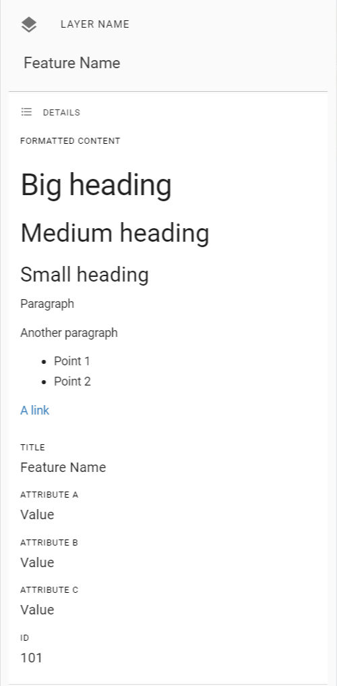

:::note Under Construction

*This page is a work in progress. Please refer to our existing Help Guide for information about this topic.*

[Existing Help Guide](https://help.pozi.com/search?query=configuring+data+sources)

:::

---

## Attribute Formatting

### Hyperlinks

When an attribute value is a URL (which is not direct link to an image), Pozi displays the *field name* as a clickable link. In addition, if the URL ends in `.pdf`, a PDF icon is shown next to the link. Otherwise, the favicon of the destination link is shown.

### Embedded Media

When an attribute value is a URL ending in `.jpg` or `.png`, Pozi displays the image within the info panel.

### Advanced Formatting

The Pozi info panel can display feature details with rich text when the attributes are formatted with HTML.

Example feature:

|Formatted Content | Title | Attribute A | Attribute B | Attribute C | ID
|--|--|--|--|--|--|
|`<h1>Big heading</h1><h2>Medium heading</h2><h3>Small heading</h3>
Paragraph

Another paragraph
<ul><li>Point 1</li><li>Point 2</li></ul>
<a href=\"https://www.example.com/ \" target=\"_blank\`|`Feature Name`|`Value`|`Value`|`Value`|`101`|

When this feature is selected in Pozi, it will display like this:

{style="width:300px"}
