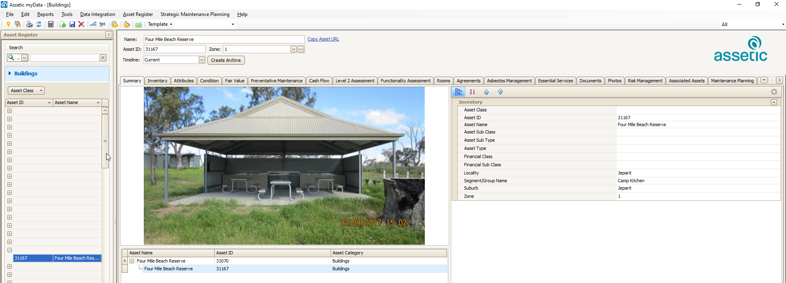

# Assetic myData

## Application Link

### Link-Out from Pozi

Assetic myData is a Windows application that supports linking via a URL protocol handler.

For any selected asset feature, Pozi users can click a link to launch the myData application which displays the asset's details.



An example link for myData looks like this:

[mydata://action=goto&assetCategory=Buildings&assetID=BD0021](mydata://action=goto&assetCategory=Buildings&assetID=BD0021)

For any PC on which a URL protocol handler has been installed, clicking this link will launch the myData application.

An example configuration in the VRT file is as follows:

```xml
<?xml version="1.0" encoding="UTF-8"?>
<OGRVRTDataSource>
    <OGRVRTLayer name="Buildings">
        <SrcDataSource>\\nhillDB2\MapData\Assets\Building\Building.TAB</SrcDataSource>
        <SrcSQL dialect="sqlite">
            select
                *,
                '&#60;a href="mydata://action=goto&#38;assetCategory=Buildings&#38;assetID=' || Asset_ID || '" target="_blank" &#62;Open in myData&#60;/a&#62;' as "Application Link"
            from Building
        </SrcSQL>
    </OGRVRTLayer>
</OGRVRTDataSource>
```

!!!note

Some of the HTML link text characters (eg "`<`") require replacement codes (eg "`&#60;`") to avoid breaking the XML format of the VRT file.

!!!

==- Supported Asset Categories

* `Buildings`
* `Bridges`
* `Civil`
* `Culverts`
* `Drains`
* `FleetPlantAndEquipment`
* `Kerbs`
* `ParkInfrastructure`
* `Parks`
* `Pathways`
* `Pits`
* `PlayEquipment`
* `Playgrounds`
* `Runways`
* `SealedRoads`
* `StreetFurniture`

==-

## Data Link

When a user selects an asset feature in the Pozi map, the feature's `Asset_ID` value can be used to look up inspection details for that feature.

### Pozi App Configuration

```json Footpath Inspections
{
  "title": "Footpath Inspections",
  "type": "GeoJSON",
  "parent": "Footpaths",
  "showInLayerControl": false,
  "localDataSource": true,
  "ResourceCheck": "https://local.pozi.com/resourcecheck/hindmarsh.json",
  "config": {
    "spatial": {
      "loader": "geojson",
      "url": "https://local.pozi.com/ogr?source=hsc_assets_inspections.vrt&options=-where|AssetID in ('[Asset_ID]')",
      "label": "InspectionNameAndDate",
      "id": "ID"
    }
  }
}
```

### Pozi Server Configuration

```xml hsc_assets_inspections.vrt
<?xml version="1.0" encoding="UTF-8"?>
<OGRVRTDataSource>
	<OGRVRTLayer name="Inspections">
		<SrcDataSource>ODBC:DRIVER={SQL Server};SERVER=NHILLDB2;DATABASE=myDataProduction,InspectionView</SrcDataSource>
		<SrcSQL dialect="sqlite">
		    select
			    *,
				InspectionName + ' (' + cast ( cast ( ScheduledDueDate as date ) as varchar ) + ')' as InspectionNameAndDate
			from InspectionView
			order by ScheduledDueDate desc
		</SrcSQL>
		<GeometryType>wkbNone</GeometryType>
	</OGRVRTLayer>
</OGRVRTDataSource>
```