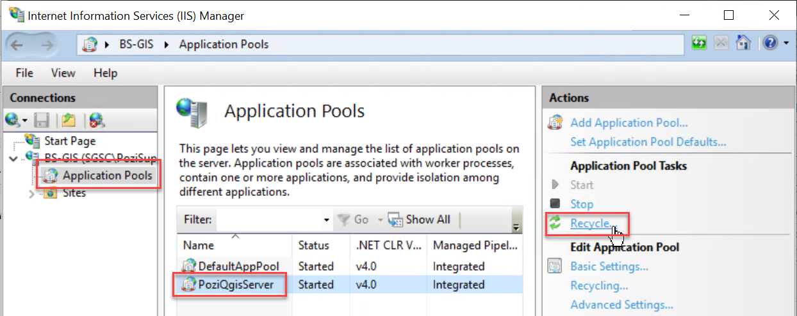
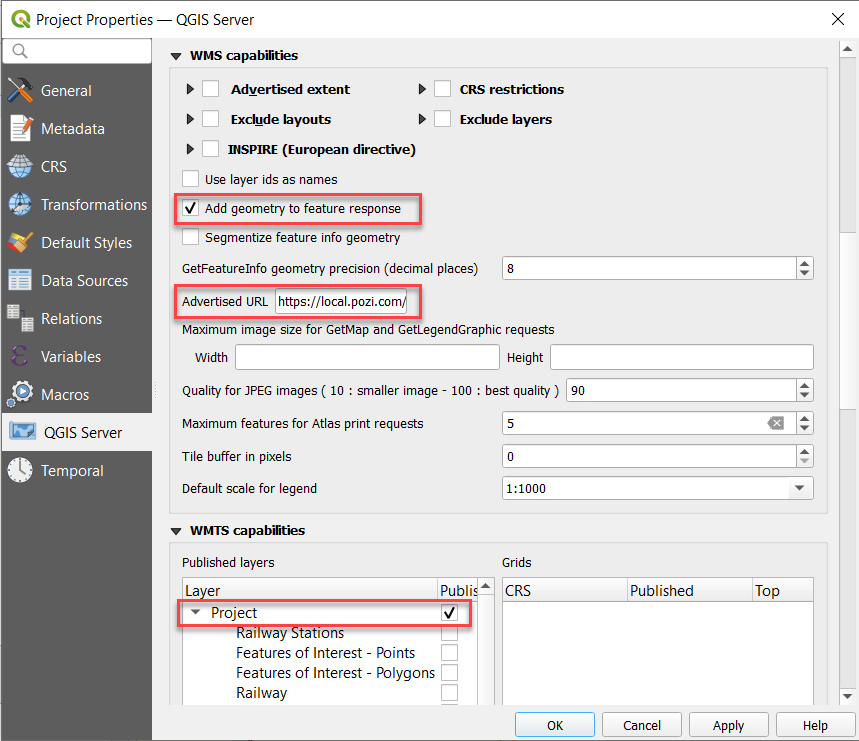
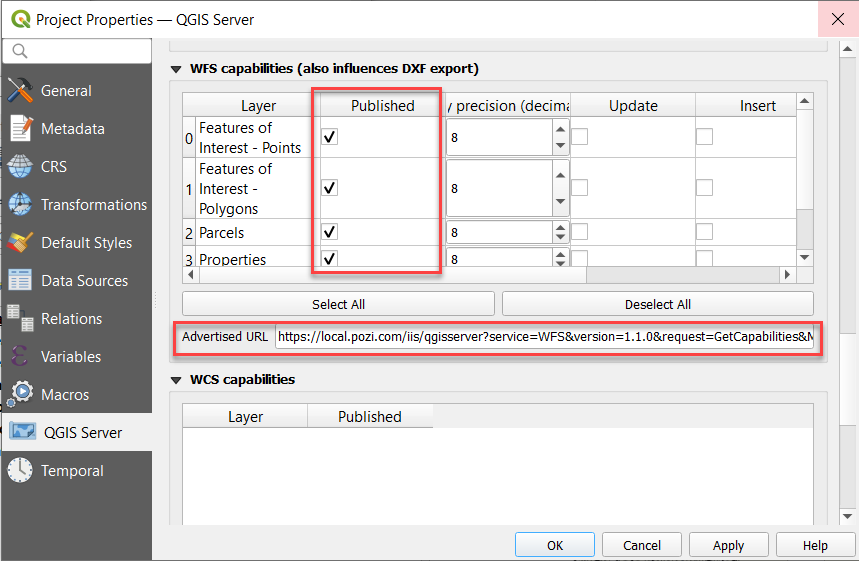

*Available for Pozi Enterprise and Enterprise Cloud customers*

## Introduction

The popular open source QGIS desktop application provides a powerful and convenient way to compile and configure map layers for publishing local datasets to internal Pozi users.

A QGIS project file (*.qgs) represents a layer group within Pozi.

## QGIS Configuration

QGIS > Settings > Options > General > Project Files >

* Prompt for confirmation when a layer is to be removed: untick
* Default project file format: QGS Project

## Create Project

1. open QGIS
2. add layers from internal data sources
3. configure styling for layers
4. Project > Save

### Adding Layers

When adding new file-based layers, we recommend to use the layer's absolute file path (UNC) to ensure that the service under which the QGIS Server is running can recognise the path.

Often your own user account may have certain drives mapped for convenience, so you might be used to working with data using file paths that refer to a drive letter (eg, `S:\` or `V:\`). However, the domain user account that runs QGIS Server often won't have these drives mapped.

A UNC path is an absolute path that is recognised by all user accounts, regardless of what drives are mapped on startup. An example UNC path might look like this:

* `\\ad.hrcc.vic.gov.au\shared\GIS\`
* `\\bs-intra\GIS\`

Add the UNC path of your GIS data folder as a *Favorite* in the QGIS Browser panel for easy access. Learn more [here](https://docs.qgis.org/3.22/en/docs/user_manual/introduction/browser.html#favorites). Also add a shortcut to the UNC location on your PC desktop for extra convenience.

### Configuring Layers

Some common layer configuration tasks that can be carried out in QGIS include:

* [change layer name](https://docs.qgis.org/latest/en/docs/user_manual/working_with_vector/vector_properties.html#source-properties)
* [filter data](https://docs.qgis.org/latest/en/docs/user_manual/working_with_vector/vector_properties.html#query-builder)
* [change opacity](https://docs.qgis.org/latest/en/docs/user_manual/working_with_vector/vector_properties.html#layer-rendering)
* layer styling
  * [basic](https://docs.qgis.org/latest/en/docs/user_manual/working_with_vector/vector_properties.html#single-symbol-renderer)
  * [thematic styling](https://docs.qgis.org/latest/en/docs/user_manual/working_with_vector/vector_properties.html#categorized-renderer)
* [add labels](https://docs.qgis.org/latest/en/docs/user_manual/working_with_vector/vector_properties.html#labels-properties)
* [modify fields](https://docs.qgis.org/latest/en/docs/user_manual/working_with_vector/vector_properties.html#fields-properties)

!!!warning

Some changes may not be available immediately in Pozi. If you encounter an issue such as a recently added or renamed layer not loading, restart the IIS application pool.

Windows > IIS > (select server) > Application Pools > PoziQgisServer > Recycle

{style="width:400px"}

!!!

## Enable Project as WMS Service

1. Project > Properties > QGIS Server
2. update these settings
   * `Add geometry to feature response`: tick on
   * `Advertised URL`: enter WMS GetCapabilities address
     * example: `https://local.pozi.com/iis/qgisserver?service=WMS&request=GetCapabilities&MAP=C:/Program%20Files%20(x86)/Pozi/userdata/local/property.qgs`
   * `Published layers`: tick Project box
3. OK
4. Project > Save

{style="width:600px"}

## Enable Layers in WFS Service

WFS (Web Feature Service) provides users with the ability to directly interact with map features.

Advantages:

* cursor changes when hovering over object
* select individual features and display results in Info Panel without displaying results of features on other layers at the same location
* enable layers to be interactive using Pozi's filter, report and table view functionality

Disadvantages:

* the browser can be easily overwhelmed when dealing with thousands of features
* labelling for WFS features is not well supported, especially for line features such as roads

We recommend to enable WFS only for layers with fewer than 10-20K features.

1. Project > Properties > QGIS Server
2. update the following settings:
   * `WFS capabilities > Published`: tick on for each layer to be published
   * `Advertised URL`: enter WFS GetCapabilities
     * example: `https://local.pozi.com/iis/qgisserver?service=WFS&version=1.1.0&request=GetCapabilities&MAP=C:/Program%20Files%20(x86)/Pozi/server/data/local/property.qgs`
3. OK
4. Project > Save

{style="width:600px"}

## Table File Maintenance

!!!danger

Extreme care should be taken when **deleting, moving or renaming** any table files that are referenced by a QGIS project file.

If such a change is made to a table while it is registered as a layer in a QGIS project, it will cause QGIS Server to return an error and prevent Pozi from loading any layers from that project.

In this scenario, **all layers belonging to the project will no longer appear in the layer panel.**

!!!

If you need to move, rename or delete a table, you must first **remove the layer from any QGIS project to which the layer is registered**, then save the QGIS project.

You may then attempt to make any changes to the table file(s). If Windows prevents you from making any changes, stop the IIS service that is locking the files.

Windows > IIS > (select server) > Application Pools > PoziQgisServer > Stop

You may also need to stop any other services that start with `PoziQgisServer`.

Restart the service(s) after you make your changes.
