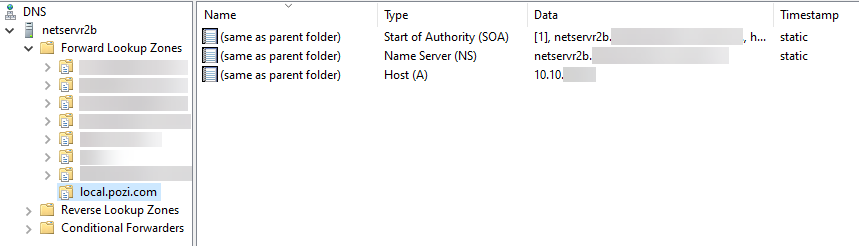

# Pozi Server Installation

## Prerequisites

* support account
* service account
* internet access (needed to communicate with connect.pozi.com for software updates)

## Download and Install

1. download the [Pozi Connect Server installer](https://connect.pozi.com/installer/PoziConnectInstaller.exe)
2. run installer and follow prompts

==- Useful supplementary software

* [Notepad++](https://notepad-plus-plus.org/downloads/)
* [JSON Viewer browser extension](https://chrome.google.com/webstore/detail/json-viewer/gbmdgpbipfallnflgajpaliibnhdgobh/)
* [TAD Viewer](https://www.tadviewer.com/) for previewing CSV files
* [DB Browser for SQLite](https://sqlitebrowser.org/dl/)

==- Useful desktop preparation

Desktop shortcuts:

* GIS data folder
* Pozi site shortcut (from browser, go Options > More tools > Create shortcut)
* Pozi site config shortcut
* Pozi folder: `C:\Program Files (x86)\Pozi`
* GDAL Shell:`C:\Program Files (x86)\Pozi\server\pipeline\.shell.cmd`
* Pozi Server log: `C:\Program Files (x86)\Pozi\server\server.log`
* QGIS Server log:`C:\Program Files (x86)\Pozi\server\iis\logs\qgis_server.log`

Pin to taskbar:

* Windows > Services
* Windows > IIS

File associations:

* `.config` > Notepad++
* `.sld` > Notepad++
* `.vrt` > Notepad++

==-

## Enable permissions on `userdata` folder

The `C:\Program Files (x86)\Pozi` will be created by the installation process with limited permissions for editing. To enable your user account to make changes within the userdata folder, do the following:

1. in Windows Explorer, navigate to `C:\Program Files (x86)\Pozi`
2. right click `userdata` folder
3. Properties > Security > Edit > Add > Locations > select Entire Directory > OK
4. type part of the user name of the support account, then click Check Names
5. select your name and click OK, then click OK again
6. tick Modify / Allow, then click OK
7. click OK

## Prepare `userdata` folder

Sample data is included in the Pozi Server installation. To enable the Pozi Server service to access this data, create a Windows symlink in within the `Pozi\userdata\local` folder.

Open the command prompt in administrator mode:

Press Windows button > type `cmd` > right-click 'Command Prompt' > click 'Run as administrator' > click 'Yes'

Then run the following command:

```
mklink /D "C:\Program Files (x86)\Pozi\userdata\local\sample" "C:\Program Files (x86)\Pozi\server\data\local\sample"
```

The `local` folder corresponds to the subdomain that is configured as per the *DNS Configuration* instructions on this page. During the Pozi Server installation, the hosts file is updated to automatically resolve requests by the local user to  `local.pozi.com`. You can add other folders to correspond to any other subdomains you might want to use.

## DNS Configuration

To enable PCs on the council network to communicate with the Pozi Server instance, configure the network Domain Name System (DNS) so that any requests to `local.pozi.com` (or another subdomain of your choosing) resolve to the IP address of the server on which Pozi Server is installed.

Add the lookup (eg `local.pozi.com`) as a "forward lookup zone (primary)" then create an "A record with no hostname" (matches zone) to target server.



To confirm the DNS is configured correctly, open a command prompt window and ping local.pozi.com. It should return a reply from the server on which Pozi Server is installed.

## SSL Certificates

Pozi Server communicates only on port 443, so all requests must be sent via https. The Pozi Server installation manages its own SSL certificate (`*.pozi.com`) to enable the local endpoint (eg `local.pozi.com`) to run securely.

If your organisation wants to use its own SSL certificate, place the `certificate.cer` and `certificate.key` files in the root Pozi folder, and restart the PoziConnectServer service.

Instead of configuring your DNS for `local.pozi.com`, you will use something like `poziserver.[yourorganisation].com`. Accordingly the subfolder you create inside the `userdata` folder (see Prepare Userdata Folder above) will need to correspond with the subdomain (eg, `userdata\poziserver` instead of `userdata\local`).

Note: due to a current limitation in Pozi Server, it will still expect any static files (images, style files, pre-rendered GeoJSON, etc) to be in `userdata\local` regardless of whatever subdomain is being used for domain forwarding.

## Scheduled Restarts

As a Windows server, Pozi Server is designed to be always on. However sometimes Windows services can fail and cause the sync and other functions to become unresponsive.

To minimise any extended outages, configure a nightly scheduled task to force Pozi Server to restart to ensure it remains responsive.

The task requires `Run with highest privileges` to be able to restart services as that is usually restricted to Administrators.

The script will log exceptions to RestartPoziConnectServer.log if they occur.

```powershell RestartPoziConnectServer.ps1
Try {
  Restart-Service PoziConnectServer
} Catch {
  "[$(Get-Date)] [ERROR] $($_)" | Add-Content RestartPoziConnectServer.log
}
```

{style="width:600px"}

## Testing New Versions

### Install Test or Dev Release

Edit the `C:\Program Files (x86)\Pozi\updater\updater-config.json` file as follows:

+++ Testing release

  ```
  {
    "serverManifestFile": "manifest-server-testing.json"
  }
  ```

+++ Dev release

  ```
  {
    "serverManifestFile": "manifest-server-dev.json"
  }
  ```

+++

Then stop and start the `PoziConnectUpdater` service. Monitor the `updater.log` file for progress.

### Revert to Production Release

To rollback to a previous version (e.g., from `v2.3.0-beta.3` on `dev` manifest to `v2.2.0` on `production` manifest):

1. revert the manifest file to the `production` version by emptying the contents
2. stop the `PoziConnectServer` service
3. rename the `server` folder
4. stop and start the `PoziConnectUpdater` service

This will revert from the higher numbered `dev` manifest version to the lower numbered production manifest version.

Important note: any additional folders under the `server` folder that have been set up for "clean" URL configuration for QGIS Server will not appear in the new installation, which would be catastrophic for those sites that are using it. They must be copied from the renamed server folder.

## Troubleshooting

==- PoziConnectServer doesn't appear in Windows Services

  Open PowerShell in Administrator mode, and enter the following:

  ```
  cd "C:\Program Files (x86)\Pozi\updater"
  .\nssm.exe install PoziConnectServer "C:\Program Files (x86)\Pozi\server\poziserver.exe"
  ```

==- Ping test fails

  If you encounter a message that says "The ping test to connect.pozi.com failed", ensure that your machine has permissions to connect to connect.pozi.com.

==-
