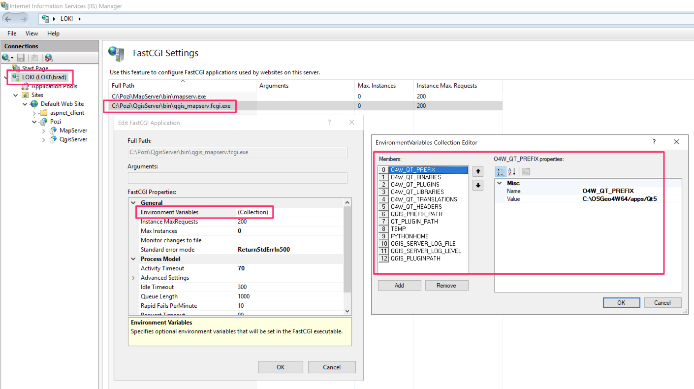

## Installation

On the server on which Pozi Server is installed:

* if any previous version of QGIS Desktop has been installed using the stand-alone installer, uninstall it
* go to [https://trac.osgeo.org/osgeo4w/](https://trac.osgeo.org/osgeo4w/)
* click on link for OSGeo4W network installer to download
* navigate to downloaded `osgeo4w-setup.exe` file, right-click on it, and "Run as administrator"
* Advanced Install, accept defaults
* Install for all users, accept defaults
* Choose a download site, select top one, Next
* Select Packages
  * Desktop
    * `qgis-ltr` - click on the word 'Skip' to toggle through to the latest version (eg 3.16.8-3)
  * Libs
    * `gdal-ecw`
    * `gdal-mss`
  * Web
    * `qgis-ltr-server`
* Next > accept defaults > "Install these packages..." > Next > "I agree..." > Next

## IIS Integration

QGIS Server IIS Integration using FastCGI.

NOTE: Pozi Server 2.2.8 ships with default configuration files for QGIS Server IIS Integration using FastCGI -- the following folder is assumed to exist if you have installed Pozi Server to the default `C:\Program Files (x86)\Pozi` location:

```
C:\Program Files (x86)\Pozi\server\iis\Pozi\QgisServer
```

### Install IIS

!!!secondary Copying and pasting using command prompt

When copying and pasting multiple lines into the command prompt, all lines will be executed except the last one. You must hit `Enter` for the last line to be executed.

!!!

In a new command prompt window, running as administrator:

```cmd
dism /online /enable-feature /featurename:IIS-WebServerRole
dism /online /enable-feature /featurename:IIS-WebServer
dism /online /enable-feature /featurename:IIS-ApplicationDevelopment
dism /online /enable-feature /featurename:IIS-ApplicationInit
dism /Online /Enable-Feature /FeatureName:IIS-CGI

```

If IIS has not previously been set up on the server, the command prompt may return `Restart Windows to complete this operation`.  Restarting may be necessary for the subsequent configuration.

### Configure IIS

```cmd
"%systemroot%\system32\inetsrv\appcmd" add app /site.name:"Default Web Site" /path:/Pozi /physicalPath:"C:\Program Files (x86)\Pozi\server\iis\Pozi"
"%systemroot%\system32\inetsrv\appcmd" add app /site.name:"Default Web Site" /path:/Pozi/QgisServer /physicalPath:"C:\Program Files (x86)\Pozi\server\iis\Pozi\QgisServer"

```

If the command prompt returns `"C:\Windows\system32\inetsrv\appcmd" is not recognised as an internal or external command`, then a restart may be required before re-attempting this configuration step.

There should be `web.config` file located at the following path:

```
C:\Program Files (x86)\Pozi\server\iis\Pozi\QgisServer
```

NOTE: If you have installed QGIS Server to a location other than the default `C:\OSGeo4W\apps\qgis-ltr\bin\qgis_mapserv.fcgi.exe` then you will need to update that path in the `web.config` below:

```xml !#5 C:\Program Files (x86)\Pozi\server\iis\Pozi\QgisServer\web.config
<?xml version="1.0" encoding="UTF-8"?>
<configuration>
    <system.webServer>
        <handlers>
            <add name="PoziQgisServerFastCgi" path="*" verb="*" type="" modules="FastCgiModule" scriptProcessor="C:\OSGeo4W\apps\qgis-ltr\bin\qgis_mapserv.fcgi.exe"
            resourceType="Unspecified" requireAccess="Script" allowPathInfo="false" preCondition=""  />
        </handlers>
        <caching enabled="true" enableKernelCache="true" />
    </system.webServer>
</configuration>
```

Back in the command prompt, run the following:

NOTE: If you have installed QGIS Server to a location other than the default `C:\OSGeo4W\apps\qgis-ltr\bin\qgis_mapserv.fcgi.exe` then you will need to update that path in the commands below:

```cmd
%windir%\system32\inetsrv\appcmd.exe unlock config -section:system.webServer/handlers
"%systemroot%\system32\inetsrv\appcmd" set config -section:system.webServer/fastCgi /+"[fullPath='C:\OSGeo4W\apps\qgis-ltr\bin\qgis_mapserv.fcgi.exe',idleTimeout='604800']" /commit:apphost
"%systemroot%\system32\inetsrv\appcmd" set config /section:isapiCgiRestriction /+"[path='C:\OSGeo4W\apps\qgis-ltr\bin\qgis_mapserv.fcgi.exe',description='PoziQgisServer',allowed='True']"

```

### Configure Environment Variables

+++ Command Prompt

Copy and paste the following into the command prompt:

```cmd
:: Clear any potentially pre-existing env vars (handy when doing upgrades)
"%systemroot%\system32\inetsrv\appcmd.exe" set config -section:system.webServer/fastCgi /-"[fullPath='C:\OSGeo4W\apps\qgis-ltr\bin\qgis_mapserv.fcgi.exe'].environmentVariables

:: Set env vars

:: The PATH variable required
"%systemroot%\system32\inetsrv\appcmd.exe" set config -section:system.webServer/fastCgi /+"[fullPath='C:\OSGeo4W\apps\qgis-ltr\bin\qgis_mapserv.fcgi.exe'].environmentVariables.[name='PATH',value='C:\OSGeo4W\apps\qgis-ltr\bin;C:\OSGeo4W\apps\qt5\bin;C:\OSGeo4W\bin;C:\Windows\system32;C:\Windows;C:\Windows\system32\WBem']" /commit:apphost

:: The following env vars may be optional
"%systemroot%\system32\inetsrv\appcmd.exe" set config -section:system.webServer/fastCgi /+"[fullPath='C:\OSGeo4W\apps\qgis-ltr\bin\qgis_mapserv.fcgi.exe'].environmentVariables.[name='O4W_QT_PREFIX',value='C:\OSGeo4W\apps\Qt5']" /commit:apphost
"%systemroot%\system32\inetsrv\appcmd.exe" set config -section:system.webServer/fastCgi /+"[fullPath='C:\OSGeo4W\apps\qgis-ltr\bin\qgis_mapserv.fcgi.exe'].environmentVariables.[name='O4W_QT_BINARIES',value='C:\OSGeo4W\apps\Qt5\bin']" /commit:apphost
"%systemroot%\system32\inetsrv\appcmd.exe" set config -section:system.webServer/fastCgi /+"[fullPath='C:\OSGeo4W\apps\qgis-ltr\bin\qgis_mapserv.fcgi.exe'].environmentVariables.[name='O4W_QT_PLUGINS',value='C:\OSGeo4W\apps\Qt5\plugins']" /commit:apphost
"%systemroot%\system32\inetsrv\appcmd.exe" set config -section:system.webServer/fastCgi /+"[fullPath='C:\OSGeo4W\apps\qgis-ltr\bin\qgis_mapserv.fcgi.exe'].environmentVariables.[name='O4W_QT_LIBRARIES',value='C:\OSGeo4W\apps\Qt5\lib']" /commit:apphost
"%systemroot%\system32\inetsrv\appcmd.exe" set config -section:system.webServer/fastCgi /+"[fullPath='C:\OSGeo4W\apps\qgis-ltr\bin\qgis_mapserv.fcgi.exe'].environmentVariables.[name='O4W_QT_TRANSLATIONS',value='C:\OSGeo4W\apps\Qt5\translations']" /commit:apphost
"%systemroot%\system32\inetsrv\appcmd.exe" set config -section:system.webServer/fastCgi /+"[fullPath='C:\OSGeo4W\apps\qgis-ltr\bin\qgis_mapserv.fcgi.exe'].environmentVariables.[name='O4W_QT_HEADERS',value='C:\OSGeo4W\apps\Qt5\include']" /commit:apphost
"%systemroot%\system32\inetsrv\appcmd.exe" set config -section:system.webServer/fastCgi /+"[fullPath='C:\OSGeo4W\apps\qgis-ltr\bin\qgis_mapserv.fcgi.exe'].environmentVariables.[name='QGIS_PREFIX_PATH',value='C:\OSGeo4W\apps\qgis-ltr']" /commit:apphost
"%systemroot%\system32\inetsrv\appcmd.exe" set config -section:system.webServer/fastCgi /+"[fullPath='C:\OSGeo4W\apps\qgis-ltr\bin\qgis_mapserv.fcgi.exe'].environmentVariables.[name='QT_PLUGIN_PATH',value='C:\OSGeo4W\apps\qt5\plugins']" /commit:apphost
"%systemroot%\system32\inetsrv\appcmd.exe" set config -section:system.webServer/fastCgi /+"[fullPath='C:\OSGeo4W\apps\qgis-ltr\bin\qgis_mapserv.fcgi.exe'].environmentVariables.[name='TEMP',value='C:\Windows\Temp']" /commit:apphost
"%systemroot%\system32\inetsrv\appcmd.exe" set config -section:system.webServer/fastCgi /+"[fullPath='C:\OSGeo4W\apps\qgis-ltr\bin\qgis_mapserv.fcgi.exe'].environmentVariables.[name='PYTHONHOME',value='C:\OSGeo4W\apps\Python39']" /commit:apphost
"%systemroot%\system32\inetsrv\appcmd.exe" set config -section:system.webServer/fastCgi /+"[fullPath='C:\OSGeo4W\apps\qgis-ltr\bin\qgis_mapserv.fcgi.exe'].environmentVariables.[name='QGIS_SERVER_IGNORE_BAD_LAYERS',value='1']" /commit:apphost
"%systemroot%\system32\inetsrv\appcmd.exe" set config -section:system.webServer/fastCgi /+"[fullPath='C:\OSGeo4W\apps\qgis-ltr\bin\qgis_mapserv.fcgi.exe'].environmentVariables.[name='QGIS_SERVER_LOG_FILE',value='C:\Program Files (x86)\Pozi\server\iis\logs\qgis_server.log']" /commit:apphost
"%systemroot%\system32\inetsrv\appcmd.exe" set config -section:system.webServer/fastCgi /+"[fullPath='C:\OSGeo4W\apps\qgis-ltr\bin\qgis_mapserv.fcgi.exe'].environmentVariables.[name='QGIS_SERVER_LOG_LEVEL',value='1']" /commit:apphost
"%systemroot%\system32\inetsrv\appcmd.exe" set config -section:system.webServer/fastCgi /+"[fullPath='C:\OSGeo4W\apps\qgis-ltr\bin\qgis_mapserv.fcgi.exe'].environmentVariables.[name='QGIS_PLUGINPATH',value='C:\OSGeo4W\apps\qgis-ltr\plugins']" /commit:apphost
"%systemroot%\system32\inetsrv\appcmd.exe" set config -section:system.webServer/fastCgi /+"[fullPath='C:\OSGeo4W\apps\qgis-ltr\bin\qgis_mapserv.fcgi.exe'].environmentVariables.[name='GDAL_DRIVER_PATH',value='C:\OSGeo4W\bin\gdalplugins']" /commit:apphost

```

+++ Manual Configuration

If the command prompt option doesn't work, you can configure the environment variables manually.



Windows > IIS > select server > Fast CGISettings > select item we just configured > Edit > Environment variables:

Name | Value 
-----|------
PATH | `C:\OSGeo4W\apps\qgis-ltr\bin;C:\OSGeo4W\apps\qt5\bin;C:\OSGeo4W\bin;C:\Windows\system32;C:\Windows;C:\Windows\system32\WBem`
O4W_QT_PREFIX | `C:\OSGeo4W\apps\Qt5`
O4W_QT_BINARIES | `C:\OSGeo4W\apps\Qt5\bin`
O4W_QT_PLUGINS | `C:\OSGeo4W\apps\Qt5\plugins`
O4W_QT_LIBRARIES | `C:\OSGeo4W\apps\Qt5\lib`
O4W_QT_TRANSLATIONS | `C:\OSGeo4W\apps\Qt5\translations`
O4W_QT_HEADERS | `C:\OSGeo4W\apps\Qt5\include`
QGIS_PREFIX_PATH | `C:\OSGeo4W\apps\qgis-ltr`
QT_PLUGIN_PATH | `C:\OSGeo4W\apps\qt5\plugins`
TEMP | `C:\Windows\Temp`
PYTHONHOME | `C:\OSGeo4W\apps\Python39`
QGIS_SERVER_IGNORE_BAD_LAYERS | `1`
QGIS_SERVER_LOG_FILE | `C:\Program Files (x86)\Pozi\server\iis\logs\qgis_server.log`
QGIS_SERVER_LOG_LEVEL | `1`
QGIS_PLUGINPATH | `C:\OSGeo4W\apps\qgis-ltr\plugins`
GDAL_DRIVER_PATH | `C:\OSGeo4W\bin\gdalplugins`

(End of `Manual Configuration` instructions)

+++

!!! Log Levels

The above script/instructions sets the `QGIS_SERVER_LOG_LEVEL` value to `1` to capture warnings and critical events in the log. If you want to capture *all* activity for troubleshooting purposes, set the value to `0` in the GUI.

More information about QGIS log levels is at https://docs.qgis.org/latest/en/docs/server_manual/config.html#qgis-server-log-level

!!!

### Application Pool

Create PoziQgisServer application pool:

```cmd
"%systemroot%\system32\inetsrv\appcmd.exe" add apppool /name:"PoziQgisServer"
"%systemroot%\system32\inetsrv\appcmd.exe" set app "Default Web Site/Pozi/QgisServer" /applicationPool:"PoziQgisServer"
"%systemroot%\system32\inetsrv\appcmd.exe" set config -section:system.applicationHost/applicationPools /+"[name='PoziQgisServer'].recycling.periodicRestart.schedule.[value='02:00:00']" /commit:apphost
"%systemroot%\system32\inetsrv\appcmd.exe" set apppool "PoziQgisServer" /recycling.periodicRestart.time:00:00:00
"%systemroot%\system32\inetsrv\appcmd.exe" set apppool "PoziQgisServer" /processModel.idleTimeout:00:00:00
"%systemroot%\system32\inetsrv\appcmd.exe" set apppool "PoziQgisServer" /startMode:AlwaysRunning
"%systemroot%\system32\inetsrv\appcmd.exe" set app "Default Web Site/Pozi/QgisServer" /preloadEnabled:true

```

Set the user for the PoziQgisServer application pool (this step may not be needed because the command immediately above seems to take care of this - remove this step if it can be confirmed this is not needed):

- IIS > select server > Sites > Default Web Site > Pozi > QgisServer > Advanced Settings > Application Pool > set to PoziQgisServer

Set permissions for `IIS AppPool\PoziQgisServer` :

- IIS > select server > Application Pools > PoziQgisServer > Advanced settings > Identity > Application Pool Identity > Custom account > enter details of the domain user that runs Pozi "service" account (include the domain prefix and backslash before the username)


### Configuring Clean URLs for QGIS Server FastCGI

The following instructions relate to hiding the QGIS project file path from the GetCapabilities URL.

```cmd
mkdir "C:\Program Files (x86)\Pozi\server\iis\Pozi\QgisServer\Next\Vicmap"
xcopy "C:\Program Files (x86)\Pozi\server\iis\Pozi\QgisServer\web.config" "C:\Program Files (x86)\Pozi\server\iis\Pozi\QgisServer\Next\Vicmap"

```

Open the new `web.config` file located in the `C:\Program Files (x86)\Pozi\server\iis\Pozi\QgisServer\Next\Vicmap` folder and replace the `PoziQgisServerFastCgi` with `'PoziQgisServerNextVicmapFastCgi` -- please note that this handler name has to be unique which is why we are replacing it:

```xml !#5 web.config
<?xml version="1.0" encoding="UTF-8"?>
<configuration>
    <system.webServer>
        <handlers>
            <add name="PoziQgisServerNextVicmapFastCgi" path="*" verb="*" type="" modules="FastCgiModule" scriptProcessor="C:\OSGeo4W\apps\qgis-ltr\bin\qgis_mapserv.fcgi.exe"
            resourceType="Unspecified" requireAccess="Script" allowPathInfo="false" preCondition=""  />
        </handlers>
        <caching enabled="true" enableKernelCache="true" />
    </system.webServer>
</configuration>
```

Below we are going to create another application pool that we are going to set the `MAP` environment variable for:

```cmd
"%systemroot%\system32\inetsrv\appcmd" add app /site.name:"Default Web Site" /path:/Pozi/QgisServer/Next/Vicmap /physicalPath:"C:\Program Files (x86)\Pozi\server\iis\Pozi\QgisServer\Next\Vicmap"
"%systemroot%\system32\inetsrv\appcmd.exe" add apppool /name:"PoziQgisServerNextVicmap"
"%systemroot%\system32\inetsrv\appcmd.exe" set app "Default Web Site/Pozi/QgisServer/Next/Vicmap" /applicationPool:"PoziQgisServerNextVicmap"

"%systemroot%\system32\inetsrv\appcmd.exe" set config -section:system.applicationHost/applicationPools /+"[name='PoziQgisServerNextVicmap'].recycling.periodicRestart.schedule.[value='02:00:00']" /commit:apphost
"%systemroot%\system32\inetsrv\appcmd.exe" set apppool "PoziQgisServerNextVicmap" /recycling.periodicRestart.time:00:00:00
"%systemroot%\system32\inetsrv\appcmd.exe" set apppool "PoziQgisServerNextVicmap" /processModel.idleTimeout:00:00:00
"%systemroot%\system32\inetsrv\appcmd.exe" set apppool "PoziQgisServerNextVicmap" /startMode:AlwaysRunning
"%systemroot%\system32\inetsrv\appcmd.exe" set app "Default Web Site/Pozi/QgisServer/Next/Vicmap" /preloadEnabled:true

"%systemroot%\system32\inetsrv\appcmd.exe" set config -section:system.applicationHost/applicationPools /+"[name='PoziQgisServerNextVicmap'].environmentVariables.[name='QGIS_PROJECT_FILE',value='C:\Program Files (x86)\Pozi\server\data\local\sample\queenscliffe\vicmap_iis_clean.qgs']" /commit:apphost

```

And now QGIS Server should respond to query for that `QGIS_PROJECT_FILE` without including it in URL:

http://local.pozi.com:3001/iis/qgisserver/next/vicmap?service=WMS&request=GetCapabilities

!!!secondary Additional Reference for Clean URLs

Development notes that may contain useful additional information for Pozi developers:

* [https://github.com/pozi/PoziServer/pull/40#issuecomment-972331899](https://github.com/pozi/PoziServer/pull/40#issuecomment-972331899)

!!!