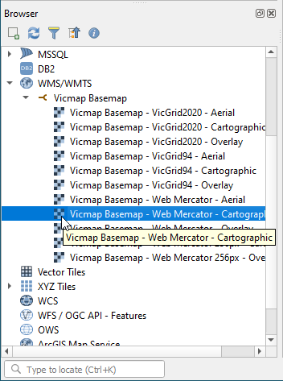
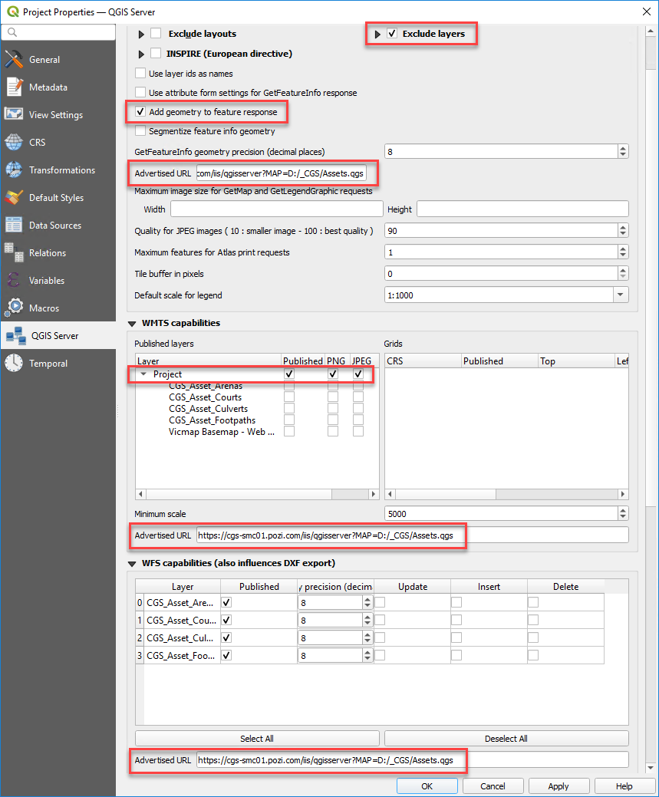

# Creating QGIS Projects

## Create Project

!!!

If you have an existing QGIS project that is already configured for Pozi, you can fast-track the steps below.

Save a copy of an existing project, remove all layers (except for any basemap that you're using as a reference layer), and update the `Advertised URL` settings to use the name of the new project file.

!!!

Create new project from scratch:

1. open QGIS
2. Project > Save > specify name and path of new project file (`.qgs`)
3. note the exact file path of project file (needed for subsequent configuration below)

### Add Basemap

It's useful to include a basemap in the project to provide visual context for the layers you will add on top.

#### Example

If you've set up 'Vicmap Basemap' as a WMS/WMTS source, you can easily one of its layers as your basemap.

Browser > WMS/WMTS > Vicmap Basemap > Vicmap Basemap - Web Mercator - Cartographic

{style="width:250px"}

## Construct 'Advertised URL'

Construct the URL required for the project to 'advertise' what layers will be available from this project file. Essentially, the project file needs a reference to itself in a URL format.

Combine the details below:

1. server URL (default server URL is `https://local.pozi.com/`, but check your local setup for any custom endpoint)
2. service endpoint (eg `iis/qgisserver?`)
3. QGIS project file path (eg `MAP=C:/Program%20Files%20(x86)/Pozi/userdata/local/property.qgs`)

Combine these three text strings to create your Advertised URL.

Example Advertised URL:

https://local.pozi.com/iis/qgisserver?MAP=C:/Program%20Files%20(x86)/Pozi/userdata/local/property.qgs

Copy your URL to your clipboard or a blank text document for reference. This URL will be used in subsequent configuration below.

## Enable WMS, WMTS and WFS Services

!!!
Pozi requires the project to be enabled for WMS, even if you intend for Pozi to use only WFS for accessing the layers.
!!!

1. Project > Properties > QGIS Server
2. update WMS capabilities settings
   * `Exclude layers` (tick) > add > pick any background layers you don't need to see in Pozi
   * `Add geometry to feature response`: tick on
   * `Advertised URL`: enter Advertised URL
3. update WMTS capabilities settings
   * `Published layers > Project > Published`: tick on
   * `Advertised URL`: enter Advertised URL
4. update the WFS capabilities settings:
   * `Advertised URL`: enter Advertised URL
5. OK

{style="width:600px"}

6. OK
7. Project > Save  (`Ctrl` + `S`)

## Choose Publishing Format for Project (WMS vs WFS)

WFS (Web Feature Service) provides users with the ability to directly interact with map features. When a WFS layer is loaded in Pozi, every feature from the source dataset is sent to the browser as *vector* layer that includes all geometries and attributes.

Advantages:

* cursor changes when hovering over object
* select individual features and display results in Info Panel (without displaying results of features on other layers at the same location)
* enable layers to be interactive using Pozi's filter, report and table view functionality

Disadvantages:

* the browser can be easily overwhelmed when dealing with thousands of features or complex features with many vertices
* not all QGIS styles are supported in Pozi for vector features
* cannot use text expressions for labels
* restricting visibility to specific zoom ranges is not currently supported

As a guideline, use WFS for layers with fewer than 5-10K point features, and even fewer for line and polygon features depending on shape complexity.

## Further Settings

A comprehensive guide for configuring QGIS projects for publishing layers via WMS/WFS can be found at:

https://docs.qgis.org/latest/en/docs/server_manual/getting_started.html#creatingwmsfromproject

## Register Project

### Test GetCapabilities URL

Construct a `GetCapabilities` URL by combining the following:

1. Advertised URL from above (eg `https://local.pozi.com/iis/qgisserver?MAP=C:/Program%20Files%20(x86)/Pozi/userdata/local/property.qgs`)
2. preferred service, either:
   * WMS: `&service=WMS`
   * WFS: `&service=WFS`
3. GetCapabilities request: `&request=GetCapabilities`

Combine these three text strings to create a `GetCapabilities` URL.

Example WMS `GetCapabilities` URL:

https://local.pozi.com/iis/qgisserver?MAP=C:/Program%20Files%20(x86)/Pozi/userdata/local/property.qgs&service=WMS&request=GetCapabilities

Test this URL by pasting it in your browser and check that you get a valid response that lists the available layers.

### Submit Helpdesk Ticket

Email support@pozi.com with these details:

* name of layer group to appear in Pozi layer panel
* order in which the layer group is to appear in the Pozi Layer Panel (relative to an existing layer group)
* choose `WFS` or `WMS` (Note: combined `WMS/WFS` coming soon)
* WFS or WMS `GetCapabilities` URL

Within 24 hours, the new layer group will be configured and available for users to view in Pozi.

During this time, and any time afterwards, you may start [adding and configuring layers](/administrator-guide/qgis/managing-layers-in-qgis/) in your new project.
