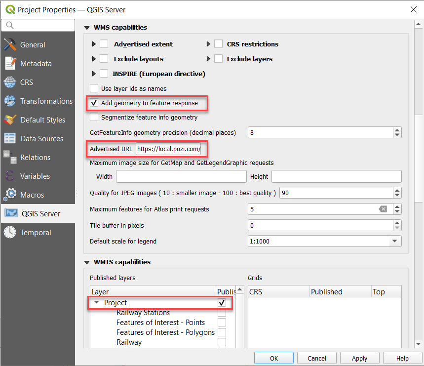

# Creating QGIS Projects

## Create Project

!!!

If you have an existing QGIS project that is already configured for Pozi, you can fast-track the steps below.

Save a copy of an existing project, remove all layers, and update WMS/WFS URL settings to include the name of the new project file.

!!!

Create new project from scratch:

1. open QGIS
2. Project > Save > specify name and path of new project file (`.qgs`)
3. note the exact file path of project file (needed for subsequent configuration below)

## Construct `GetCapabilities` URL

Combine the details below:

1. server URL (eg `https://local.pozi.com/`)
2. service and WMS/WFS parameters (eg `iis/qgisserver?service=WMS&request=GetCapabilities`)
3. QGIS project file path (eg `&MAP=C:/Program%20Files%20(x86)/Pozi/userdata/local/property.qgs`)

For example:

https://local.pozi.com/iis/qgisserver?service=WFS&request=GetCapabilities&MAP=C:/Program%20Files%20(x86)/Pozi/userdata/local/property.qgs

Copy your URL to your clipboard or a blank text document for reference. This URL will be used in subsequent configuration below. Note that the URL will not yet return a valid response until the configuration is complete.

## Enable WMS Service

Pozi requires the project to be enabled for WMS.

1. Project > Properties > QGIS Server
2. update WMS settings
   * `Add geometry to feature response`: tick on
   * `Advertised URL`: enter WMS GetCapabilities address
     * example: `https://local.pozi.com/iis/qgisserver?service=WMS&request=GetCapabilities&MAP=C:/Program%20Files%20(x86)/Pozi/userdata/local/property.qgs`

{style="width:600px"}

3. OK
4. Project > Save  (`Ctrl` + `S`)
5. test that you get a valid WMS/WFS GetCapabilities response by entering the GetCapabilities request in your browser. 

## Enable WFS Service

WFS (Web Feature Service) provides users with the ability to directly interact with map features.

Advantages:

* cursor changes when hovering over object
* select individual features and display results in Info Panel (without displaying results of features on other layers at the same location)
* enable layers to be interactive using Pozi's filter, report and table view functionality

Disadvantages:

* the browser can be easily overwhelmed when dealing with thousands of features or complex features with thousands of vertices
* labeling for WFS features is not well supported, especially for line features such as roads
* restricting visibility to specific zoom ranges is not supported

As a guideline, use WFS for layers with fewer than 5-10K features.

1. Project > Properties > QGIS Server
2. update the WFS settings:
   * `Advertised URL`: enter WFS GetCapabilities
     * example: `https://local.pozi.com/iis/qgisserver?service=WFS&version=1.1.0&request=GetCapabilities&MAP=C:/Program%20Files%20(x86)/Pozi/server/data/local/property.qgs`
3. OK
4. Project > Save (`Ctrl` + `S`)

## Exclude Base Layer

If your project uses a base layer for background context, you'll want to exclude it from appearing in the layer panel in Pozi.

QGIS > Project > Properties > QGIS Server > WMS Capabilities > Exclude layers (tick) > add > pick layer(s) to exclude > OK

QGIS > Project > Save

## Register Project

Your project is now ready to be registered in Pozi. Email support@pozi.com with these details:

* name of layer group to appear in Pozi layer panel
* order in which the layer group is to appear (relative to an existing layer group)
* choose `WFS` or `WMS` (Note: `WMS/WFS` coming soon)
* GetCapabilities URL

Within 24 hours, the new layer group will be configured and available for users to view in Pozi.
