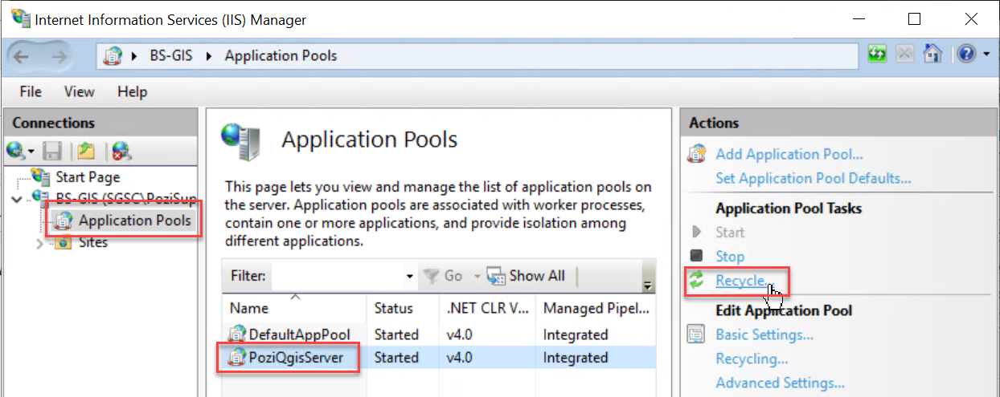
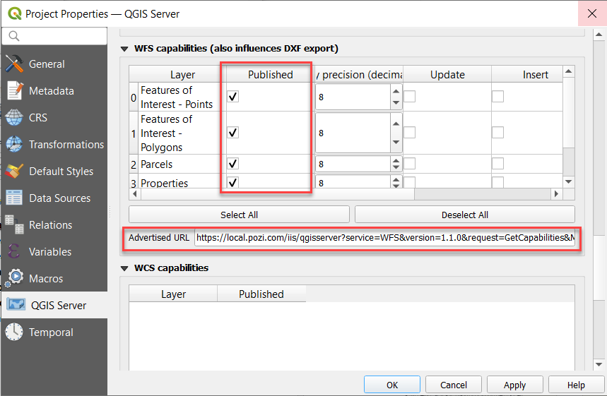
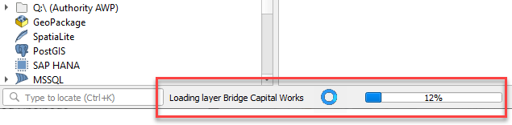

# Managing Layers in QGIS

## Adding Layers

Using your [existing QGIS project](creating-qgis-projects), you can add new layers to publish them to your users.

1. open your project file in QGIS
2. Layer > Add Layer > pick from vector, raster or other options
3. navigate to source (see note about file paths below)
4. Add
5. Close
6. Project > Save (`Ctrl` + `S`)

[QGIS Reference: Opening Data](https://docs.qgis.org/latest/en/docs/user_manual/managing_data_source/opening_data.html#opening-data)

==- A note about layer file paths

When adding new file-based layers, use the layer's absolute file path (UNC) to ensure that the service under which the QGIS Server is running can recognise the path.

Often your own user account may have certain drives mapped for convenience, so you might be used to working with data using file paths that refer to a drive letter (eg, `S:\` or `V:\`). However, the domain user account that runs QGIS Server often won't have these drives mapped.

A UNC path is an absolute path that is recognised by all user accounts, regardless of what drives are mapped on startup. An example UNC path might look like this:

* `\\ad.hrcc.vic.gov.au\shared\GIS\`
* `\\bs-intra\GIS\`

Add the UNC path of your GIS data folder as a *Favorite* in the QGIS Browser panel for easy access. Learn more [here](https://docs.qgis.org/latest/en/docs/user_manual/introduction/browser.html#favorites). Also add a shortcut to the UNC location on your PC desktop for extra convenience.

==-

!!!warning

Some changes may not be available immediately in Pozi. If you encounter an issue such as a recently added or renamed layer not loading, restart the IIS application pool on the server.

Windows > IIS > (select server) > Application Pools > PoziQgisServer > Recycle

{style="width:400px"}

!!!

## Configuring Layers

Some common layer configuration tasks you can do in QGIS include:

* [change layer name](https://docs.qgis.org/latest/en/docs/user_manual/working_with_vector/vector_properties.html#source-properties)
* [filter data](https://docs.qgis.org/latest/en/docs/user_manual/working_with_vector/vector_properties.html#query-builder)
* [modify fields](https://docs.qgis.org/latest/en/docs/user_manual/working_with_vector/vector_properties.html#fields-properties)

## Styling Layers

Using QGIS, you can control many visual aspects of your layer.

Reference:

* [basic symbols](https://docs.qgis.org/latest/en/docs/user_manual/working_with_vector/vector_properties.html#single-symbol-renderer)
* [thematic styling](https://docs.qgis.org/latest/en/docs/user_manual/working_with_vector/vector_properties.html#categorized-renderer)
* [add labels](https://docs.qgis.org/latest/en/docs/user_manual/working_with_vector/vector_properties.html#labels-properties)

### Supported Styles in Pozi

For any layers that are to be made accessible to Pozi as *vector* layers (ie, WFS), use only the supported styles specified below. Even if you only intend to serve layer via WMS, we recommend to keep the styling as simple as possible to make any future transition to WFS easier.

Styling options supported by Pozi:

* simple points, lines, polygons symbolisers
  * `square`
  * `circle`
  * `triangle`
  * `star`
  * `cross`
  * `x`
* rule-based styles
* basic labels
* customisable legend text

Not currently supported:

* SVG marker symbols
* `diamond` symbol
* fill hatching
* label offsets
* rules based on a field name that contains spaces

Tips:

* any changes to opacity must be set in the style colour setting - the layer's global opacity slider has no effect
* for polygon features to be selectable, the fill opacity must be greater than `0` - it can be as little as 1%
* increase symbol size from the default size in QGIS to enable easier interaction for users in the browser
* increase line thicknesses beyond the QGIS default to enable users to more easily select line features

## Enable Layers for WFS

As a guideline, enable WFS only for layers with fewer than 5-10K features. See [here](/administrator-guide/qgis/creating-qgis-projects/#enable-wfs-service) for more information about pros and cons of using WFS.

1. Project > Properties > QGIS Server
2. `WFS capabilities > Published`: tick on for each layer to be published
3. OK
4. Project > Save (`Ctrl` + `S`)

{style="width:600px"}

## Table File Maintenance

If you need to move, rename or delete a table, first remove the layer from any QGIS project to which the layer is registered, then save the QGIS project.

You may then attempt to make any changes to the table file(s). If Windows prevents you from making any changes, stop the IIS service that is locking the files.

Windows > IIS > (select server) > Application Pools > PoziQgisServer > Stop

You may also need to stop any other services that start with `PoziQgisServer`.

Restart the service(s) after you make your changes.

## Troubleshooting

==- Layer features are not displayed when the layer is turned on

Pozi is only able to display features that have at least one valid/non-null attribute.

If any records in your data contain no attributes, populate some values into one of the fields.

==- Layers are not displayed with the styling from QGIS

Pozi will display layers in a generic style if it cannot process the style that was configured in QGIS.

Simplify the style in the QGIS project and try again. Replace hatch styles with semi-opaque fills. Replace custom point symbols with one of the standard symbols specified above.

==- Layers are slow to load

Use QGIS to determine whether the layer also causes its project file to load slowly. Observer the progress bar at the bottom to see if any layers are taking more than a fraction of a second to load in QGIS. If it appears that a layer is taking longer, check the source data. If it's from a database view, check that any join fields are properly indexed.

==-
