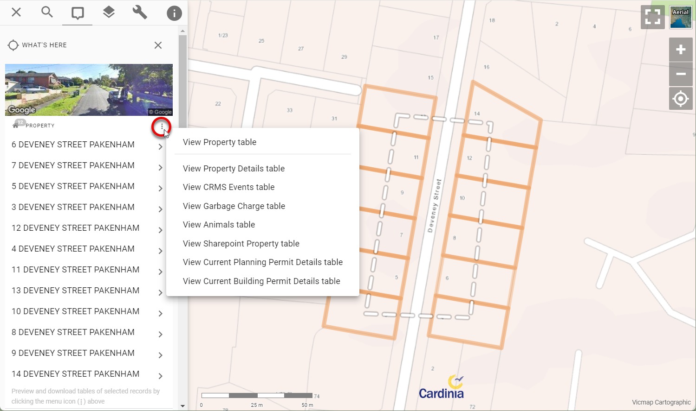

# Introducing Advanced Selection

Late last year, we released one of Pozi's significant enhancements to date - super-charged selection capabilities. We call it *Advanced Selection*.

You can now use Pozi's polygon or polyline selection tools to select all intersecting features from *any active layer*. Properties, trees, drainage pits, road defects - you name it! The results can be viewed as a table and optionally downloaded.

Previously, the bulk selection tools would return only features from the default *What's Here* layers such as properties, waste collection, etc.

Now when you use the polygon or polyline selection tool, Pozi's info panel will display the results of every feature in every active (switched on) layer.

In addition, a new options button (three stacked dots) is shown at the top of each result set. Click the dots to view the selected features in a table view. 

Then use the table's download button to optionally download the results in CSV format.

If a layer has any linked/child datasets, you'll also see menu options to view those results as a table too. This enables you to bulk select properties on the map to view/download any linked information such as property owner details, animal registrations, planning permits, etc. Similarly, you can bulk select asset features on the map to view all related inspection or maintenance events for those assets. Any child dataset that has been configured for the active layer will be available to view and download in this menu.

For users who are used to using the old download links at the bottom of the selection results, we've replaced the links with text saying "blah". We'll remove this text soon after giving users the chance to adjust to the new workflow.

Thank-you to [Cardinia Shire Council](https://cardinia.pozi.com/) for funding the development of this functionality.

Let us know what you think of Pozi's new Advanced Selection!

---

Stay tuned for further enhancements. Our next major development will be to enable any selected feature to be used for performing selections on other layers. Imagine selecting a work zone polygon, and using that to fetch every work order within that zone. Or selecting a public park feature, and querying all the trees within the park. This elevates Pozi from a simple enquiry tool to a powerful analysis tool.