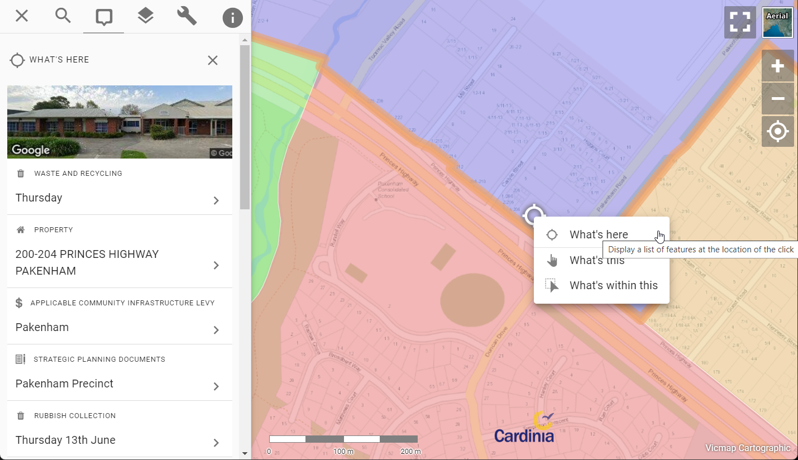

# Introducing Context-Aware Info Results

We've just rolled out a change to Pozi that makes it more intuitive for users to view information about map features and locations.

Now when you click on any vector polygon feature or any overlapping vector features, the information panel will not only display the topmost feature, but a list of *all* features at the location you clicked on.

*Click the **New** and **Previously** tabs below to compare the information displayed in the info panel.*

+++ New

+++ Previously

+++

## Why the Change?

Until now, Pozi has only displayed the details of the topmost feature in the information panel for any vector layers. This works well for point and line features, because if you want to view information about what else is at or around the same location, you could always click *next* to the feature.

Polygons are different though. Because they occupy 2D space over the map, there was no avoiding clicking on them if they are covering the location you're interested in. You couldn't query anything else at the same location because Pozi would only show information about the topmost feature and prevent you from click on features underneath.

## What's Changed

Pozi is now more context-aware, and treats any vector polygon objects under your cursor differently to vector point and line features. 

When you click on a vector polygon layer, or any layer containing overlapping features, Pozi's information panel now lists all features at that location.

This new functionality makes it easier for users to discover more about features and locations of interest.

## More Flexible Configuration

This change opens up new possibilities for use of vector layers.

Previously, it was common for administrators to *not* enable polygon layers as vector (WFS) to avoid the issue of users not being able to click on other features at the same location. This meant that users missed out on the advantages that vector layers provide such as searching, filtering and table view.

Now that vector polygons no longer prevent users from querying other layers, administrators are free to enable polygon layers for vector just like point and line layers, knowing that users can now interact with other layers in the map.

!!!

It's not always practical to enable datasets that contain tens of thousands of features as a vector layer.

Learn more about the pros and cons of vector layers [here](/admin-guide/qgis/configuring-layers.md#advantages-of-vector-layers).

!!!

### Feature Stacking

Because users can now view details of all stacked and overlapping vector features, it becomes practical to use vector point layers for displaying multiple features at the same location.

For example, animal registrations can be represented as a point layer based on the related property centroids. Users can see at a glance which properties have registered animals. Whether there are one or more animals registered at a property, users can click on the point, and they will now see *all* the animal registrations for that property, not just the topmost one.

## New Right-Click Menu

Pozi offers both the *new* and *old* ways of interacting with map features via its new right-click menu.

Right-click on the map and select "What's here" to return all features at the location you clicked on. This is the new way that Pozi now behaves for vector polygon layers and overlapping vector features.

Alternatively, right-click on a vector feature and select "What's this" to return information about the topmost feature. This is how Pozi used to behave by default for all vector layers.

And for Pozi's new advanced spatial query functionality, right-click on a vector feature and select "What's within/along this" to return all features that intersect with the feature. (We'll reveal more about this exciting new feature in another post!)

Happy mapping!
