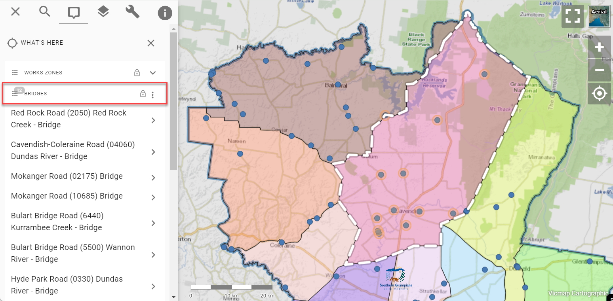

# Introducing Dynamic Spatial Querying

Pozi continues to develop advanced spatial capabilities while retaining its ease of use.

Pozi's latest update enables you to use any selected feature from any layer to select intersecting features from any other layer.

Dynamic spatial querying allows you to perform workflows like...

- select properties along a pipeline
- compile a list of assets within a park
- identify all road defects within a maintenance zone
- generate report of capital spending projects within a council ward
- view a table of property owners within a subdivision

No special configuration is required to enable this new functionality. Any queryable layer can be used for selecting features from any other queryable layer.

## How To Use

When you view the details of any selected feature, you'll now see a menu button (three stacked dots) next to the feature title. Click the button to reveal the new option, which will be named differently depending on the feature type.

- point feature: "What's here"
- line feature: "What's along here"
- polygon feature: "What's within here"

When you click one of these options, Pozi lists every active layer and default "What's Here" datasets as tabs in the info panel. Click to expand the tab of the layer you're interested in.

For example, if you want to see all intersecting bridge features, click the Bridges result tab to expand it.

Upon the tab's expansion, Pozi uses the selected feature's geometry to perform a spatial query to return every intersecting feature in the layer and display the results in the info panel.

The selection can also be viewed as a table. Click the three dots in the results header to reveal the table view options. If there are related child datasets configured for the layer, you'll see menu options to view those results as a table too.

## New Right-Click Menu

The new spatial query functionality is also accessible via a new right-click menu.

Right-click on the map to reveal the new options. If your cursor is over a vector feature, you'll be presented with options to query the feature ("What's this"), query all features that intersect with the feature ("What's within/along this"), or to *drill down* to all features that intersect with the cursor location ("What's here").

## What's Next

This is just the beginning for using selected features to support a variety of workflows. The new feature menu opens up new possibilities to provide other valuable workflows based on an initial selection from the map. Here is a taste of what's to come:

- navigate to the selected feature
- share selection via link
- download selected feature
- copy selected feature to annotation layer
- display measurements
- make a new selection based on a user-input buffer distance

We'll continue to develop advanced spatial functionality while keeping the user experience as simple and distraction-free as possible!
