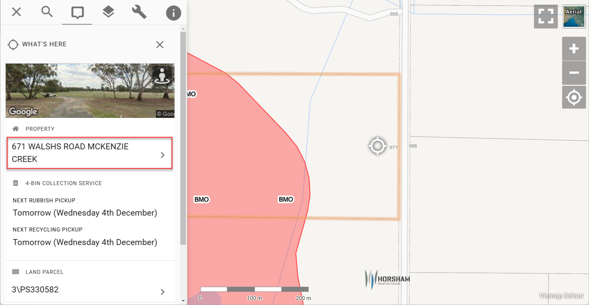
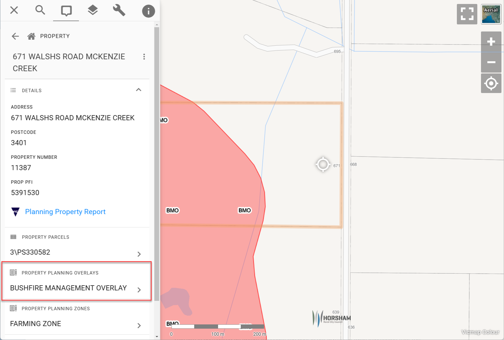

# Best Practice for Spatial Queries

Dynamic spatial intersections are a powerful component of Pozi's user experience. However, they sometimes require some configuration to ensure users obtain the information they need.

## Use Case

A common use case for Pozi users is to know whether a property is affected by any planning overlay or not.

Simply clicking on a location on the Pozi map will not trigger the necessary spatial intersection between a property and an overlay.

How do you configure Pozi to ensure users know for certain whether a property is affected by any overlay or not?

## Configuration

### Selectability

If the overlays layer is selectable, users will see results in the What's Here results about any overlay found at the location of the click. However this doesn't necessarily tell users whether the target property is affected by any overlay or not.

You can avoid giving users the impression that simply clicking on a location on the map will give them the right information by making the overlays layer *unselectable*. This will prevent users seeing any overlays result in the initial What's Here results.

https://pozi.com/admin-guide/qgis/configuring-layers/#selectability

### Child Dataset

Pozi can be made to trigger a spatial intersection between the property and overlay layers by configuring the overlay layer as a *child dataset* of the property layer.

If you already have an overlay layer that is used for visualisation purposes, and it's *not* enabled for WFS (which is typically the case to ensure performance and styling of large layers), you'll need a new dedicated layer that *is* enabled for WFS and configured as a child dataset of the property layer.

Duplicate the existing overlay layer in the QGIS project, give the new layer a different name (such as Property Planning Overlays) to avoid conflicting with the existing overlay layer name, and enable the layer for WFS. Then add `parent=Property, showInLayerControl=false` to the layer keywords.

https://pozi.com/admin-guide/qgis/configuring-linked-datasets/#spatial-filter

With this configuration, Pozi will trigger a spatial intersection between the parent (Property) and child (Property Planning Overlays) layers when the user selects any property.

!!! note
We are currently working to make it even easier to configure spatial queries. Upcoming releases of Pozi will enable layers to be used as child datasets while also being displayed as WMS. This will avoid the need to have separate layers for spatial intersection and visualisation purposes. Stay tuned!
!!!

## End Result

When the user clicks on the map, the What's Here results will show any features (from the property layer and any other active layers) found at that location as per normal. The user then selects the desired property feature, and Pozi performs a spatial query between the property and overlay layer. Any intersecting overlays will be displayed under the property details, under the heading 'Property Planning Overlays'.

This enables the user to know with certainty whether the property is affected by any overlay or not.

## Example

https://horsham.pozi.com/#/x[142.15469]/y[-36.77435]/z[16]/feature[whatshere,142.15469%20-36.77435]/layers[planningoverlays]/

From the initial What's Here results, the user selects the desired property by clicking the feature title (ie, the property address).

Pozi shows that the property is affected by an overlay despite the user not having directly clicked on the overlay feature.

Notes:

- the planning overlays are combined into a single layer, which has major benefits:
  - improve performance by reducing the number of WMS requests to the server every time the user zooms or pans the map
  - improve user experience by reducing the space taken up in the Info Panel to display the presence or absence of any overlay
- the overlays layer used for visualisation is configured in QGIS as *unselectable*
- a 'Property Planning Overlays' layer is added to QGIS, enabled for WFS, and configured as a *child dataset* of the property layer
- with the 'Property Planning Overlays' layer configured as a child dataset, it is not even necessary for the layer to be visible in order for users to see the results of the spatial query
- if your existing overlays layer is already enabled for WFS (which would only be the case if styling and performance are suitable for WFS), you can use it directly as a child dataset of the property layer without adding a separate layer - simply add `parent=Property` to the existing overlay layer keywords
