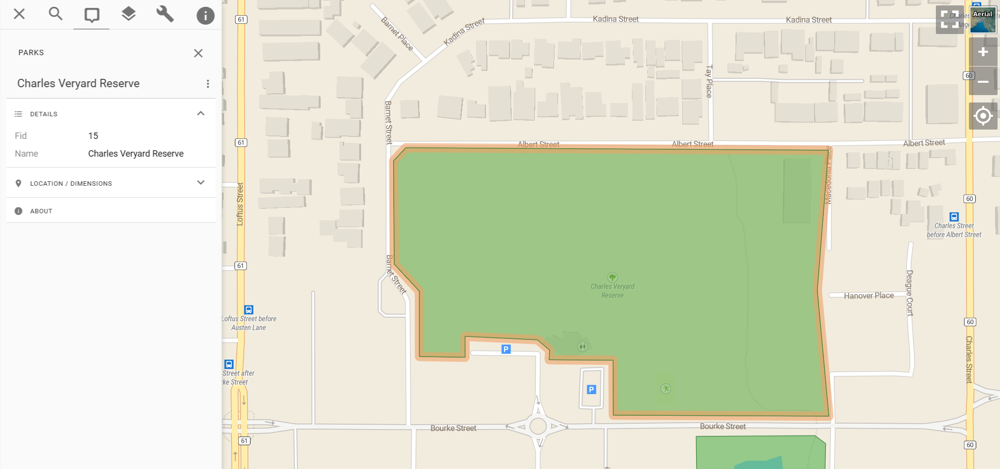

# Enhanced Link-Ins

We're excited to announce improvements to Pozi's link-in functionality to make third-party integrations even more powerful.

As the name suggests, the Pozi *link-in* enables third-party applications to link ***in*** to Pozi. Following a simple URL format, any application can launch Pozi and zoom directly to specific features in your map. The new format link-in looks like this:

https://council.pozi.com/#/feature[parks.fid,15]/

This example link launches the Pozi web application, activates the Parks layer, selects and highlights the target feature, zooms the map to it, and displays its details in the Info Panel.



## What's New

### Automatically Zoom to Feature

Pozi link-ins have long supported the selection of specific features, but additional URL parameters were required to position the map view at the appropriate location. Pozi now automatically zooms to the selected feature based on its location as well as its size.

### Choose Your Link Field

Previously, the link-in required Pozi's internal id field as the feature link, which didn't always reflect any id known to external applications. Now, the link-in URL can specify *any* field from the selected feature's layer to use for the link. Simply append the layer name with a dot followed by the field name to the layer name in the link-in URL.

Example: link to a feature in the `Parks` layer where the `fid` field is `15`:

```
https://council.pozi.com/#/feature[parks.fid,15]/
```

### Turn On Layer Automatically

The link-in now turns on the target layer without requiring a separate `layers[...]` parameter to load it. Link-in URLs are more self-contained, making them easier to generate, share and use.

## Try It Out

This enhancement is part of our ongoing commitment to make spatial data sharing and collaboration as seamless as possible. Try it out today and let us know what you think!
