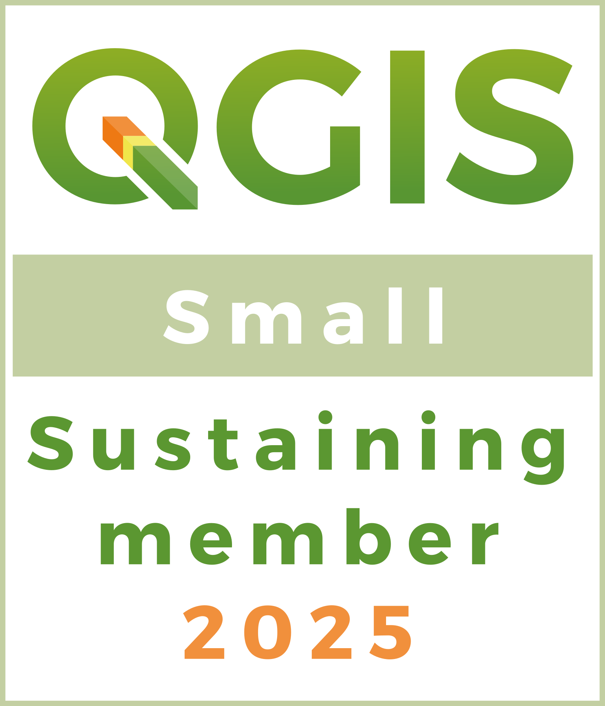

# Building Together: Pozi's QGIS Sustaining Membership and Commitment to the Open-Source GIS Community

{style="width:400px"}

Have you heard of Free and Open-Source Software? Many of our customers who utilise QGIS are familiar with this concept, often drawn in by the “free” aspect. There's nothing wrong with that - after all, who doesn't appreciate a good bargain? The fact that the software is free allows users to test it without commitment. If the software meets your needs, fantastic! You've discovered a solution that addresses your problem, all without a significant investment. And if it doesn’t work out, you don't have to worry about financial loss - this accessibility is one of the greatest advantages of free and open-source software, as it is available to everyone, not just a select few.

At Pozi, we are particularly fascinated by the community aspect of open-source software. A robust and engaged community is essential for the survival of any open-source project, and it’s this vibrant community that we appreciate the most. Mature projects like QGIS and OpenLayers boast established communities and user groups that offer opportunities for learning and professional networking.

But how do these incredible projects and communities sustain themselves if the software is free? This is a fundamental challenge that all open-source projects eventually face. While many developers embark on these projects as passion projects or to satisfy an intellectual curiosity, they realise that as these projects mature and attract a larger user base, financial resources become necessary to ensure their sustainability.

At [Pozi](https://pozi.com/), we are committed to supporting these projects financially, and we are proud to be a sustaining member of QGIS and OpenLayers. As we continue to develop Pozi, we recognise that our product and user experiences are deeply influenced by the open-source projects on which we are built. It makes perfect sense for us to give back to these projects financially, as we derive immense value from them every day. Supporting these initiatives not only acknowledges their contribution to our success but also extends benefits to everyone who uses the software.

We are proud to support the following projects that we rely on daily:

- [QGIS](https://qgis.org/): An industry-leading desktop Geographic Information System (GIS) client, QGIS stands out for its ability to run on multiple operating systems (Windows, MacOS, and Linux). Its robust features for vector and raster analysis are available to everyone, democratising access to powerful GIS tools. At Pozi, we value QGIS for its user-friendly interface, cartographic capabilities, and QGIS Server functionalities, which enable our customers to seamlessly push their data to the [Pozi](https://pozi.com/qgis/) App.
- [OpenLayers](https://openlayers.org/): This free, open-source JavaScript web mapping framework allows anyone to create full-featured web mapping experiences. At Pozi, we utilize OpenLayers to deliver the best browser mapping experience possible.
- [GeoStyler](https://geostyler.org/): An open-source React library, GeoStyler enhances the appearance of vector styles in the browser. When adapting native QGIS styles for compatibility with OpenLayers, GeoStyler provides the finishing touches that elevate the cartography within Pozi App's presentation.
- [TurfJS](https://turfjs.org/): An advanced JavaScript library for geospatial analysis, TurfJS empowers the spatial querying capabilities of the Pozi App. It enables users to answer critical spatial questions, such as identifying what lies within a specific area or around a particular feature.

We take pride in sponsoring these projects as a small token of our appreciation. Support like this from the community adds up, and through numerous small donations these can accumulate into significant resources that help these projects thrive.

**[QGIS Sustaining Member 2025](https://qgis.org/funding/membership/members/)**

Our decision to elevate our QGIS sponsorship to a sustaining membership reflects more than just financial support; it **signifies a deep-seated commitment to the vibrant and essential QGIS community**. We recognize that QGIS isn't merely software—it's a collaborative ecosystem built on shared values and a passion for open geospatial tools. By becoming a sustaining member, we're investing in the long-term health and development of this vital platform, ensuring its accessibility and innovation for years to come. We believe in the power of community-driven projects, and this upgrade is our way of actively participating in and strengthening the foundation upon which QGIS thrives, enabling us all to benefit from its continued growth and success.

In addition to direct sponsorship of open-source software projects, we are actively involved in our local open-source community. Our local geospatial community fosters an environment where enthusiasts can learn from and support one another in achieving remarkable outcomes. That’s why Pozi was proud to be a bronze sponsor of the [FOSS4G SoTM Oceania](https://2024.foss4g-oceania.org/) event in Hobart 2024, the largest Free and Open-Source Software for Geospatial conference in the Oceania region. Such events are vital for our community, and we look forward to sponsoring more grassroots open-source initiatives in the future.

So, if you’ve ever been curious about a Free and Open-Source Software project we encourage you to jump in and check it out. The power of open-source software comes from its amazing community. **It’s not just about getting free tools. It’s about being part of something bigger.**

At Pozi, we believe anyone can pitch in, whether you're a developer contributing code or someone new to it all. When you engage with these projects, share your ideas, or even make a small donation, you help keep them alive and thriving. **Because at the end of the day a community is strongest when we all pitch in and work together.**
