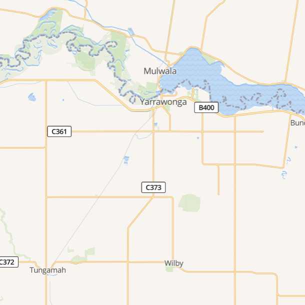
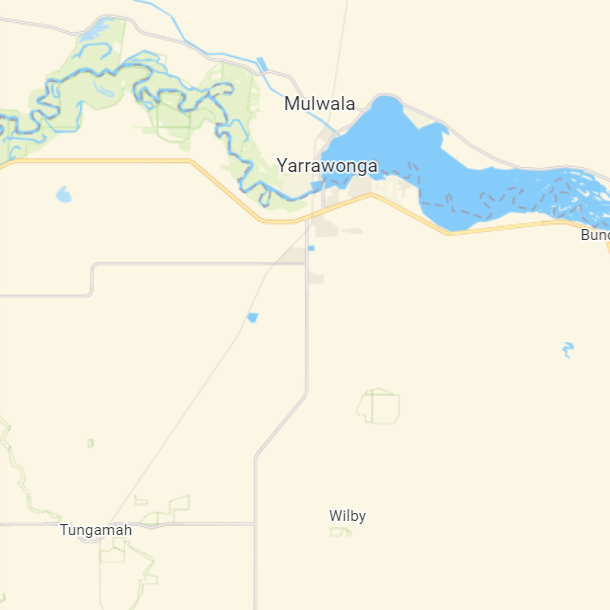

# Raster and Tile Layers

## Web Map Service (WMS)

### Services

#### DELWP DataVic

This service is soon to be retired. See 'DELWP DataVic (New)' below for details about the replacement service.

* [GetCapabilities](https://services.land.vic.gov.au/catalogue/publicproxy/guest/dv_geoserver/wms?request=getCapabilities)

#### DELWP DataVic (New)

* [GetCapabilities](https://geoserver-uat.maps.vic.gov.au/geoserver/ows?service=WMS&request=getCapabilities)
* [GeoWebCache](https://geoserver-uat.maps.vic.gov.au/geoserver/gwc/)

#### data.gov.au

* [GeoServer Layer Preview](https://data.gov.au/geoserver/web/wicket/bookmarkable/org.geoserver.web.demo.MapPreviewPage?0)
* [GetCapabilities](https://data.gov.au/geoserver/wms?SERVICE=WMS&VERSION=1.3.0&REQUEST=GetCapabilities)

#### Pozi Cloud Server

* [Example GetCapabilities](https://d2nozjvesbm579.cloudfront.net/iis/qgisserver?service=WMS&request=GetCapabilities&MAP=C:/Program%20Files%20(x86)/Pozi/server/data/local/sample/queenscliffe/vicmap.qgs)

### Layer Type

For WMS datasets, the dataset type can be either `TileWMS` or `ImageWMS`.

* `TileWMS` - loads the layer in a series of 640 x 640 image tiles. The tiles load incrementally in the map view, enabling the user to start to see the layer before the the entire map view is generated.
* `ImageWMS` - loads the layer as a single image that covers the current map view. In most scenarios it will be slower to load, but may be useful in avoiding unwanted duplication of any label text. (Note: there are currently differences between the way that Pozi loads TileWMS and ImageWMS layers that might result in degraded functionality for ImageWMS)

```json
  "type": "TileWMS"
```

### Layer and Styling Configuration

==- Layer with default style

```json
{
  "title": "Public Land",
  "legend": "https://services.land.vic.gov.au/catalogue/publicproxy/guest/dv_geoserver/wms?request=GetLegendGraphic&version=1.0.0&format=image/gif&width=20&height=20&layer=CROWNLAND_PLM25",
  "group": "Administrative",
  "type": "TileWMS",
  "config": {
    "url": "https://services.land.vic.gov.au/catalogue/publicproxy/guest/dv_geoserver/wms",
    "params": {
      "LAYERS": "CROWNLAND_PLM25",
      "FORMAT": "image/GIF"
    }
  },
  "opacity": 0.5
}
```

==- Aerial image from local MapServer

```json
{
  "title": "Aerial Photo (2021 Jan)",
  "group": "Imagery",
  "type": "TileWMS",
  "queryable": false,
  "config": {
    "url": "https://pozi-cardiniavicgovau.msappproxy.net/iis/MapServer?MAP=C:/Pozi/MapServer/maps/Aerial.map",
    "params": {
      "FORMAT": "image/jpeg",
      "LAYERS": "NMD-1199_Cardinia"
    }
  },
  "linkedLayers": [
    "Vicmap Labels"
  ],
  "localDataSource": true
}
```

==-

#### External SLD

WMS GetMap requests can be made with an `sld` parameter that contains the URL of an SLD file.

*Note: as at 25 Feb 2022, the data.gov.au WMS service is not successfully responding to WMS requests that point to external SLDs. See 'Embedded SLD' below for an alternative styling configuration. Or better yet, consider using WFS if the dataset is small enough.*

==- Layer with external SLD

*Note: the layer name is not specified in the config because it is specified within the SLD itself.*

```json
{
  "title": "Localities",
  "group": "Administrative",
  "type": "TileWMS",
  "config": {
    "url": "https://services.land.vic.gov.au/catalogue/publicproxy/guest/dv_geoserver/wms",
    "params": {
      "SLD": "http://files.pozi.com/config/sld/datavic-VMADMIN_LOCALITY_POLYGON-BENDIGO.sld",
      "FORMAT": "image/png8"
    }
  }
}
```

==-

#### Embedded SLD

WMS GetMap requests can be made with an `sld_body` parameter that contains the SLD styling rules as a string of XML.

==- Layer with embedded SLD

```json
{
  "title": "Park and Street Trees",
  "group": "Council Facilities and Services",
  "type": "TileWMS",
  "config": {
    "url": "https://data.gov.au/geoserver/wms",
    "params": {
      "sld_body": "<?xml version='1.0' encoding='UTF-8'?><StyledLayerDescriptor xmlns='http://www.opengis.net/sld' xmlns:ogc='http://www.opengis.net/ogc' xmlns:xsi='http://www.w3.org/2001/XMLSchema-instance' version='1.1.0' xmlns:xlink='http://www.w3.org/1999/xlink' units='mm' xsi:schemaLocation='http://www.opengis.net/sld http://schemas.opengis.net/sld/1.1.0/StyledLayerDescriptor.xsd' xmlns:se='http://www.opengis.net/se'><NamedLayer><se:Name>ckan_ed15e3ea_48dc_47d2_afa6_518e6f5276e1</se:Name><UserStyle><se:Name>Glen Eira - Trees</se:Name><se:FeatureTypeStyle><se:Rule><se:Name>Single symbol</se:Name><se:PointSymbolizer><se:Graphic><se:Mark><se:WellKnownName>circle</se:WellKnownName><se:Fill><se:SvgParameter name='fill'>#33a02c</se:SvgParameter></se:Fill><se:Stroke><se:SvgParameter name='stroke'>#000000</se:SvgParameter></se:Stroke></se:Mark><se:Size>10</se:Size></se:Graphic></se:PointSymbolizer></se:Rule></se:FeatureTypeStyle></UserStyle></NamedLayer></StyledLayerDescriptor>"
    }
  }
}
```

==-

##### Switching from external SLD to embedded SLD:

1. open SLD in text editor (VSCode or NotePad++ recommended)
2. ensure `<NamedLayer><se:Name>` is populated with the name that the server uses to identify the layer (eg the ckan id in data.gov.au)
3. ensure any field names that specified in `<ogc:PropertyName>` settings match the case expected by the server (eg must be lower case for data.gov.au)
4. find and replace double quotes with single quotes
5. find and replace double spaces with blank
6. find and replace line returns (use `\n` in 'Extended' search mode in Notepad++) with blank

The resulting text is a single line of XML.

In the dataset config, replace the existing `sld` parameter with a new `sld_body` parameter, using the line of XML as the value.

Example configurations:

* [Glen Eira Street Trees](https://github.com/pozi/PoziAppConfig/commit/c2f9bf6b3eb9998b27d85df266ebf48fc4ff80c5#diff-5a45ada4e9f3d1ed3db20f652cabe746c1767390718cf94228bc25a7576c9f7dL776-R776)
* [Mitchell Contours](https://github.com/pozi/PoziAppConfig/commit/d95812fd4691e86e0fac3de91d0e3ad5fbb7683b#diff-216128510370c47687518818e49f4d63083c96ba0b3686031cea3cc7dc0d98feL3214-R3234)
* Southern Grampians Waste Water Land Capability Hazard Classification

#### CQL Filter

==- Layer with CQL Filter

```json
{
  "title": "Public Land - Council Committee of Management",
  "group": "Administrative",
  "type": "TileWMS",
  "config": {
    "url": "https://services.land.vic.gov.au/catalogue/publicproxy/guest/dv_geoserver/wms",
    "params": {
      "LAYERS": "CROWNLAND_PLM25",
      "FORMAT": "image/GIF",
      "CQL_FILTER": "MNG_GROUP='COM Council'"
    }
  }
}
```

==-

#### Selectability

WMS layers are not selectable/queryable by default. (However there is [a plan](https://trello.com/c/NuPIDgSL/18-enable-wms-layers-getfeatureinfo-results-to-be-displayed-in-info-panel-by-default) to change Pozi's default behaviour for WMS layers.)

To make WMS layers selectable, add `"parent": "Whats Here"` to the layer's configuration.

```json
  "parent": "Whats Here",
```

Also, if a WMS layer doesn't have a specified style, it may need an additional `query_layers` parameter to enable Pozi to fetch attributes for the layer.

==- Layer without specified style

```json
{
  "title": "Waste Water Land Capability Hazard Classification",
  "group": "Land Capability",
  "type": "TileWMS",
  "parent": "Whats Here",
  "config": {
    "url": "https://data.gov.au/geoserver/wms",
    "params": {
      "layers": "ckan_088d79af_df5a_4bfe_87ce_6c7236a8216c",
      "query_layers": "ckan_088d79af_df5a_4bfe_87ce_6c7236a8216c"
    }
  }
}
```

==-

## Imagery

Any layer configured with `"group": "Imagery"` will appear in the 'Imagery' layer group (as expected). Layers within this special group are displayed with a radio button to toggle between layers instead of the standard tick boxes.

The topmost imagery layer can be toggled by the Aerial button at the top right of the Pozi map.

### Imagery Tile Services

==- HERE Satellite

```json
{
  "title": "HERE Satellite",
  "group": "Aerial",
  "type": "XYZ",
  "about": {
    "organisation": "HERE Technologies",
    "url": "https://developer.here.com/documentation/map-tile/topics/what-is.html"
  },
  "config": {
    "url": "https://{1-4}.aerial.maps.api.here.com/maptile/2.1/maptile/newest/hybrid.day/{z}/{x}/{y}/256/png8?lg=ENG&app_id=ourappid&token=ourtoken"
  }
}
```

==- ArcGIS World Imagery

```json
{
  "title": "ArcGIS World Imagery",
  "group": "Imagery",
  "type": "XYZ",
  "config": {
    "url": "https://server.arcgisonline.com/ArcGIS/rest/services/World_Imagery/MapServer/tile/{z}/{y}/{x}"
  }
}
```

==-

### DELWP Image Web Server

* [About](https://www.land.vic.gov.au/maps-and-spatial/imagery/about-image-web-server)
* [Login](http://images.land.vic.gov.au/iwsadmin/)
* [Viewer](http://images.land.vic.gov.au/iws/SimpleExampleNative.htm)
* Report outages: gis.helpdesk@delwp.vic.gov.au
* Other support requests: coordinated.imagery@delwp.vic.gov.au

#### GetCapabilities

http://images.land.vic.gov.au/ecwp/ecw_wms.dll?service=WMS&request=getcapabilities

The current GetCapabilities is over 13MB in one long line. Save it to a text file and use https://stackoverflow.com/questions/3961217/how-do-i-format-xml-in-notepad to format the text into a readable form.

#### Configuration

##### Layer Name

The layer name from the permissions list needs to modified to reflect the actual layer name in the IWS server.

###### Example 1

* before: `\land\aerial\nth-grampians_2017feb03_air_vis_20cm_mga54.ecw`
* after: `aerial_nth-grampians_2017feb03_air_vis_20cm_mga54`

###### Example 2

* before: `\land\aerial\mallee_2020dec23_air_vis_20cm_mga54\mallee_2020dec23_air_vis_20cm_mga54.ecw`
* after: `aerial_mallee_2020dec23_air_vis_20cm_mga54`

###### Example 3

* before: `\land\aerial\towns\navarre_2016dec23_air_cir_10cm_mga54.ecw`
* after: `towns_navarre_2016dec23_air_cir_10cm_mga54`

#### Credentials

Include an authkey configuration item to instruct the Pozi Image Proxy to attach client-supplied credentials to each request.

Example: `"authkey": "iws-bendigo"`

For any troubleshooting purposes, there is one layer on IWS which doesn't require any credentials: `satellite_victoria_2000jan01_sat_etm543_30m_vg94`

[Example image](http://images.land.vic.gov.au/erdas-iws/erdas/imagex/?request=image&cache=true&transparent=true&type=jpg&l=3&tx=1&ty=7&ts=256&fill=FFFFFF&quality=60&layers=%2Fimages%2Fland%2Fsatellite%2Fvictoria_2000jan01_sat_etm543_30m_vg94.ecw&style=default&srs=EPSG:3111)

#### Example Configuration

==- Single Image Example

```json
{
  "title": "Aerial 2008 Dec (Urban)",
  "group": "Imagery",
  "type": "TileWMSAuth",
  "about": {
    "source": "Victorian Coordinated Imagery Program",
    "organisation": "DELWP",
    "url": "https://www2.delwp.vic.gov.au/maps/maps-and-services/coordinated-imagery-program"
  },
  "linkedLayers": [
    "Vicmap Labels"
  ],
  "config": {
    "url": "https://imageproxy.pozi.com/http://images.land.vic.gov.au/ecwp/ecw_wms.dll",
    "params": {
      "LAYERS": "aerial_bendigo_2008jan06_air_vis_15cm_mga55",
      "STYLES": "",
      "TILED": true,
      "FORMAT": "image/jpeg",
      "authkey": "iws-bendigo"
    }
  }
}
```

==- Multi Image Example

*Note: each layer name in the `LAYERS` parameter is separated by a comma, and the `STYLES` parameter must contain the same number of commas.*

```json
{
  "title": "Aerial Photo (Latest)",
  "group": "Imagery",
  "type": "TileWMSAuth",
  "about": {
    "source": "Victorian Coordinated Imagery Program",
    "organisation": "DELWP",
    "url": "https://www2.delwp.vic.gov.au/maps/maps-and-services/coordinated-imagery-program"
  },
  "linkedLayers": [
    "Vicmap Labels"
  ],
  "config": {
    "url": "https://imageproxy.pozi.com/http://images.land.vic.gov.au/ecwp/ecw_wms.dll",
    "params": {
      "LAYERS": "aerial_bendigo_2021jan17_air_vis_10cm_mga55,towns_bendigo_2021sep02_air_vis_10cm_mga55,towns_axedale_2021jan18_air_vis_10cm_mga55,towns_elmore_2021jan18_air_vis_10cm_mga55,towns_goornong_2021jan18_air_vis_10cm_mga55,towns_heathcote_2020feb22_air_vis_10cm_mga55,towns_lockwood-south_2021jan17_air_vis_10cm_mga55,towns_marong_2020feb22_air_vis_10cm_mga55,towns_neilborough_2021jan17_air_vis_10cm_mga55,towns_ravenswood_2021jan17_air_vis_10cm_mga55,towns_raywood_2021jan17_air_vis_10cm_mga55,towns_redesdale_2020feb22_air_vis_10cm_mga55,towns_sebastian_2021jan17_air_vis_10cm_mga55,towns_mia-mia_2020feb22_air_vis_10cm_mga55",
      "STYLES": ",,,,,,,,,,,,,",
      "TILED": true,
      "FORMAT": "image/jpeg",
      "authkey": "iws-bendigo"
    }
  }
}
```

==-

#### New Image Web Server

Notification of new service from DELWP in May 2022:

> Image Web Server and its storage have been migrated to the new AWS Cloud hosted Raster Data Platform and Image Web Server. This change is part of DELWP’s Spatial Transformation Program, which aims to enhance our service delivery capabilities including support of GDA2020.

New endpoint: https://iws.maps.vic.gov.au/erdas-iws/ogc/wms/RDP?SERVICE=WMS&REQUEST=GetCapabilities

> ...the existing Image Web Server service (
https://images.maps.vic.gov.au/erdas-iws/ogc/wms)...will be decommissioned by 30 June 2022.

## Basemaps Tiles

Any layer configured with `"group": "Basemap"` will appear in the 'Basemap' layer group (as expected). Layers within this special group are displayed with a radio button to toggle between layers instead of the standard tick boxes.

Set `"visible": true` for the default basemap.

### Sources

#### Raster Tiles

==- OpenStreetMap

```json
{
  "title": "OpenStreetMap",
  "group": "Basemap",
  "type": "XYZ",
  "about": {
    "organisation": "OpenStreetMap",
    "url": "https://www.openstreetmap.org/about"
  },
  "config": {
    "url": "https://{a-c}.tile.openstreetmap.org/{z}/{x}/{y}.png"
  }
}
```

  Other OpenStreetMap layers are available at https://wiki.openstreetmap.org/wiki/Tile_servers.

==- HERE

```json
{
  "title": "HERE Map",
  "group": "Basemap",
  "type": "XYZ",
  "about": {
    "organisation": "HERE Technologies",
    "url": "https://developer.here.com/documentation/map-tile/topics/what-is.html"
  },
  "config": {
    "url": "https://{1-4}.base.maps.api.here.com/maptile/2.1/maptile/newest/normal.day/{z}/{x}/{y}/256/png8?lg=ENG&app_id=ourappid&token=ourtoken"
  }
}
```

==- Stamen Watercolor

```json
{
  "title": "Stamen Watercolor",
  "group": "Basemap",
  "type": "XYZ",
  "about": {
    "organisation": "Stamen",
    "url": "http://maps.stamen.com"
  },
  "config": {
    "url": "https://stamen-tiles-{a-d}.a.ssl.fastly.net/watercolor/{z}/{x}/{y}.jpg"
  }
}
```

==- Stamen Terrain

```json
{
  "title": "Stamen Terrain",
  "group": "Basemap",
  "type": "XYZ",
  "about": {
    "organisation": "Stamen",
    "url": "http://maps.stamen.com"
  },
  "config": {
    "url": "https://stamen-tiles-{a-d}.a.ssl.fastly.net/terrain/{z}/{x}/{y}.png"
  }
}
```

==- Vicmap

```json
{
  "title": "Vicmap",
  "group": "Basemap",
  "type": "XYZ",
  "visible": true,
  "about": {
    "source": "Vicmap Maps and Services",
    "organisation": "DELWP",
    "url": "https://www.land.vic.gov.au/maps-and-spatial/data-services/vicmap-basemap/licensing-and-copyright"
  },
  "config": {
    "url": "https://base.maps.vic.gov.au/wmts/CARTO_WM_256/EPSG:3857:256/{z}/{x}/{y}.png"
  }
}
```

https://base.maps.vic.gov.au/service?SERVICE=WMTS&REQUEST=Getcapabilities

==- Mapscape

Pozi is not currently licensed for Mapscape. This configuration is for evaluation purposes only.

```json
{
  "title": "Mapscape",
  "group": "Basemap",
  "type": "XYZ",
  "about": {
    "organisation": "Spatial Vision",
    "url": "https://spatialvision.com.au/mapscape/"
  },
  "config": {
    "url": "https://proxy.pozi.com/https://mapscape.maps.em.vic.gov.au/color/{z}/{x}/{y}.png"
  }
}
```

==- Queensland Globe

```json
{
  "title": "Queensland Globe Lite",
  "group": "Basemap",
  "type": "XYZ",
  "config": {
    "url": "https://spatial-gis.information.qld.gov.au/arcgis/rest/services/Basemaps/QldMap_Lite/MapServer/tile/{z}/{y}/{x}?blankTile=false&browserCache=Map"
  }
}
```

Basemaps are available in `QldMap_Lite`, `QldBase_Pastel` and other variations: https://spatial-gis.information.qld.gov.au/arcgis/rest/services/Basemaps/.

==-

##### Comparison

==- Preview

##### HERE

{style="width:305px"}

##### Mapbox

{style="width:305px"}

##### Mapscape

{style="width:305px"}

##### MapTiler

{style="width:305px"}

##### OpenStreetMap

{style="width:305px"}

##### Vicmap

{style="width:305px"}

##### Vicmap Legacy

{style="width:305px"}

==-
