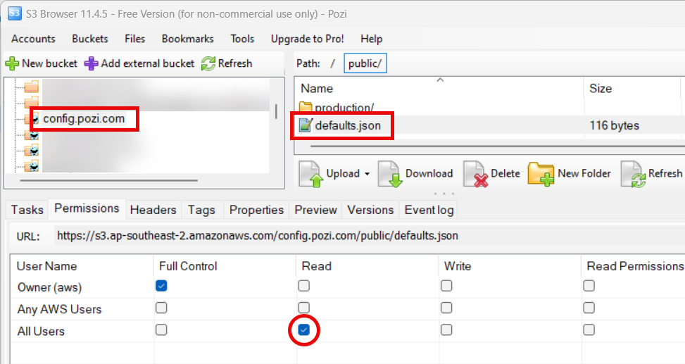

## CORS

For data services that do not have [CORS](https://en.wikipedia.org/wiki/Cross-origin_resource_sharing) enabled, Pozi Proxy can route data requests from Pozi users to satisfy the provider's restrictions.

Examples:

* Jotform
* GeoSciences Australia WFS
* Mapscape Basemap
* Google Spreadsheets

## Services Requiring Authentication

Some third party data services require that credentials or a key be appended to any data request. In order to keep these credentials out of public view, these requests can be routed via Pozi Proxy, which adds the necessary credentials.

* Nearmap
* DEECA Image Web Server
* Google Maps API (for Street View imagery)
* Geocode Earth
* HERE
* Pingdom status check

Credentials can be added/updated [here](https://github.com/pozi/PoziProxy/blob/master/lib/pozi-auth.js).

## Entra ID

Due to limitations with the Entra ID service, all requests to a client's MS App Proxy must have custom headers set. Pozi Proxy is responsible for adding these headers to all requests to the Entra ID service.

There are currently two independent proxy services available for this purpose:

- geoproxy.pozi.com
- pozi-proxy.azurewebsites.net

The default proxy endpoint is set in a JSON config file located at https://config.pozi.com/public/defaults.json.

In the event that the active proxy service becomes unstable, the proxy endpoint can be changed in the config file. Download the existing file, edit the file in a text editor to change the proxy endpoint, and upload the updated file.

{style="width:500px"}

Ensure that the updated file has public read permissions.
