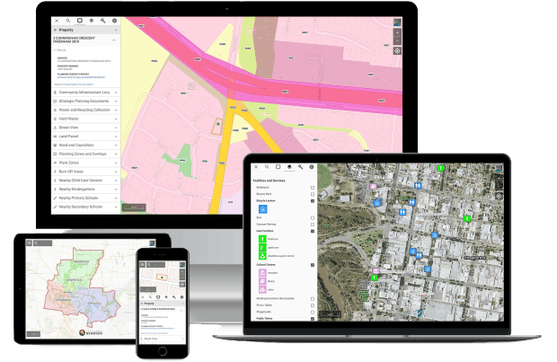
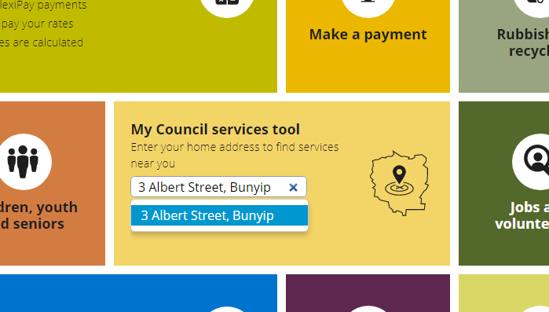

#

<!--- START HEADING --->

:::section

  ## Building Connected Communities Through Spatial Thinking

  Pozi combines geographic information from local data sources and trusted web services to give your users the complete picture.

  Deploy for a fraction of cost of traditional GIS software, with no lock-in contracts.

  [!button variant="primary" icon="checklist" size="xl" corners="pill" text="Discover Pozi's features >"](/features/)

:::

 
 

<!--- END HEADING --->

<!--- START SECTION - BENEFITS --->

#### Confident decision making

Empower your users with the critical information they need by integrating with live, authoritative data sources

 
 

#### Ease of use

Simple, modern map interface with a focus on immediate usability

 
 

#### Real Support

Our team works with you to customise and maintain your map application - you're never on your own

 
 
 

<!--- END SECTION - BENEFITS --->

<!--- START SECTION - VISUALISE --->

 

#### Visualise & interact with location-based information in a simple map interface

For over twenty years, Pozi has helped organisations to work more efficiently and gain greater insights into their clients, resources, activities and risks by making use of location-based information in their business processes.

 
 

<!--- END SECTION - VISUALISE --->

#### Ultimate connectability

Eliminate data double-handling by accessing data directly from any local or remote source

<!--- START SECTION - CLIENTS --->

:::section

  ### What our clients say...

:::

> "We see great online traffic data and know visiting the website has become a key part of customer service interaction. The waste and recycling collection widget is one of the most popular pages on our website.​"
>
> *Cardinia Shire Council*

 
 

> "Really appreciate the 5 star support. So helpful and fast to respond. Thank you!"
>
> *Strathbogie Shire Council*

 
 

> "The Pozi mapping product is a great tool to easily display public map-based information for users. The process, design and planning stages are made simple by the Pozi Support team."
>
> *Rural City of Wangaratta*

 
 

> "The clean look and layout of Pozi, along with its user friendly functionality make it easy for customers to locate and interpret data. It's an efficient tool for delivering information to our customers, and the staff at Pozi provide great support to their clients."
>
> Latrobe City Council

 
 

<!--- END SECTION - CLIENTS --->

<!--- START SECTION - SHOWCASE --->

:::section

  ## Showcase

  [!badge size="3xl" variant="light" icon="/static/img/client-logos/gleneira.png" text="Glen Eira City Council"](https://gleneira.pozi.com/) &zwnj; &zwnj; &zwnj;
  [!badge size="3xl" variant="light" icon="/static/img/client-logos/frankston.png" text="Frankston City Council"](https://frankston.pozi.com/) &zwnj; &zwnj; &zwnj;

  [!badge size="3xl" variant="light" icon="/static/img/client-logos/cardinia.png" text="Cardinia Shire Council"](https://cardinia.pozi.com/) &zwnj; &zwnj; &zwnj;
  [!badge size="3xl" variant="light" icon="/static/img/client-logos/bendigo.png" text="City of Greater Bendigo"](https://bendigo.pozi.com/) &zwnj; &zwnj; &zwnj;

  [!badge size="3xl" variant="light" icon="/static/img/client-logos/horsham.png" text="Horsham Rural City Council"](https://horsham.pozi.com/) &zwnj; &zwnj; &zwnj;

  [!ref size="3xl" text="See more"](/showcase/) &zwnj;

:::

<!--- END SECTION - SHOWCASE --->

<!--- START SECTION - WHY --->

:::section

## Why Pozi?

Pozi is your new geospatial software solution; a hosted web map solution tailored for organisations who need to:

||| 
Make timely and informed decisions about infrastructure, properties and workforce
||| 
Help customers with their location-based enquiries
||| 
Promote local places, facilities events and services to customers
|||

<big>Pozi is an intuitive, interactive, location-based communication platform for your internal and external users that aggregates geographic information from multiple sources in an simple web interface, at a fraction of the cost of traditional Geographic Information System (GIS) software.</big>

:::

<blockquote class="twitter-tweet">
Latrobe City Council is seeking feedback from residents about a proposed planning scheme amendment, and is using Pozi to show the public the extent of the changes. <a href="https://t.co/wlyYItkkMF">https://t.co/wlyYItkkMF</a> <a href="https://t.co/83Q2kbGdhk">pic.twitter.com/83Q2kbGdhk</a>
&mdash; Pozi (@PoziApp) <a href="https://twitter.com/PoziApp/status/1494111660734582788?ref_src=twsrc%5Etfw">February 17, 2022</a></blockquote> 

 

### Benefit from a hosted web map that...

* ✔️ Displays location-based information and data from multiple sources in one map window
* ✔️ Creates maps for enquiries, visualisation and fieldwork
* ✔️ Integrates existing systems and software easily at lower cost
* ✔️ Customises to your unique data
* ✔️ Eliminates expensive software licensing fees and doesn't lock you in to a long-term contract

<blockquote class="twitter-tweet">
Pozi leverages QGIS to give organisations more control of their Pozi site. In today&#39;s update, Pozi automatically generates layer legends from styles created in QGIS. <a href="https://t.co/WWu1W2FwsD">https://t.co/WWu1W2FwsD</a> <a href="https://t.co/exRgu8sEev">pic.twitter.com/exRgu8sEev</a>
&mdash; Pozi (@PoziApp) <a href="https://twitter.com/PoziApp/status/1467725591315038210?ref_src=twsrc%5Etfw">December 6, 2021</a></blockquote> 

 

### Pozi features...

Deliver data to staff and public – easily and affordably. Users can access the information they need at any time, such as property information, nearby community facilities and services, and aerial imagery.

* ✔️ **Manage services intelligently** - Staff can view additional information such as property owner details and asset information
* ✔️ **Find information about any location** - View land parcel details, planning controls, road closures, maintenance schedules, major projects, waste collection zones and more.
* ✔️ **Reduce data maintenance overheads** - the Pozi app operates independently of your internal IT infrastructure and connects live to state and federal government web services so you don't have to spend time maintaining and updating background datasets

<blockquote class="twitter-tweet">
Our clients are always finding new datasets to open up to the public. <a href="https://twitter.com/SwanHillCouncil?ref_src=twsrc%5Etfw">@SwanHillCouncil</a> has just published the locations of their dog waste bag dispensers on Pozi <a href="https://twitter.com/hashtag/opendata?src=hash&amp;ref_src=twsrc%5Etfw">#opendata</a> <a href="https://t.co/CfaVfTSBfU">https://t.co/CfaVfTSBfU</a> <a href="https://t.co/xHvveLh9OJ">pic.twitter.com/xHvveLh9OJ</a>
&mdash; Pozi (@PoziApp) <a href="https://twitter.com/PoziApp/status/1442715683733733377?ref_src=twsrc%5Etfw">September 28, 2021</a></blockquote> 

 

### Let's get technical...

Pozi runs from our secure Australian-based web server. This means you get all the benefits of cloud computing (security, backups, disaster recovery and continuous upgrades) and ongoing support.

* ✔️ Responsive design for desktop, tablet and mobile devices
* ✔️ Bookmarking of locations, layers and features for sending links and embedding custom maps in your website
* ✔️ Integration with internal and external sources to display vital information for any location
* ✔️ GPS location to place your staff and customers at the scene
* ✔️ Customisation so your organisation can get up and running quickly

### Let's get functional...

Deliver data to staff and public – easily and affordably. Users can access the information they need at any time, such as property information, nearby community facilities and services, and aerial imagery.

* ✔️ Display map information from different sources on the one map
* ✔️ Have full visibility of your organisation's activities through a single portal
* ✔️ Free your people to use data strategically with no need to double-handle externally-maintained data.
* ✔️ Share information cost effectively and connect with staff and public
* ✔️ Deliver relevant data to external stakeholders on demand
* ✔️ Customise maps display with just one click

[!ref icon="checklist" text="Discover Pozi's features"](/features/)
[!ref icon="mention" text="Contact us today!"](/contact/)

<!--- END SECTION - WHY --->

<!--- START SECTION - ABOUT --->

:::section

  ### Helping organisations with GIS since 1999

  For over twenty years, Pozi (formerly Groundtruth) has helped government organisations to work more efficiently and gain greater insights into their clients, resources, activities and risks by making use of location-based information in their business processes.

  [!button variant="info" icon="organization" size="xl" corners="pill" text="About us >"](/about/)

:::

 
 

<!--- END SECTION - ABOUT --->

<!--- START SECTION - CONTACT --->

:::section

  ## Get in touch

  <big>Contact us to discuss a free, 60 day Pozi trial or for a friendly chat how we can work with you to deliver your organisation's needs.</big>

  [!button variant="info" icon="mention" size="xl" corners="pill" text="Contact us >"](/contact/)

:::

<!--- END SECTION - CONTACT --->
