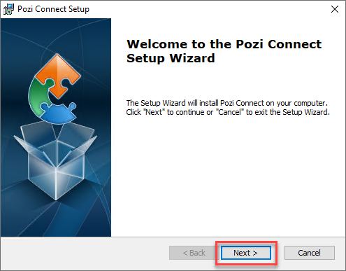
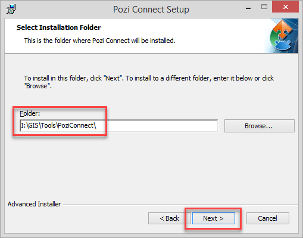
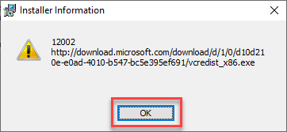
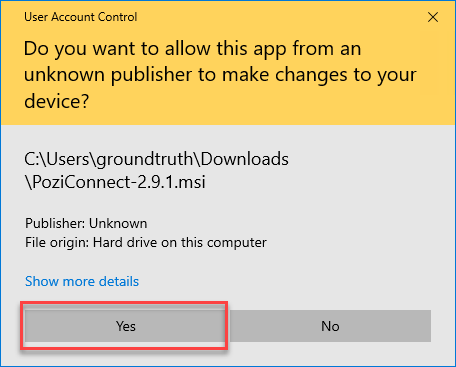

# Pozi Connect Installation

## Express Instructions

*This is a brief overview of the steps involved. For step-by-step instructions, including details of the prompts you'll encounter, go to the **Step-by-Step Instructions** below.*

1. go to the <a href="https://github.com/pozi/PoziConnect/releases/latest" target="_blank">Pozi Connect download page</a>
2. click on the link to the `PoziConnect-*.*.*.msi` file to download the installer
3. run the installer
4. change the default path to the desired PoziConnect location on your network (pick the location of the existing installation if you have previously installed it)
5. follow the prompts to complete the installation

## Step-by-Step Instructions

The steps below show the many dialogs that the PC/server may display during the installation. The installation process requires that you accept all prompts.

You may see fewer prompts depending on the operating system and/or your user permissions.

### Backup Existing Installation

For peace of mind when performing an upgrade on an existing Pozi Connect installation, you may choose to backup your existing installation by copying the entire `PoziConnect` folder to another location (eg, `C:\Temp\PoziConnect\`). In the event that the new installation causes any issues, you can restore files or folders from the backup.

### Download Pozi Connect Installer

Go to the <a href="https://github.com/pozi/PoziConnect/releases/latest" target="_blank">Pozi Connect download page</a>.

{style="width:500px"}

Click on the link to the `PoziConnect-*.*.*.msi` file to download the installer.

### Launch Installer

Double-click the downloaded Pozi Connect `.msi` file to launch the installer.

### Accept Security Prompts

If you see a prompt saying "Windows protected your PC"... click the *More info* link.

You'll then see a message about "Unknown Publisher". Click on *Run anyway*.

### Start Setup Wizard

{style="width:400px"}

Click `Next >`

### Specify Installation Location

{style="width:400px"}

Pozi Connect is typically installed in a shared location on your organisation's network.

**Important: When upgrading an existing installation, set the `Folder` to the location at which Pozi Connect is already installed**

If the installer doesn't remember the location at which Pozi Connect was previously installed, click the `Browse` buttton and navigate to the Pozi Connect folder on your network (note: the file path ends with the folder name `...\PoziConnect\`)

### Begin Installation

{style="width:400px"}

Click `Install`

### Accept Installer Information

You may encounter various prompts and warnings. Click OK/Yes on all of them.

{style="width:300px"}

Click `OK`

### Confirm Installation

{style="width:300px"}

Click `Yes`

### Accept User Account Control Prompt

{style="width:300px"}

Click `Yes`

### Confirm Continue

{style="width:300px"}

Click `Yes`

### Finish Installation

{style="width:400px"}

Click `Finish`

**Success!** You've now installed/upgraded Pozi Connect.

Launch Pozi Connect to resume your regular data maintenance processes.

---

## Customise Configuration

You can customise the Pozi Connect drop-down task list to display only the tasks that you're interested in.

The `PoziConnect\PoziConnect.site.ini` file contains filters to specifically include or exclude tasks. Open the file in a text editor, and specify the filter. For example, if you only want to display tasks that relate to 'Glen Eira', update the file as follows:

```ini PoziConnect\PoziConnect.site.ini
[Settings]
Include: Glen Eira
Exclude:
```

You can enter multiple filter terms, separated by commas. Save the file and exit.

This file should persist in your Pozi Connect application folder, so you need only do this step once, not every time you update the application or configuration.

## Moving Pozi Connect

Pozi Connect can be easily moved to a new location at any time to suit your changing needs. The `PoziConnect` folder is self-contained, meaning the application will continue to work as long as all the files within the folder are moved together. Any PC that can access the `PoziConnect.exe` file can run it.

Moving Pozi Connect can be done with or without upgrading at the same time. See the following options.

### Move Without Upgrading

1. move the entire `PoziConnect` folder to desired location
2. update any user's desktop shortcuts to point the the new location

### Upgrade and Move

1. run the installer to install Pozi Connect at the new location
2. copy the `PoziConnect\output` folder from the old location to the new one
3. copy the `PoziConnect\PoziConnect.site.ini` file from the old location to the new one
4. update any user's existing desktop shortcuts to point the the new location

### Other Changes

The reason for your needing to change Pozi Connect location may coincide with other changes on your network, such as the location of source data. If your source data (eg Vicmap datasets) has moved, your Pozi Connect configuration will also need to be updated. Email support@pozi.com with details of any changes to your source data so that your Pozi Connect task files can be updated accordingly.

## FAQ

==- How does Pozi Connect connect to my corporate database?

  Pozi Connect uses your PC's existing ODBC connection settings. It does not require any additional network or firewall configuration. It requires only that the user's PC has the appropriate DSN configured to access (read-only) the council's property database. Authentication can be based on a username/password or trusted connection (using Windows login name).

==-

## Troubleshooting

==- Pozi Connect fails to start

  Download and install the [Microsoft Visual C++ 2008 Redistributable Package (x86)](https://www.microsoft.com/en-au/download/details.aspx?id=11895), and try running Pozi Connect again.

==- Pozi Connect returns an 'Incorrect padding' error

  If you encounter an error saying 'Incorrect padding', it may be because your database password contains a special character (such as '&') that interferes with the database connection string.

  Reset your password so that it doesn't contain any special characters. (If your password needs to use at least one special character, use '#'.)

==- Pozi Connect returns a 'No column definitions found for table' error

  Check that you have the appropriate permissions to connect to the database. Also check that the table prefix specified in Pozi Connect is the one still used in the database.

  To see a list of tables (and table prefix) that your user account has access to, launch the GDAL shell by launching this batch file:

  ```
  ...\PoziConnect\vendor\release-xxxx-gdal-x-x-x-mapserver-x-x-x\SDKShell.bat
  ```

  Then type in:

  ```
  ogrinfo ODBC:DSN=yourDSNname;UID=yourDBusername;PWD=yourDBpassword -ro -so
  ```

  (If you're running as a trusted user of the database, you can leave out the `UID` and `PWD` settings.)

  Then hit enter. It might take a few minutes, but it should list all the tables you have access to. Check if the table specified in the initial error message appears in the list.

  ==- Cannot connect to data source

  *In this example, we'll assume that we're trying to connect to a DSN called 'pthprod'.*

  Run the 32 bit ODBC setup wizard (instead of the standard DSN wizard in the Control Panel). At the Windows Start menu, type in cmd, then at the command-line prompt, type or paste in the following, then hit 'Enter':

  `C:\Windows\SysWOW64\odbcad32.exe`

  In the System DSN tab, check if there is a data source for 'pthprod'. If not, add a new DSN, using the same settings as your existing 64 bit one. It is recommended to use a different name for the new 32 bit DSN. For example, name it 'pthprod32' or similar so it can be distinguished from the existing DSN.

  Open the relevant Pozi Connect config file (eg `PoziConnect\tasks\~Shared\M1 Shared - Import Pathway.ini` or equivalent client-specific task) in a text editor and update the DSN name:

  ```
  Data_Source: ODBC:DSN=pthprod32
  ```

==- Pozi Connect returns an error number 1073741512

  Go into your `C:\Windows\System32` folder and see if there is a file called `libeay32.dll`. If so, rename it to `libeay32.bak`. Then try running Pozi Connect again.

  (Rename the file back again when you've finished so that any other programs that may rely on it can use it.)

==-
